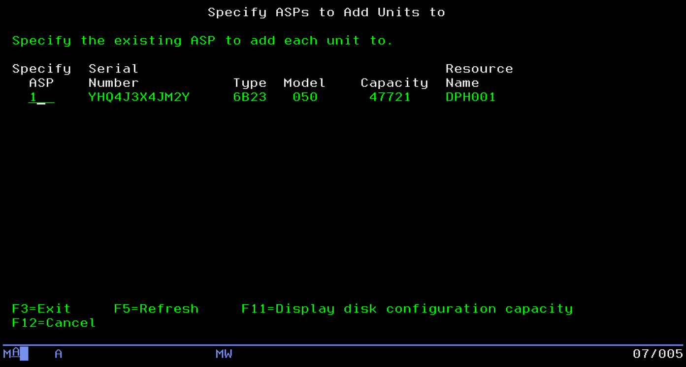
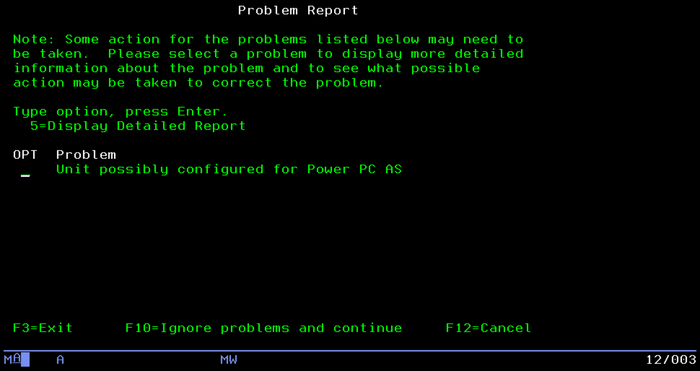
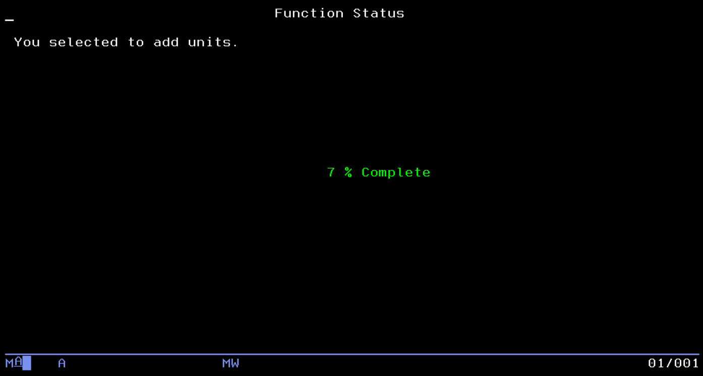

# Configure the second disk

During the reservation process you can add a second disk. The additional disk is mapped to your system and we let you use it at your convenience (raw, LVM, formatting, mount points, etc).
Here are some examples on how to discover, format and mount the disk in a traditional fashion.

[Add storage to a Linux server](#add-storage-to-a-linux-server)

[Add storage to an AIX server](#add-storage-to-an-aix-server)

[Add storage to an IBM i server](#add-storage-to-an-ibm-i-server)


## Add storage to a Linux server

The volume added to your system is presented as a "block device". In order to make use of it, some additional steps are required.
Depending on the environment and operating system your system is currently running with, the following instructions will help you with basic configuration of your newly added block device as a filesystem. 

### Discover the new block device
The command to list block devices on Linux is lsblk. If you type it on your system before you add a volume, you should get the following output, or similar:

```shell
$ lsblk
NAME   MAJ:MIN RM  SIZE RO TYPE MOUNTPOINT
sr0     11:0    1  580K  0 rom
vda    253:0    0   60G  0 disk
├─vda1 253:1    0    4M  0 part
└─vda2 253:2    0   60G  0 part /
```

:point_up: Depending on the environment you are running from (KVM, PowerVM, ...) your block device names can be different. 

:warning: If your `lsblk` output shows multiple block devices with some sub-devices named **mpatha** or similar, it means you are running in a multipath configuration. Please read the section about [Multipathing](#multipathing) first before continuing

On RHEL 8.x and Ubuntu 18.04 and above, the new storage is usually automatically discovered, in case it is not, you can rescan the SCSI bus as indicated below.

On RHEL 7.x and SLES, rescan the SCSI bus to discover the new storage using the following command.

```shell
$ sudo rescan-scsi-bus.sh -a
```

After adding a volume, the output of lsblk will look like:

```shell
$ lsblk
NAME   MAJ:MIN RM  SIZE RO TYPE MOUNTPOINT
sr0     11:0    1  580K  0 rom
vda    253:0    0   60G  0 disk
├─vda1 253:1    0    4M  0 part
└─vda2 253:2    0   60G  0 part /
vdb    253:16   0   50G  0 disk
```

If for any reason the added volume does not appear as a new block device, even after scanning with `rescan-scsi-bus.sh -a`, reboot the system.

The devices shown by `lsblk` have a path in the system to access and configure them, it is located under /dev: /dev/vda and /dev/vdb, etc (for a multipath device, they would be located under /dev/mapper). 

### Partition the block device

:point_up: The following instructions assume you identified the path to your new block device - whether it is a multipath device or not. For the purpose of those examples, we will use the `/dev/vdb` block device. If you have a multipath device, you should have a `/dev/mapper/mpathb` or similar path to your multipath device. Make sure to substitute your block device or multipath device path in the commands instructed below. 

Best practices recommend to partition the block device before formatting it for a given filesystem. We will use `parted` to partition the drive. 

```shell
$ sudo parted /dev/vdb
GNU Parted 3.1
Using /dev/vdb
Welcome to GNU Parted! Type 'help' to view a list of commands.
````

First we check that this block device has no existing partitions (to make sure we are working on the newly added volume which should be empty), we use the print command from parted

```shell
(parted) print
Error: /dev/vdb: unrecognised disk label
Model: Virtio Block Device (virtblk)
Disk /dev/vdb: 53.7GB
Sector size (logical/physical): 512B/512B
Partition Table: unknown
Disk Flags:
```

The fact that it says "unknown" for the Partition Table indicates this block device has not been partitioned - it is likely that it is currently unused (although there are cases were block devices are used "raw" without partition or filesystem, people usually partition block device before using them in order to indicate the block device is not empty)

Then we create a partition table as follow:

```shell
(parted) mktable gpt
```

Finally we create a partition that we will name "main" and that takes 100% of the block device capacity:

```shell
(parted) mkpart main 0% 100%
```

We can verify our partition is now showing:

```shell
(parted) print
Model: Virtio Block Device (virtblk)
Disk /dev/vdb: 53.7GB
Sector size (logical/physical): 512B/512B
Partition Table: gpt
Disk Flags:

Number  Start   End     Size    File system  Name  Flags
 1      1049kB  53.7GB  53.7GB               main
```

And we can close parted:

```shell
(parted) quit
Information: You may need to update /etc/fstab.
```

Now let's take a look at the output of `lsblk` again:

```shell
$ lsblk
NAME   MAJ:MIN RM  SIZE RO TYPE MOUNTPOINT
sr0     11:0    1  580K  0 rom
vda    253:0    0   60G  0 disk
├─vda1 253:1    0    4M  0 part
└─vda2 253:2    0   60G  0 part /
vdb    253:16   0   50G  0 disk
└─vdb1 253:17   0   50G  0 part
```

As you can see, a new line appeared to show the block device partition we just created. 

### Format the block device partition

We can now format that block device partition with a filesystem:

```shell
$ sudo mkfs.xfs /dev/vdb1
meta-data=/dev/vdb1              isize=512    agcount=4, agsize=3276672 blks
         =                       sectsz=512   attr=2, projid32bit=1
         =                       crc=1        finobt=0, sparse=0
data     =                       bsize=4096   blocks=13106688, imaxpct=25
         =                       sunit=0      swidth=0 blks
naming   =version 2              bsize=4096   ascii-ci=0 ftype=1
log      =internal log           bsize=4096   blocks=6399, version=2
         =                       sectsz=512   sunit=0 blks, lazy-count=1
realtime =none                   extsz=4096   blocks=0, rtextents=0
```

The command above created an xfs filesystem on our block device partition. There are many other filesystem types available however we currently recommend using xfs (mkfs.xfs) or ext4 (mkfs.ext4) 

### Mount the filesystem

Once the filesystem is created, we need to mount it to make use of it. A mount point is required.

The mount point is the directory you want your filesystem to be "attached" to. Let's create a new directory for it, for example **/data**

```shell
$ sudo mkdir /data
```

Let's mount our filesystem in it:

```shell
$ sudo mount /dev/vdb1 /data
```

And verify:

```shell
$ df -h
Filesystem      Size  Used Avail Use% Mounted on
/dev/vda2        60G  5.5G   55G  10% /
devtmpfs        3.7G     0  3.7G   0% /dev
tmpfs           3.8G     0  3.8G   0% /dev/shm
tmpfs           3.8G   23M  3.8G   1% /run
tmpfs           3.8G     0  3.8G   0% /sys/fs/cgroup
tmpfs           766M     0  766M   0% /run/user/1000
/dev/vdb1        50G   33M   50G   1% /data
```

We now have 50GB of available space in /data. However /data belongs to the root user and does not allow write access to other users:

```shell
$ ls -al /data
total 0
drwxr-xr-x.  2 root root   6 Aug  8 15:01 .
dr-xr-xr-x. 18 root root 252 Aug  8 16:21 ..
```

Let's allow all users read+write access to /data

```shell
$ sudo chmod a+rw /data
$ ls -al /data
total 0
drwxrwxrwx.  2 root root   6 Aug  8 15:01 .
dr-xr-xr-x. 18 root root 252 Aug  8 16:21 ..
```

There is one more step in order to get the filesystem to auto mount in case of a system reboot: add an entry in the **/etc/fstab** file.

:warning: First take a backup of the /etc/fstab file:

```shell
$ sudo cp -p /etc/fstab /etc/fstab.bak
````

Then append the entry in /etc/fstab as follow:

```shell
$ sudo bash -c "echo '/dev/vdb1 /data xfs defaults 0 0' >> /etc/fstab"
```

:warning: The >> append is critical - if a single > is used you will overwrite all other information in /etc/fstab

The /dev/vdb1 /data xfs defaults 0 0 tells the system to mount the xfs filesystem we created in /dev/vdb1 on /data with the defaults options (read/write).

It is recommended to check what the /etc/fstab file looks like after your modification. I should look similar to the following:

```shell
$ cat /etc/fstab
#
# /etc/fstab
# Created by anaconda on Wed Oct 10 18:12:29 2018
#
# Accessible filesystems, by reference, are maintained under '/dev/disk'
# See man pages fstab(5), findfs(8), mount(8) and/or blkid(8) for more info
#
UUID=2caf9fcf-b5c2-48b0-a951-72d0beecdb11 /                       xfs     defaults        0 0
/swap.img swap swap sw 0 0
/dev/vdb1 /data xfs defaults 0 0
```

The /data filesystem is now ready to use.

### Multipathing

If your system is using multipathing, the output of the `lsblk` command before adding a storage volume should look similar to this:

```shell
$ lsblk
NAME        MAJ:MIN RM  SIZE RO TYPE  MOUNTPOINT
sdb           8:16   0   50G  0 disk
└─mpatha    253:0    0   50G  0 mpath
  ├─mpatha1 253:1    0   10M  0 part
  └─mpatha2 253:2    0   50G  0 part  /
sr0          11:0    1  524K  0 rom
sda           8:0    0   50G  0 disk
└─mpatha    253:0    0   50G  0 mpath
  ├─mpatha1 253:1    0   10M  0 part
  └─mpatha2 253:2    0   50G  0 part  /
```

You will notice this output shows 2 block devices: sda and sdb. However, both block devices have the same sub-device: mpatha.

mpatha is a multipath alias. This means that actually sda and sdb are representing the same volume but seen from 2 paths (because the system that you are using has multiple storage controllers, or is using SAN attached storage with multiple paths defined).

:point_up: On SLES, the multipath aliases are usually longer and look like *SIBM_3303_NVDISK_c2b0668f6d0654c818b7c7003288d155*

On Linux, multipathing is managed by the multipathd daemon. To query it and check the status of multipath devices:

```shell
$ sudo multipath -ll
mpatha (SIBM_3303_NVDISKcd73ec09d5297ae1692ab95c6810dbf1) dm-0 IBM     ,3303      NVDISK
size=50G features='1 queue_if_no_path' hwhandler='0' wp=rw
|-+- policy='service-time 0' prio=1 status=active
| `- 0:0:2:0 sda 8:0  active ready running
`-+- policy='service-time 0' prio=1 status=enabled
  `- 1:0:1:0 sdb 8:16 active ready running
```

This output give details about the multipath devices you have on your systems. We can clearly see here how mpatha is a single volumes with 2 paths which are sda and sdb.

After adding a new volume to that system, you must re-scan for new multipath volumes with the following command:

:warning: If the `rescan-scsi-bus.sh` is not available, install it with the following commands depending on the Linux distro:
- Ubuntu: `sudo apt-get install sg3_utils`
- RHEL: `sudo yum install sg3-utils`
- SLES: `sudo zypper install sg3_utils`

```shell
$ sudo rescan-scsi-bus.sh -a
Scanning SCSI subsystem for new devices
Scanning host 0 for  SCSI target IDs  0 1 2 3 4 5 6 7, all LUNs
 Scanning for device 0 0 1 0 ...
OLD: Host: scsi0 Channel: 00 Id: 01 Lun: 00
      Vendor: AIX      Model: VOPTA            Rev:
      Type:   CD-ROM                           ANSI SCSI revision: 04
 Scanning for device 0 0 2 0 ...
OLD: Host: scsi0 Channel: 00 Id: 02 Lun: 00
      Vendor: IBM      Model: 3303      NVDISK Rev: 0001
      Type:   Direct-Access                    ANSI SCSI revision: 05
 Scanning for device 0 0 3 0 ...
NEW: Host: scsi0 Channel: 00 Id: 03 Lun: 00
      Vendor: IBM      Model: 3303      NVDISK Rev: 0001
      Type:   Direct-Access                    ANSI SCSI revision: 05
Scanning host 1 for  SCSI target IDs  0 1 2 3 4 5 6 7, all LUNs
 Scanning for device 1 0 1 0 ...
OLD: Host: scsi1 Channel: 00 Id: 01 Lun: 00
      Vendor: IBM      Model: 3303      NVDISK Rev: 0001
      Type:   Direct-Access                    ANSI SCSI revision: 05
 Scanning for device 1 0 2 0 ...
NEW: Host: scsi1 Channel: 00 Id: 02 Lun: 00
      Vendor: IBM      Model: 3303      NVDISK Rev: 0001
      Type:   Direct-Access                    ANSI SCSI revision: 05
2 new or changed device(s) found.
	[0:0:3:0]
	[1:0:2:0]
0 remapped or resized device(s) found.
0 device(s) removed. 
```

Let's check again the status of our multipath devices:

```shell
$ sudo multipath -ll
mpathb (SIBM_3303_NVDISK7236fb85f9522ca8a566ebffd46c11b8) dm-3 IBM     ,3303      NVDISK
size=50G features='1 queue_if_no_path' hwhandler='0' wp=rw
|-+- policy='service-time 0' prio=1 status=active
| `- 0:0:3:0 sdc 8:32 active ready running
`-+- policy='service-time 0' prio=1 status=enabled
  `- 1:0:2:0 sdd 8:48 active ready running
mpatha (SIBM_3303_NVDISK5c2599a892748a74f2b2b68066b619b8) dm-0 IBM     ,3303      NVDISK
size=50G features='1 queue_if_no_path' hwhandler='0' wp=rw
|-+- policy='service-time 0' prio=1 status=active
| `- 0:0:2:0 sda 8:0  active ready running
`-+- policy='service-time 0' prio=1 status=enabled
  `- 1:0:1:0 sdb 8:16 active ready running
```

You can see a new multipath device mpathb is available.

:point_up: If a new multipath device does not appear even after scanning with `rescan-scsi-bus.sh -a`, reboot the system

You now identified the name of the multipath device for the newly added volume.

The multipath devices are located in **/dev/mapper** which means you will have to use the following path when doing operations on the multipath device: **/dev/mapper/mpathb** (for example using parted, or formatting with mkfs.ext4).

Now that you have identified your multipath device name and path you can return to the instructions to partition the block device. 

## Add storage to an AIX server

AIX uses LVM by default, all block devices are automatically presented as Physical Volumes (PV).

### Discover the new volume

The command to list Physical Volumes on AIX is `lspv`. If you type it on your system before you add a volume, you should get the following output, or similar:


```shell
$ lspv
hdisk0          00c3545039af54e2                    rootvg          active
```

After adding the volume, you need to rescan the system configuration to discover the newly added volume using the `cfgmgr` command:

```shell
$ sudo cfgmgr
```

Finally, check you see the new Physical Volume with lspv again:

```shell
$ lspv
hdisk0          00c3545039af54e2                    rootvg          active
hdisk1          none                                None
```

### Configure the new physical volume with AIX LVM

A Physical Volume needs to be part of a Volume Group (VG). We can either extend an exiting Volume Group, or create a new one. Here we will create a new one, but you could decide to extend rootvg which is the Volume Group used by AIX for its system files and to boot the system.

Create a new volume group called datavg for the new Physical Volume:

```shell
$ sudo mkvg -S -y datavg hdisk1
0516-1254 mkvg: Changing the PVID in the ODM.
datavg
```

Check with lspv

```shell
$ lspv
hdisk0          00c3545039af54e2                    rootvg          active
hdisk1          00c3546076c7701f                    datavg          active
```

A volume group contains logical volumes which are the devices used to create filesystems on.

Create a new logical volume called datalv in the datavg volume group:

```shell
$ sudo mklv -y datalv -t jfs2 -x 4096 datavg $(lsvg datavg | awk '/FREE PPs/ {print $6}')
datalv
```

Check with `lsvg`

```shell
$ lsvg -l datavg
datavg:
LV NAME             TYPE       LPs     PPs     PVs  LV STATE      MOUNT POINT
datalv              jfs2       199     199     1    closed/syncd  N/A
```

### Create the filesystem

Use the following command to create a /data filesystem on the logical volume datalv you just created

```shell
$ sudo crfs -v jfs2 -A yes -a logname=INLINE -d datalv -m /data
File system created successfully.
52123900 kilobytes total disk space.
New File System size is 104660992
```

### Mount the filesystem

Mount `/data` with the following command:

```shell
$ sudo mount /data
```

Verify that it is mounted and available:

```shell
$ df -g
Filesystem    GB blocks      Free %Used    Iused %Iused Mounted on
/dev/hd4           0.12      0.06   50%     4150    22% /
/dev/hd2           3.19      0.11   97%    56468    65% /usr
/dev/hd9var        1.00      0.96    5%     1144     1% /var
/dev/hd3           1.00      1.00    1%       30     1% /tmp
/dev/hd1           2.00      2.00    1%       18     1% /home
/dev/hd11admin      0.12      0.12    1%        5     1% /admin
/proc                 -         -    -        -      - /proc
/dev/hd10opt       1.00      0.56   44%    12446     9% /opt
/dev/livedump      0.25      0.25    1%        4     1% /var/adm/ras/livedump
/dev/datalv       49.91     49.70    1%        4     1% /data
```

Finally, let's allow all users read+write access to /data

```shell
$ sudo chmod a+rw /data
```

The /data filesystem is now ready to use. 

## Add storage to an IBM i server 

### Before you begin

:point_up: On IBM i 7.4, you can use your Operating System credentials to get into SST.

:warning: On IBM i 7.3 and earlier, we cannot create DST/SST user during setup automatically. Please open a support request and ask for a DST/SST account to be able to add your disk to an ASP.


### Grow the System ASP

Open SST using STRSST and log in with your SST user.
1. Select 3. Work with disk units
2. Select 2. Work with disk configuration
3. Select 2. Add units to ASPs or 4. Add units to ASPs and balance data
4. Select 3. Add units to existing ASPs

Specify the ASP you want to grow. Press `F11` to get the current system ASP number.



You can press `F10` to ignore the warnings and continue.




Finally press `Enter` or `F10` to go on and wait for the process to complete.

