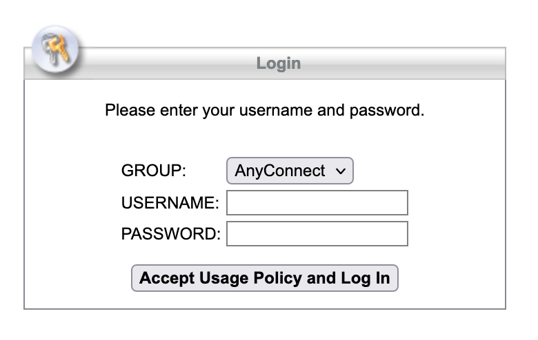
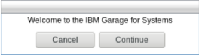
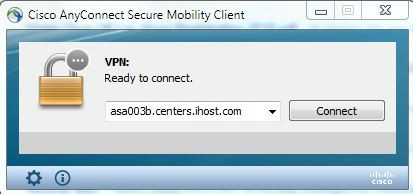
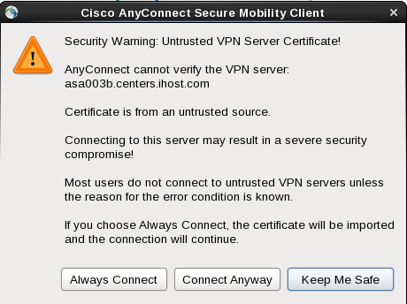
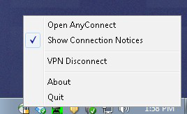

# Configure your VPN connection

:warning: *If you are an IBMer* either at an IBM location or connection to IBM from home or remote office through Cisco AnyConnect, you don't need to use this guide. You already have access to the systems from the IBM intranet.

## Windows

### Download Cisco AnyConnect

:warning: If you already have cisco 4.4 or greater installed on your system, you should skip to [Connecting the VPN](#connecting-the-vpn).


Open your browser and enter [https://asa003b.centers.ihost.com](https://asa003b.centers.ihost.com) in the address field. If for some reason the name is not resolving, you can use the IP address (32.97.185.16). The URL will automatically expand to the one shown in the following screenshot:

You will be presented with the welcome screen shown above. If you do not see it, if the page does not load, there are some things to check:
1. Do you have a firewall installed on your system that may be blocking the connection?
2. Is your browser configured with a proxy that restricts access to certain sites?
3. Are you on a corporate network with restricted internet access?
You may need to engage your local IT helpdesk to help resolve the connectivity issues.

Assuming the page loads properly, choose the default *AnyConnect*. 



Then, enter the VPN username and password assigned to you.

Before clicking **ACCEPT Usage Policy AND Log in** please read and understand the usage policy accessible via the link at the top of the log in page.

If the authentication succeeded, you will see a welcome screen.



If authentication did not succeed, you will see a “Login Failed” message. Verify the password and try again, and if it still does not work, contact support.

Once you click 'Continue', the download and install process will begin. You will be presented with the following screen which will be tailored to your operating system.


Click on the Download button to begin downloading the client installer. Save the file to a known location for easy access.

Once the download completes, browse to the location of the saved file and open, run, or execute the file as required by your OS.

This will attempt to install the VPN client. During this process you may see various warning messages from the browser, from anti-virus application, or from the OS itself (password requested for installing new software, etc). In all cases, it is important to be aware of what the messages say.

Choose appropriate selections that will allow the install to continue. 

### Connecting the VPN

Start the client, enter **asa003b.centers.ihost.com** in the box and click connect. When prompted choose **AnyConnect** as the group, and enter the VPN id and password assigned to you.



Users on Linux may see an initial warning message saying the server is untrusted. This is a known bug, and is not accurate (the gateway does use an SSL certificate from a known and trusted CA). If this happens to you, please select 'Connect Anyway' and then enter the information as mentioned above.



If your connection to the gateway fails, please contact support.

If the connection is successful, you will see the VPN client icon in your system tray (or equivalent)



Right-clicking the icon will bring up a menu where you can see more details or disconnect/quit your session.

Congratulations, you are now able to access the resources assigned and provided to you. 

## Red Hat / CentOS / Fedora Linux

[NetworkManager's openconnect VPN plugin](https://gitlab.gnome.org/GNOME/NetworkManager-openconnect) can be used. Make sure the plugin's RPM was installed, and then create a new VPN profile via Gnome's Settings panel, or via command-line like this:
```
sudo dnf install NetworkManager-openconnect-gnome
nmcli connection add type vpn connection.id IBM-TECH-ZONE vpn-type openconnect vpn.data gateway=asa003b.centers.ihost.com ipv4.dns-search ihost.com
```

:information_source: For Ubuntu, consider `sudo apt install network-manager-openconnect-gnome`
