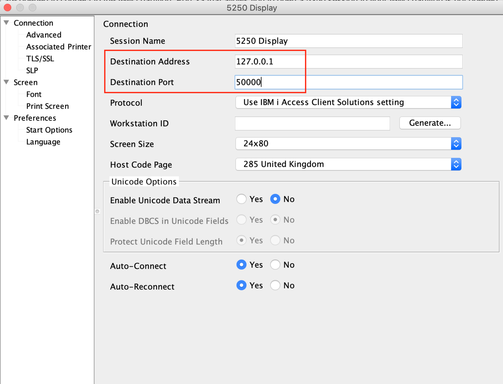

# Connecting to Power Systems Virtual Server IBM i Environments

By default not all the ports are opened on the IBM Cloud firewall to connect to the IBM i partition. Port 23 that allows you to open a 5250 session to your IBM i partiiton is **NOT** open.

You can visit this page [https://cloud.ibm.com/docs/power-iaas?topic=power-iaas-network-security](https://cloud.ibm.com/docs/power-iaas?topic=power-iaas-network-security) to have more information about the list of opened ports.

As PowerVS does not yet support security groups, at least at the time of this writing, we do not have the ability to open additional ports.    

To connect to your IBM i partition, you must open a SSH tunnel to redirect local ports from your local machine to remote ports of your IBM i system. Opening a SSH tunnel is different if you run on a Windows or Linux/Mac OS machine.

Read IBM Cloud official documentation here [https://cloud.ibm.com/docs/power-iaas?topic=power-iaas-connect-ibmi](https://cloud.ibm.com/docs/power-iaas?topic=power-iaas-connect-ibmi) to get the right procedure.

> At the beginning of the page, you are requested to start SSH server issuing STRTCPSVR SERVER(*SSHD) from the console. Skip this task as SSHD is started automatically at IPL. You can also skip the paragraph "Starting the TCP servers" as they also start at IPL automatically.

By default, for security purpose, we disabled SSH authentication with password, so you must use SSH key authentication.

This will let you open a 5250 session using your loopback IP address (127.0.0.1 or localhost) and port 50000 automatically redirected to the port 23 of your remote IBM i partition.

