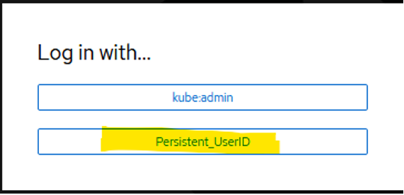
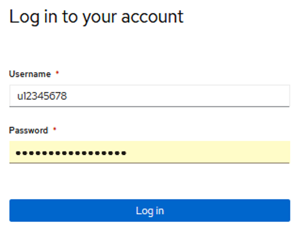
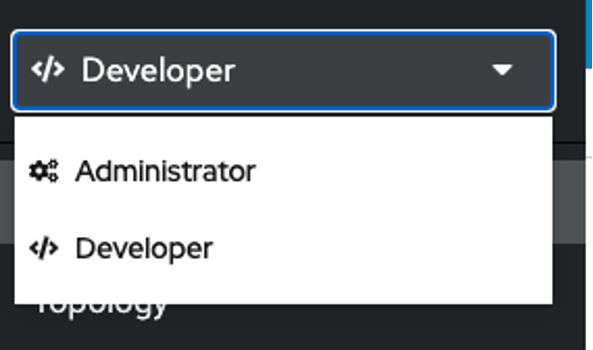
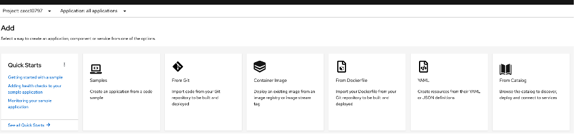
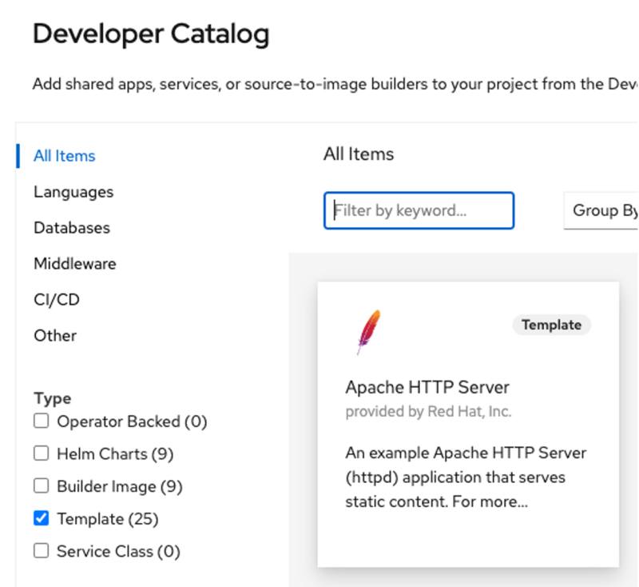
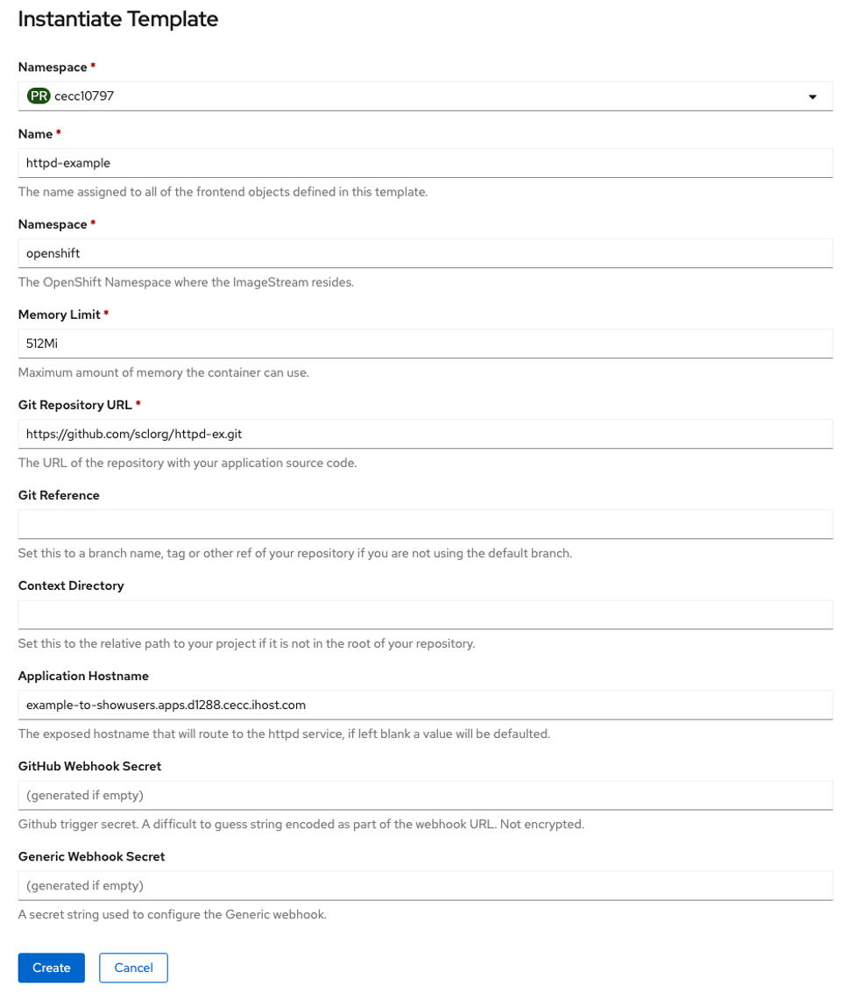
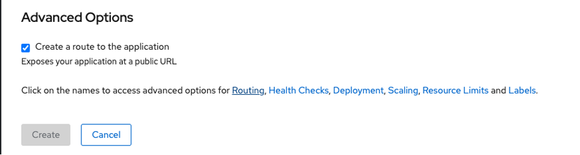

# OpenShift Multi-Tenant Cluster

Instructions on how to login and create sample applications using the Openshift on Power multi-tenant environment.

Login into the Openshift console from project kit provided to you using your persistent user id and password. 

        

    
Go to Developer account as shown below

## Example 1

If you choose “From Catalog” from the below screenshot, go to step 4

    
I selected Apache template as an example below

  
Once I selected http in the catalog, template auto populates with necessary information. Please enter **Application Hostname** with the **wild card dns entry** information in your project kit to create applications. It creates the route and lets you access the applications on your web browser. In the below image, application hostname entered is an example and do not use it.

        
## Example 2

If you choose the “Container Image” as shown below, please follow the below instructions.

    
Go to Advanced options to the bottom of the page and click on Routing as highlighted below.

    
Once you click on Routing, you should see the below options as shown in the image below. Enter your Hostname with the **wild card dns entry**  information from the project kit provided to you. Once you enter the hostname, you will see that the application creates a route for you and you will be able to access it using your web browser.
