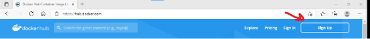
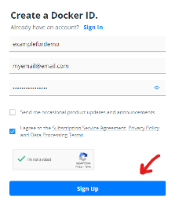
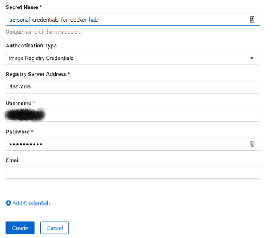
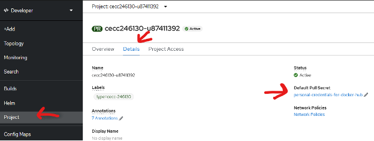
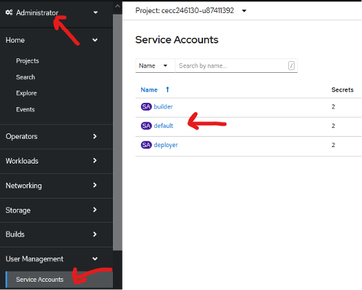
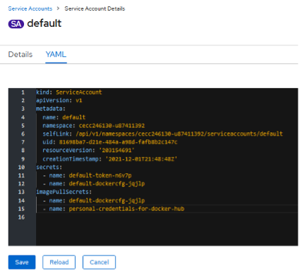
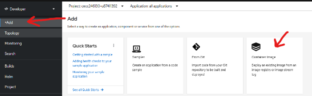
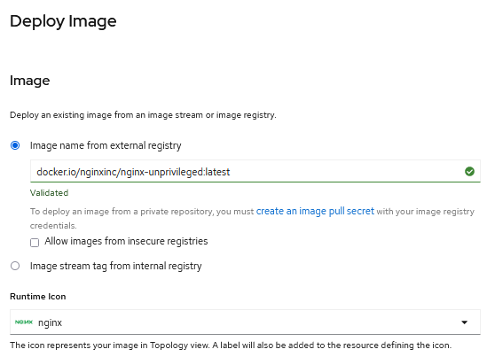
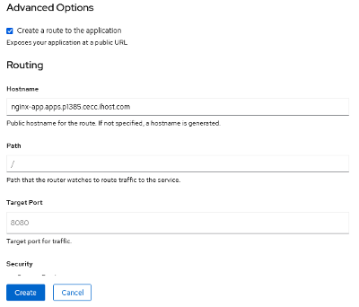
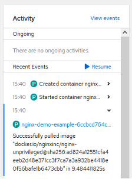

# OpenShift Rate Limiting

Docker Hub has imposed rate-limiting on anonymous access for image downloads (aka, pulls). The limit is tracked at an IP level and is currently set to 100 pull requests every 6 hours. Details can be found here: [https://docs.docker.com/docker-hub/download-rate-limit/ https://docs.docker.com/docker-hub/download-rate-limit/]

By default, OpenShift uses anonymous access, and so in environments that share the same external IP (such as found in Technology Zone for Systems, formerly known as CECC), it is possible and common to hit this restriction. Attempts to pull images will fail with error messages such as ImagePullBackOff, indicating that the image could not be pulled – and a closer look at the error message should indicate that rate limit was exceeded. This can be confusing for those who just received access to their OpenShift and have not performed any previous pulls but if your environment is not directly on the internet, traffic to the internet likely goes through a firewall that is converting your lab IP to a shared internet one (aka NAT), and Docker Hub is counting all pulls from that NAT IP.

The purpose of this guide is to walk through the steps to obtain your own (free) account on Docker Hub and apply these credentials to OpenShift when pulling images. Note that the free account tier still has rate-limiting imposed, but that is 200 pulls every 6 hours – and is tracked by your login, not by IP.

Note that the OCP instance used in this guide was reserved through the IBM Technology Zone – technically the Multi-tenant cluster on Power which is currently available through the Technology Zone for Systems portal (formerly known as CECC): [https://techzone.ibm.com/collection/cloud-for-enablement-and-co-creation-cecc https://techzone.ibm.com/collection/cloud-for-enablement-and-co-creation-cecc]

In the multi-tenant offering you are given developer access to a project which is dedicated to you, but do not have full admin access to the cluster. As the focus of this guide is accessing Docker Hub using your credentials and pulling images from there, the developer access is sufficient. If you have full admin access to a dedicated OpenShift, the steps below should be the same.

## Create an account on Docker Hub

Go to [https://hub.docker.com/ https://hub.docker.com/] and click Sign Up

If you already have an account, you can skip this of course and go to Step 2.

Fill out the sign up fields:

*Docker ID 
*Email 
*Password 

It is your option to opt-in to receive email updates about Docker

Check your agreement (after reading them of course) to the Service Agreement and Privacy Policy

Check the captcha and hopefully prove you are not a robot by clicking images

Click Sign Up

You should receive an email confirming your account.

## Create secret in OpenShift

Click Secrets on left-hand menu, then Create and select Image Pull Secret

Provide a Secret Name that is meaningful to you and your project.

Keep Authentication Type as given: Image Registry Credentials

For Registry Server Address, use docker.io for Docker Hub

Username is the Docker Hub ID you created in Step 1

Password is the password for that Docker Hub ID

Email is not required

Click Create

## Assign secret to the service account

This is the confusing part that can lead people astray, or rather to think that this step isn’t needed. If you go to Project and Details you will see that the secret you created is listed as default (assuming it is the only pull secret created in this namespace):

But this is misleading because the secret isn’t actually used in image pulls until it is added to the service account. To enable this:

Switch to Administrator context, click on User Management and Service Accounts, then click on default

Click on YAML tab and then edit by adding your secret under the imagePullSecrets section:

Click Save

You can now switch back to Developer context and continue your project.

## Perform the image pull from Docker Hub

This step depends on what you are trying to do, and if you hit the rate-limiting you likely already know what image(s) to pull. But for sake of completeness, this guide will walk through the creation of a simple application involving the nginx container image.

Select +Add and click Container Image

Under Image name from external registry, enter the appropriate location for the Docker Hub image. As mentioned, this guide was created and tested using the Multi-Tenant OCP on Power offering, and so the appropriate Power (ppc64le) nginx image (that does not require root privileges) is given.

This may be all you have to enter; for the multi-tenant instance it is configured with an ingress router defined on a different VLAN from the main (web UI/API) instance, and so it is necessary to go to Advanced Options and click on Routing to specify the appropriate hostname. Refer to your project kit if you also are using the multi-tenant offering.

Click Create

The progress of the application install can be tracked by going to Project and viewing the Activity feed. You should hopefully see events like the following:

Once complete, validate the application – in this case, that the nginx web server is reachable via the given route on port 8080:

Success!
