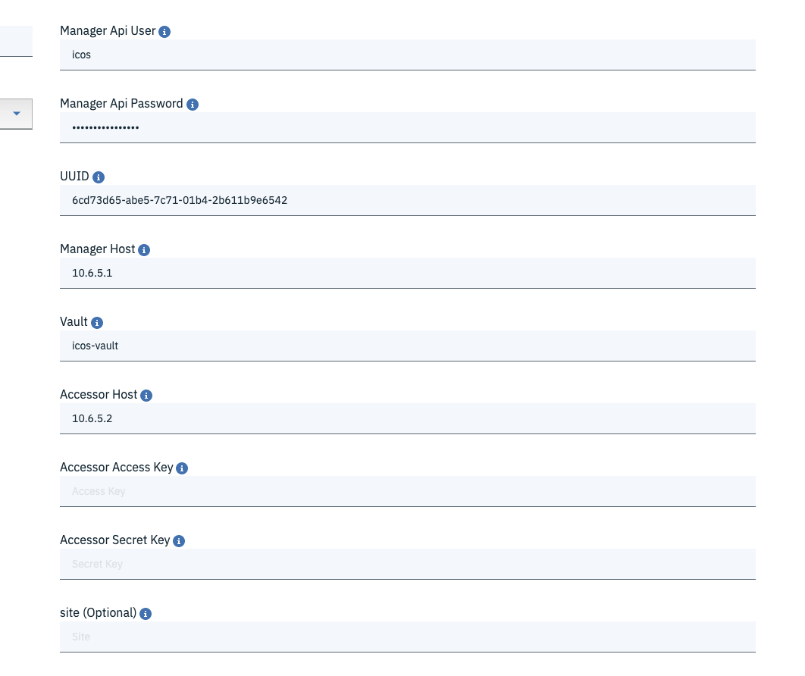

# IBM Spectrum Discover

IBM Spectrum Discover is modern metadata management software that provides data insight for exabyte-scale unstructured storage. IBM Spectrum Discover easily connects to multiple file and object storage systems both on-premises and in the cloud to rapidly ingest, consolidate and index metadata for billions of files and objects, providing a rich metadata layer on top of these storage sources. This metadata enables data scientists, storage administrators, and data stewards to efficiently manage, classify and gain insights from massive amounts of unstructured data. If you're new to Spectrum Discover, we strongly recommend you take some time to familiarize yourself with the product and its capabilities beforehand. A great place to start is the online Spectrum Discover product documentation.

Additionally, check out:

[https://www.ibm.com/us-en/marketplace/spectrum-discover](https://www.ibm.com/us-en/marketplace/spectrum-discover)

[http://www.redbooks.ibm.com/redpieces/abstracts/redp5550.html?Open](http://www.redbooks.ibm.com/redpieces/abstracts/redp5550.html?Open)

[https://www.ibm.com/support/knowledgecenter/en/SSY8AC_2.0.0/isd200_welcome.html](https://www.ibm.com/support/knowledgecenter/en/SSY8AC_2.0.0/isd200_welcome.html)

Your Spectrum Discover environment is connected to IBM Cloud Object Storage (ICOS) and IBM Spectrum Scale.

## How to connect to Spectrum Discover

Open your web browser and connect to [https://hostname.cecc.ihost.com](https://hostname.cecc.ihost.com) or [https://ip_address](https://ip_address) using the hostname or IP address provided in the CECC portal.

Use the credentials that are provided in the CECC portal.

## How to connect to data source

### Spectrum Scale

1. Log in to the IBM Spectrum Discover web interface with a user id that has the data admin role associated with it

 a. Username: <username>
 b. Password: <password>

2. Select Admin from the left navigation menu.

 Clicking Admin displays the different types of data source connection names, platforms, clusters, data source, size, and Add Connection.

3. Click Add Connection to display a new window that shows Data Connections Add Data Source Connection.

4. In the field for Connection Name, define a Connection Name.

5. Click the down arrow for Connection Type to display a drop-down menu for Choose an option and two line items, Cloud Object Storage and Spectrum Scale.

 Select the connection type IBM Spectrum Scale.

6. In the screen for IBM Spectrum Scale, complete fields, then click Submit Connection.

### For IBM Spectrum Scale connections

Connection name

The name of the connection, an identifier for the user: < >

```
  User: spectrumscale
  Password: sC4le!s5oGr3art
```

 Working Directory: /gpfs/gpfs0/scratch/CECC_PROJECTID_RESERVATIONID   

#replace PROJECTID with your own project id found in CECC portal 
#replace RESERVATIONID with your own reservation id found in CECC portal 
#the result must look like /gpfs/gpfs0/scratch/CECC_1234_56789 


```
 Scan Directory: /gpfs/gpfs0/dataSource
 Connection Type: Spectrum Scale
 Cluster: spectrum-scale
 Host: 10.6.5.4
 Filesystem gpfs0 
 Node list: spectrum-scale  
```

### IBM Cloud Object Storage (ICOS)

1. Log in to the IBM Spectrum Discover web interface with a user id that has the data admin role associated with it

 a. Username: <username>
 b. Password: <password>

2. Select Admin from the left navigation menu.

 Clicking Admin displays the different types of data source connection names, platforms, clusters, data source, size, and Add Connection.

3. Click Add Connection to display a new window that shows Data Connections Add Data Source Connection.

4. In the field for Connection Name, define a Connection Name.

5. Click the down arrow for Connection Type to display a drop-down menu for Choose an option and two line items, Cloud Object Storage and Spectrum Scale.

 Select the connection type IBM Cloud Object Storage.

6. In the screen for IBM Cloud Object Storage, complete fields, then click Submit Connection.

### For Cloud Storage Object connections Manager

```
 Manager API user: icos
 Manager API Password: iCos!s3ven8ett3R
 UUID: 6cd73d65-abe5-7c71-01b4-2b611b9e6542
 Host: 10.6.5.2
 Vault: icos-vault
```


