# Onboarding users for CPDaaS / watsonx.ai SaaS workshops

## General Recommendations to Onboard Users for SaaS Workshops

1.	It is recommended to ask attendees to sign up for [watsonx.ai trial account](https://dataplatform.cloud.ibm.com/registration/stepone?context=wx) before the workshop as a prerequisite.

2.	If somehow the attendee fails to sign up for a trial account, you can create student ids using AppID service on IBM Cloud and assign them to whoever need an account at the workshop. This rest of the document will walk you through the step to create student ids in AppID.

3.	For Business Partners, they should be able to reserve an environment in TechZone: for watsonx.ai SaaS, [reserve this one](https://techzone.ibm.com/my/reservations/create/64b8490a564e190017b8f4eb). 

## Create App IDs to Onboard Users

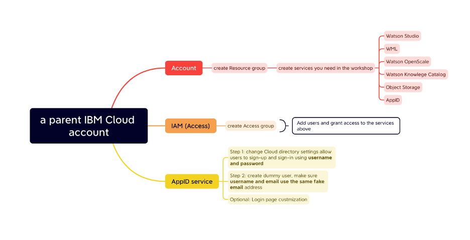

### Create Resource Group to Host Services for the Workshop

1.	In the account with which you will host the workshop, create resource group by Manage -> Account -> Resource group

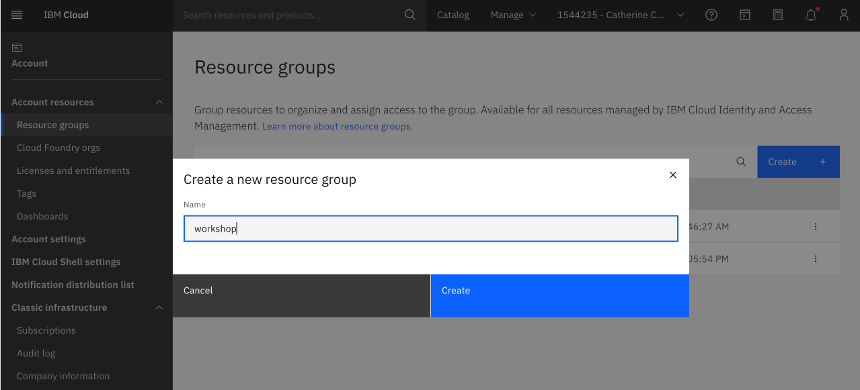

2.	In the Catalog, search and create services you need for the workshop in the catalog. Make sure you create them in the resource group you just created, and choose paid plans so that you won’t run out of tokens or quota during the workshop. For example, for data science workshops, the following services need to be created.

    - Object Storage (Lite plan)
    - Watson Studio (Dallas, Professional plan)
    - Watson Machine Learning (Essentials plan)
    - Watson OpenScale (professional)
    - Watson Knowledge Catalog (Lite)

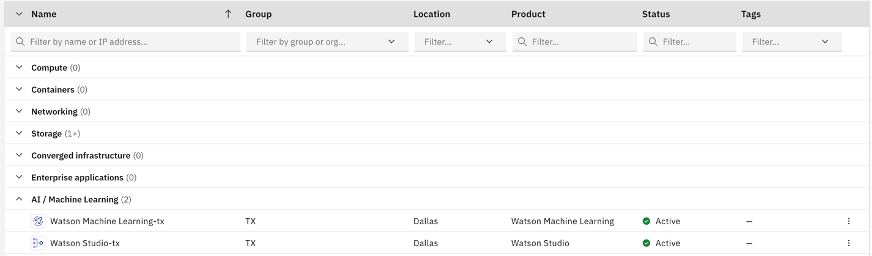

### Configure App ID

1. Make sure you create an App ID service as well.

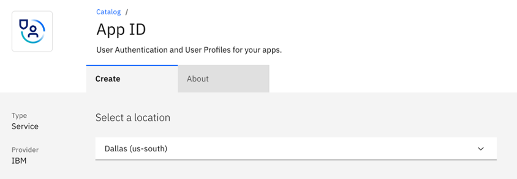

2. Go to AppID -> Cloud Directory -> settings, set allow users to sign-up and sign-in using Username and password.

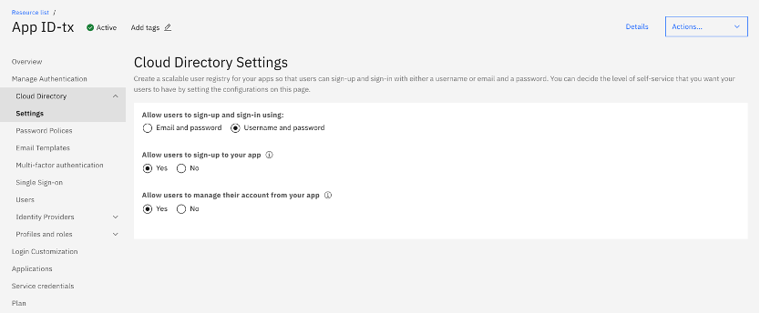

3. Go to App ID -> Cloud Directory -> Users -> Create 

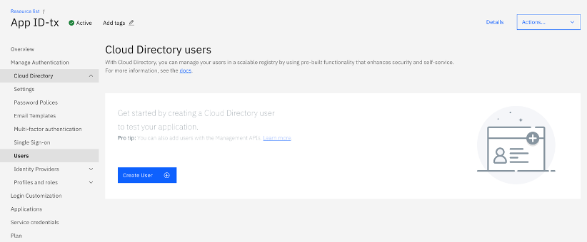

Fill out the form to add dummy users using fake username / email and random password. Make sure use the same email for username and email.

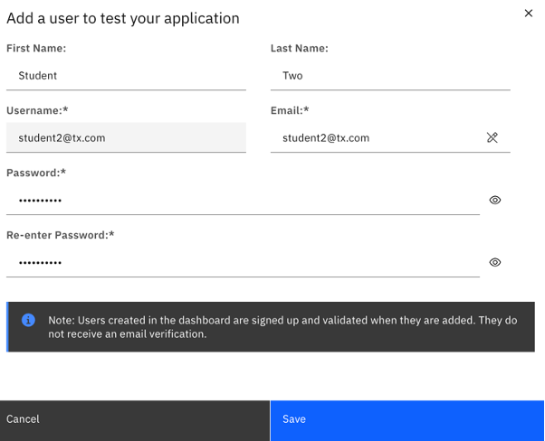

4. In Manage Authentication view, turn off options for Identify providers we don’t use such as Facebook, Google, etc.

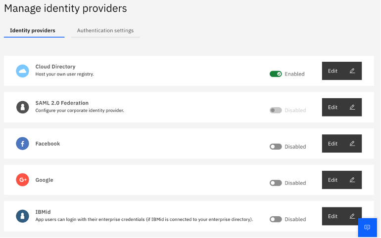

5. Optionally, in Login Customization view, you can customize login page for your workshop.

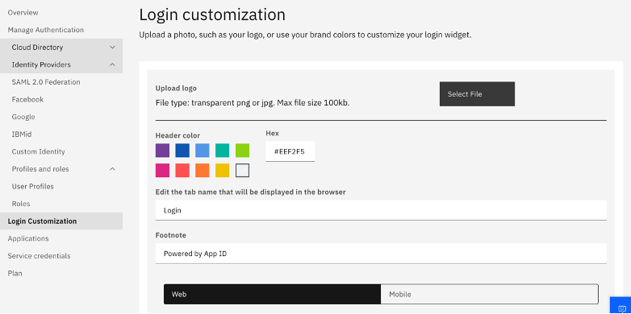

### Configure Identity Providers

1. Go back to the cloud console, Manage -> Access (IAM) -> Identity providers -> create. Provide it a name and select the appID instance you created. Leave the rest as default.

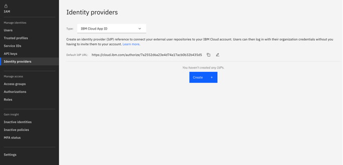

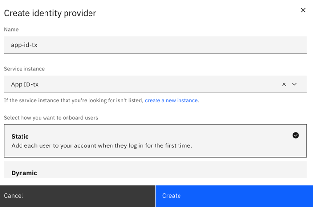

Note: The url is what you need to share with your workshop attendees for login using App ID. The part highlighted in red is the alias for the App ID by default, you can click the pen icon to customize it, eg. techxchangelabs

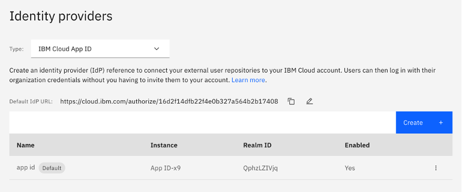

### Configure Access Group

1. Create access group: Manage -> Access (IAM) -> Access group -> create

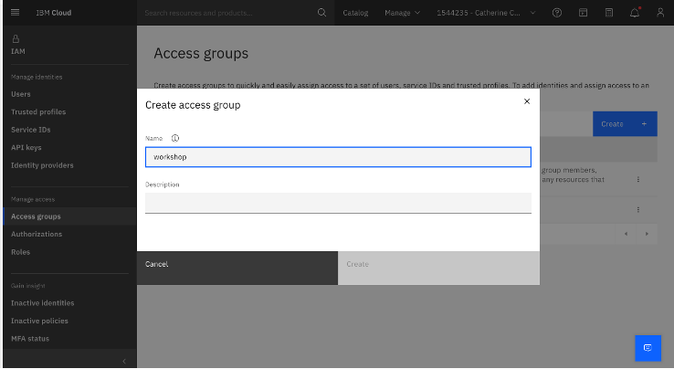

2. In the Access tab, assign access to all the services needed in the workshop.

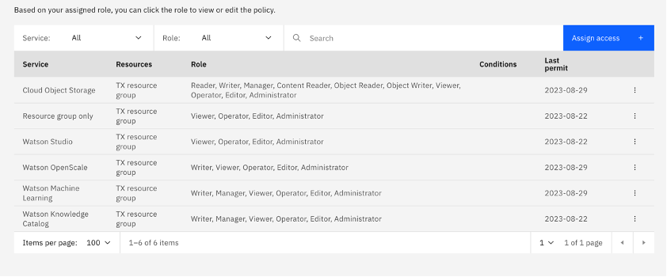

3. In the Dynamic rules tab, add a new rule. Provide a name, choose App ID as the authentication method, and choose the identity provider you created earlier. Add a condition: (in this case as long as the given name of all the dummy users is not 0, the condition is always met, users will be allowed to login.)
    - Allow users when: given_name
    - Qualifier: Not Equals
    - Values: 0

### First Login

Test the login. In a private browser window, go to the default IdP URL as shown in the identity provider view. Login using the email and password you created in App ID. You should be able to login to IBM Cloud.

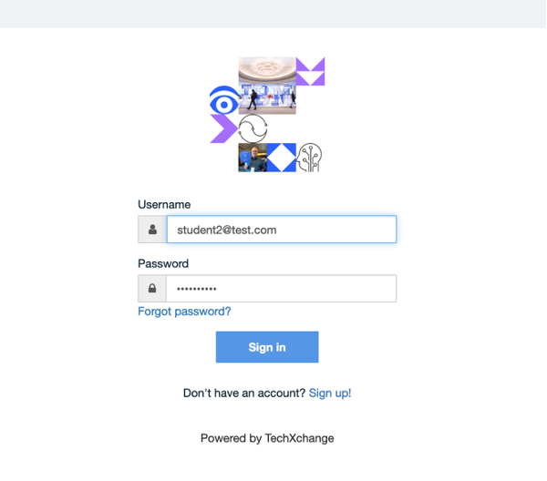

### Add Users to Access Group 

1. Once they login, as account admin, you can then add those users to the access group by Manage -> IAM -> Access group -> Users -> add users.

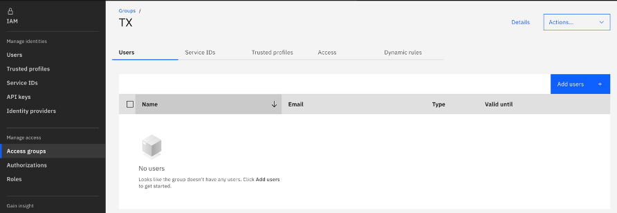

From the user list, select the dummy users and add to the group.

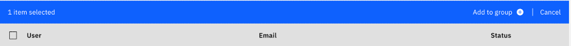

2. Now the dummy user should be able to see the services you created for the resource group.

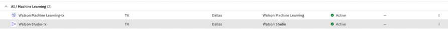

## How Users Login at the Workshop

1.	Go to login page:
    - Cloud Pak for Data: https://dataplatform.cloud.ibm.com/login
    - watsonx.ai: https://dataplatform.cloud.ibm.com/login?context=wx

2. Login with AppID, the alias is techxchangelabs They will be redirected to the AppID login page. From here, attendees login using the username and password you assigned them.

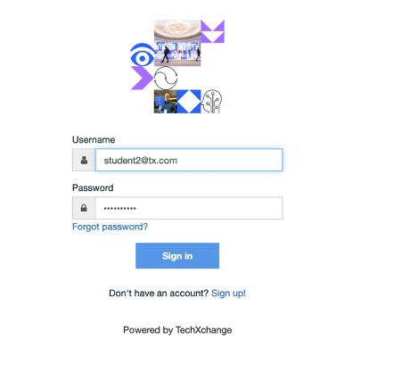

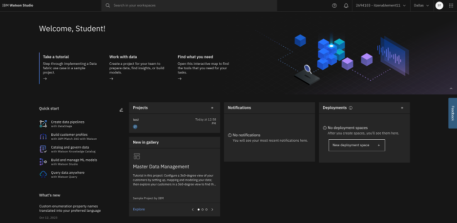
