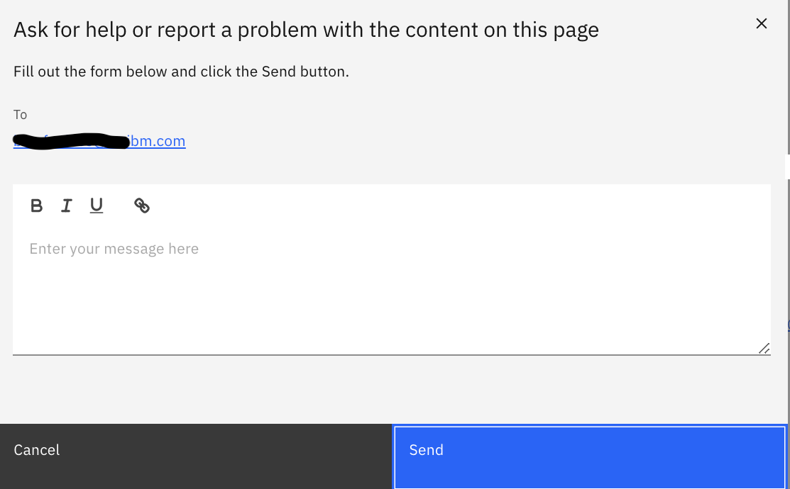

## Content Support

Content Support for all Collections, resources and environments are handled by the Content Author

To report/log a content issue follow steps listed below.

1. Go to the Collection/resource
2. Click on the Question Mark "Ask for help" 
3. Select the "Ask for help or report a problem with the content on this page" 
4. Fill out the form with details and click send 
5. This will go directly to the content author, collaborators or the support contact listed for the collection/resource. 
   Kindly note in some collection/resource instances, clicking on the "Ask for Help" button will direct you to slack channels for support
