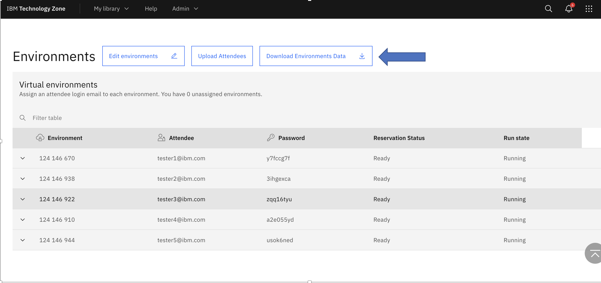

public link: https://github.com/IBM/itz-support-public/blob/main/IBM-Technology-Zone/IBM-Technology-Zone-Runbooks/DownloadWSEnvInfo.md

# How to Download Workshop Environment Information to a Spreadsheet
Workshop Manager will maintain a list of environments and assigned students. But some users prefer to manage the workshop own their own in a spreadsheet. 
Workshop Manager allows you to download a ".csv" file (spreadsheet) with a list of students and their assigned environment information.

To download the spreadsheet:
1. Select you workshop from the "My Workshops" page. 
2. On the instructor page scroll down until you see the "Environments" section.
3. Click the "Download Environment Data" Button.

4. Depending on how your computer is set up, you will either be prompted on where to save the file or it will download to your computer's download folder.
5. You can then open the file with your favorite spreadsheet program.
   

* In order to download the spreadsheet the workshop must be in the "Scheduled" or "Active" state.

### Support

IBMers - use the [#itz-workshop-support](https://ibm-techzone.slack.com/archives/CTA2MV9AM) slack channel  

For any questions, contact ITZ support - techzone.help@ibm.com  
