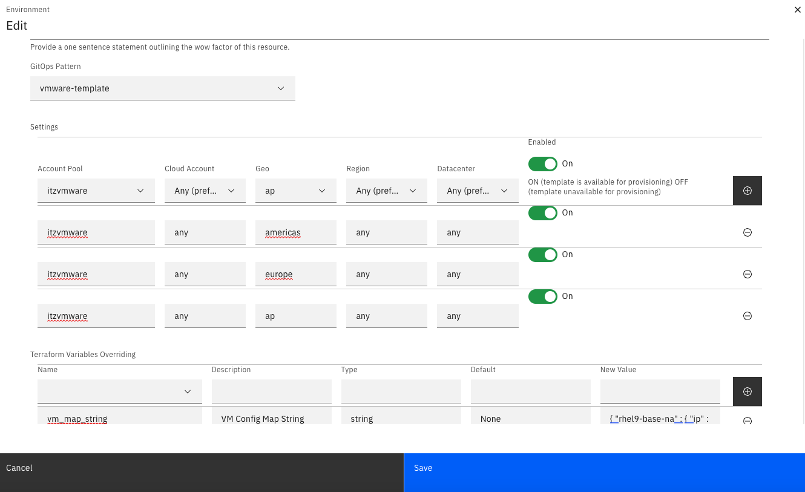

# Best Practices for Environment Definition

## Environment Definition Best Practices

1. For VMWare based infrasturcture:
    * Set 'Account Pool' to `itzvmware` in the majority of cases
    * Set 'Cloud Account' to `any`
    * Create an seperate entry for each Geo: `Americas`, `Europe` and `AP`.
    * Set Region to `any`.
    * Set Datacenter to `any`.
2. For IBM Cloud based infrastructure:
    * Set 'Account Pool' to `shared` in the majority of cases
    * Set 'Cloud Account' to `any`
    * Create an seperate entry for each Geo: `Americas`, `Europe` and `AP`.
    * Set Region to `any`.
    * Set Datacenter to `any`.
3. For any patterns that require a specific account and/or data center to be successful, then work the TechZone team to help configure the Environment entries properly. 

## How does Dynamic Workload Placement Work

### Definitions

* Account Pool - This is used to group multiple accounts/locations that are configured the same into a pool of accounts. This helps us expand capacity across multiple IBM Cloud accounts without running into quota issues.
* Cloud Account - This is a specific cloud account to use. This field is only used for certain Environments where there is a specific need to use a particular account, does this field get set to anything other than `any`. If there is a need to use a specific account, then there will be a specific Account Pool set up for just that purpose.
* Geo - These are `Americas`, `Europe`, and `AP`. Ideally a user wants their workload to be as close as possible to them. We use this field for that purpose. We will not attempt to deploy workload to any other Geo. 
* Region - This is an IBM Cloud specific field that we don't use any longer. Leaving to `any` is always the safe choice.
* Datacenter - This is used, similar to the Cloud Account field, only when a specific datacenter must be used. 

### How we decide where to place workload

1. Once a user requests a reservation, our reservation micro service (reservation-ms) will pick it up and start processing.
2. reservation-ms will then send the requested Account Pool, Geo, Accounts, Region, and Data Centers to the capacity scheduler (scheduler) service.
3. scheduler will then perform the following steps:
    1. Expand the Accounts requested to all within the Account Pool (i.e. if the reservation has the Account `ITZ-V2` and the Account Pool is `shared` it will also add `ITZ-Squad`).
    2. Expand the Data Centers requested to include all within the Geo and Accounts in the Pool. 
    3. At this point we have what is called a Score Map with multiple Account/DataCenter pairs.
    4. Look up current capacity usage for each Account/DataCenter pair.
    5. Apply a score to each Account/DataCenter pair based on availability of CPU, memory, Storage, and other metrics that we track.
    6. Select the highest scoring Account/DataCenter pair.
4. scheduler will then return the selected Account/Datacenter pair to reservation-ms and a Capacity field with true or false. Sometimes the answer is false as none of the options have capacity. 
5. If the overall answer to "Is there capacity available" is no, reservation-ms will mark the reservation as "Failed" with a result of "Insufficient capacity"
6. Otherwise it will send the reservation and all details for the Account/Datacenter selected to our gitops provisioning service for provisioning.
