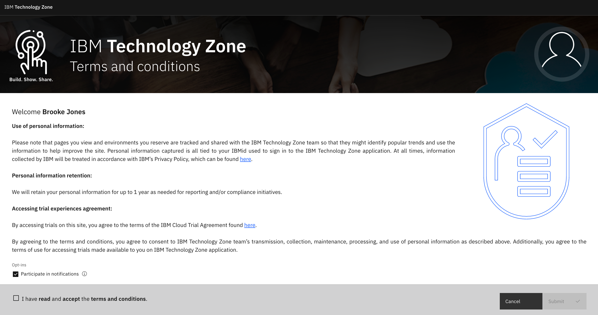
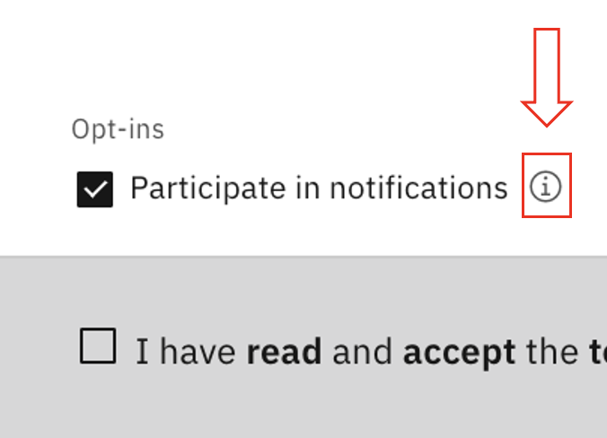
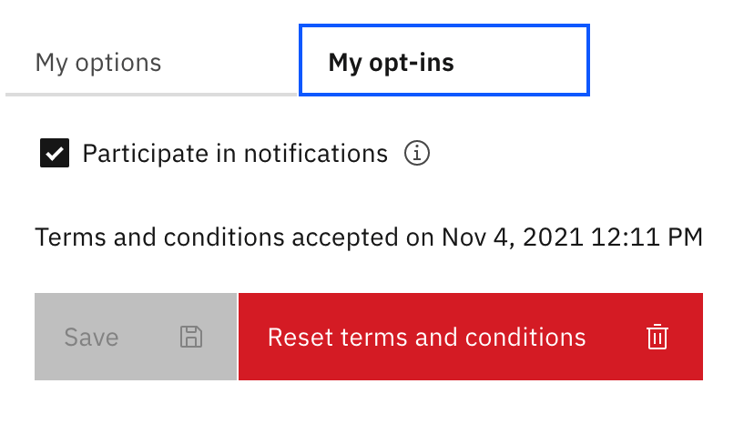

# GDPR Guidelines and Features (For Clients)

IBM Technology Zone is algined with IBM GDPR standards and have created this page to properly capture your sign off on the data that we capture from you logging in and using the site.

In order to use IBM Technology Zone, you have to agree to the terms and conditions by checking the checkbox at the bottom left of the page.

The optional opt-in options are as followed: 

- Participate in notifications

- Participate in content metrics and feedback

- Participate in leaderboards

Select the helper text icon for more information on each of these options.

## Change opt-ins at any time

Once logged in, select your profile icon located in the L0 (top) navigation bar to the far right, then select "Profile". 

Select the "My opt-ins" tab.

As you change options the "save" button will display in blue so you can save your updated preferences.

A notification will display once your changes have been successfully captured to your profile. 

**IMPORTANT: Selecting the "Reset terms and conditions" button will present a modal to capture if you would like to unaccept the terms and conditions for using IBM Technology Zone. NOTE: Accepting "Yes" will immedietly log you out of IBM Technology Zone. If you would like to use IBM Technology Zone in the future, you will have to accept the terms and conditions from the initial GDPR page as shown at the beginning of this runbook.**

### Support

For any questions, clients should contact techzone.help@ibm.com.
