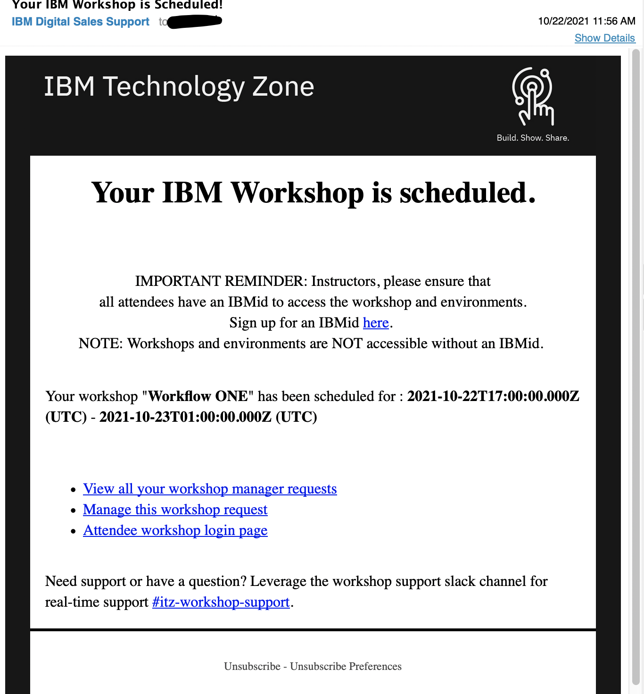
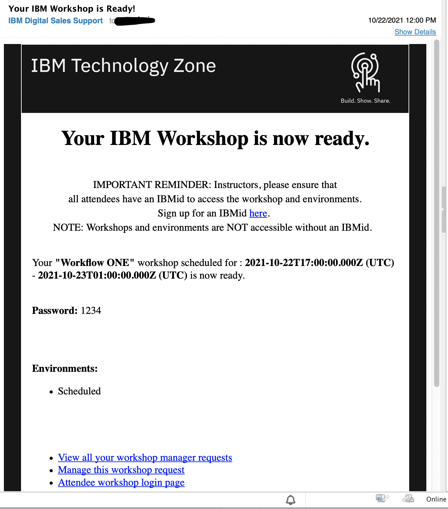
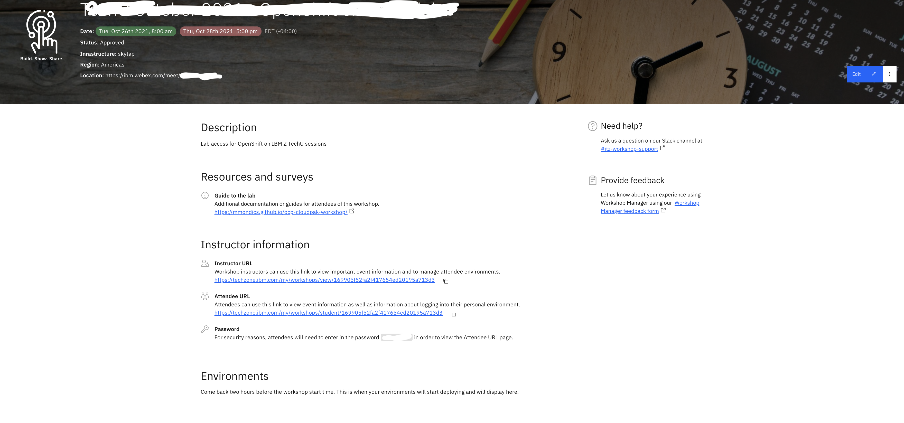
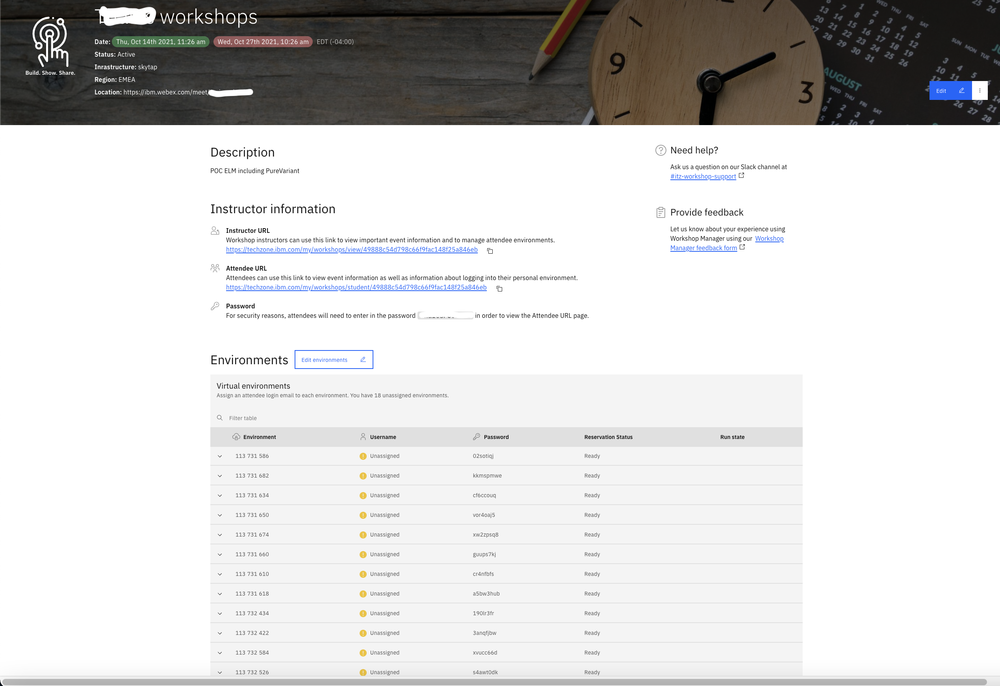
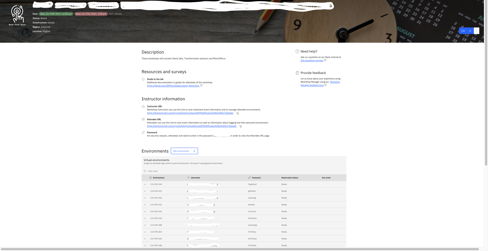
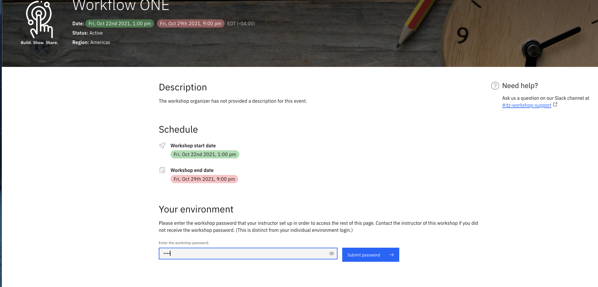
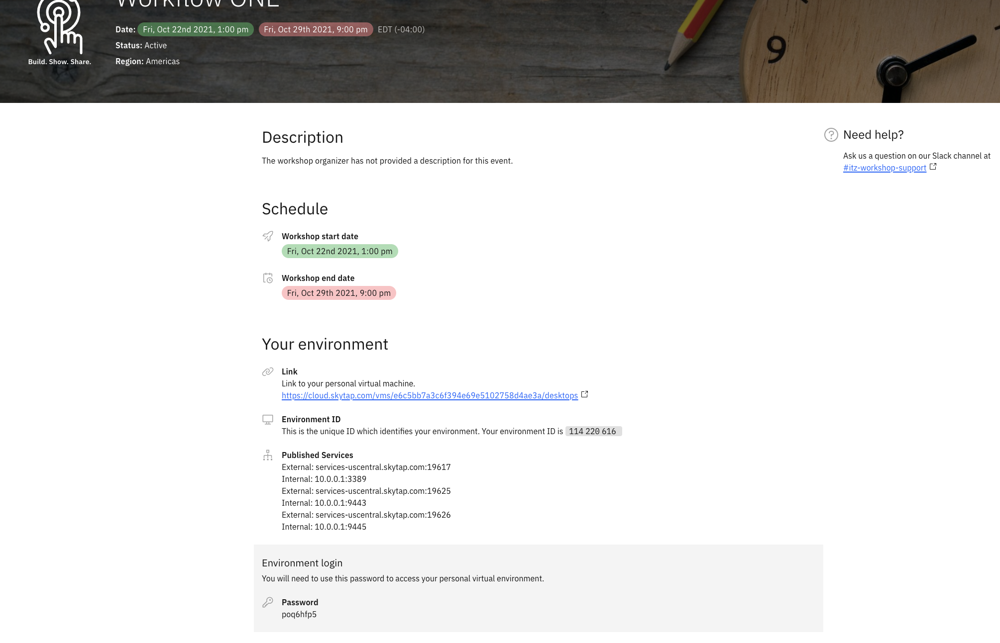
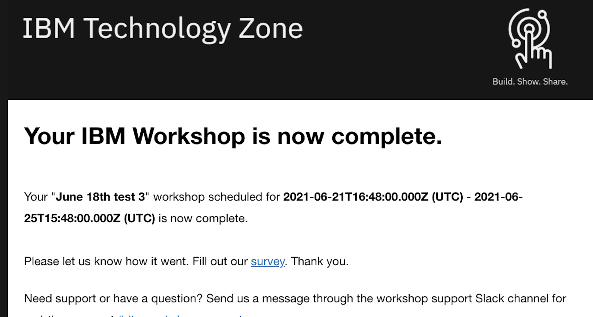

## How to for Instructors

Once an instrutor submits a Workshop schedule it is reviewed within 72 hours from when it is submitted. 

If your request is not reviewed send a note to #itz-workshop-support

1. When an instructor submits a schedule it is automatically placed in "pending approval" within 72 hours your request will either be denied or approved based on available resources, a notification is also sent to the #itz-worskhop-support channel.
2. Notifications are sent in slack #itz-worskhop-support channel for when your workshop is "pending approval", "rejected" or "approved", "ready/active"
3. You can view the status of your request directly from [My Workshop page](https://techzone.ibm.com/my/workshops) or using the instructors urls (Manage this workshop request) sent in the confirmation/scheduled email.
4. Instructors receive an email containing workshop details 24 hours before the schedule start date and time.

Example, Workshop Scheduled mail

Workshop Name, Workshop date and time 

- View all your workshop manager requests (contains a view of all your scheduled workshops)
- Manage this workshop request (manage your current workshop)
- Attendee workshop login page (attendee access link to the workshop)

Example Workshop Ready mails

Workshop Name, Workshop date and time, workshop password, Environments

- View all your workshop manager requests (contains a view of all your scheduled workshops)
- Manage this workshop request (manage your current workshop)
- Attendee workshop login page (attendee access link to the workshop)

5. You should send attendee url and Workshop password to all attending the workshops. IBM ids are required for access

6a. Environments are automatically claimed by students when they log in with "attendee url"
6b. Alternately you can manually assign environments to attendees from the Instructor page. 

7. Default deploy environment time is 4 four before the schedule start time and date. Attendees will not be able to access environment until the scheduled start date/time

Instructor view before environments are deployed. 
NOTE: environments are typically deployed 4 (fours) before the scheduled start time.

Instructor view after environments are deployed

Instructor view after environments are deployed and assigned/claimed by students

8. Once your environments are completely deployed and ready a slack notification is sent to the #itz-workshop-support channel

## Attendee view 

When an attendee clicks on the link provided by the instructor they are directed to enter password if the workshop is password protected. See below

Click on submit to access the workshop
- Workshop name, start/end date/time, Environment access details

9. Instructor will receive a workshop complete email. Kindly take a few mintues to take the survey attached in mail sent.

 

For support and inquiries use the Slack channel #itz-workshop-support

For Feed back click the "Workshop Manager feedback form" from the instructor page

For enhancement request " https://ibm.biz/techzone-enhancements"

