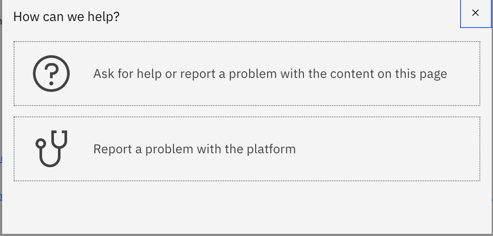

## How do I get Support?

1. Self help guides directly from IBM Technology Zone ["Help"](https://techzone.ibm.com/help) page
2. Fill the ["Contact us"](https://techzone.ibm.com/help) form a salesforce ticket will be generated.
3. Use the support email "techzone.help@ibm.com" a salesforce ticket will be generated.
4. Slack channel #itz-techzone-support (IBMer ONLY)
5. Ask for Help? button, this can be found from the resource/collection page by clicking on the Question Mark "?"

 a. Ask for help or report a problem with the content on this page : Use this selection for help with Content inquiry,documentation, passwords, collection inquiry, application. 
 This will go directly to the content author, collaborators or support contact listed by the content author.  
 
 
 
 
 Enter your inquiry/issue and click "Yes"
 
 b. Report a problem with the platform : Use this selection for help with platform inquiry, infrastructure inquiry. This will go directly to the IBM Technology Zone Support team
 

Enter your inquiry/issue and click "Yes"
