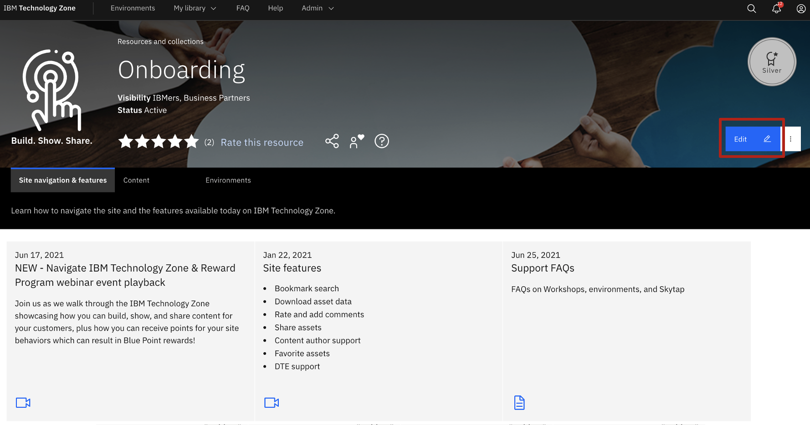
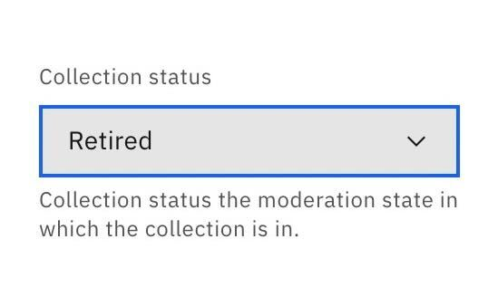
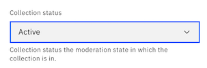

# How to validate content currency and update last updated date

1. Navigate to your collection from the **My library* tab in the top navigation bar.

2. Select **My created resources** to view all collections that you have created to date.

4. From the view collection page, select the **Edit** button located in the top right of the collection banner. 

5. Please look for and update the following within your collection (if applicable): 

Review the collection title & description.

Review resources (w/ links), environments, & journeys referenced on the collection.

Review owners and collaborators on the collection. [Update ownership or transfer ownership if needed by following documentation](https://github.com/IBM/itz-support-public/blob/main/IBM-Technology-Zone/IBM-Technology-Zone-Runbooks/transfer-collection.md).

Review and update taxonomy. [Update taxonomy by following this documentation](https://github.com/IBM/itz-support-public/blob/main/IBM-Technology-Zone/IBM-Technology-Zone-Runbooks/product-taxonomy.md#how-to-catalog-the-correct-taxonomy-for-your-collection-on-ibm-technology-zone).

Review and update brand. [Update or add a brand by following this documentation](https://github.com/IBM/itz-support-public/blob/main/IBM-Technology-Zone/IBM-Technology-Zone-Runbooks/product-taxonomy.md#selecting-the-correct-brand).

6. Click the **Save** button. 

## How to retire content that is not longer current

If after following the review process above (step 5) you determin your collection is no longer needed, please follow next steps to unpublish your collection.

1. Click on collection status located on the bottom right of collection edit form. 

2. Click the **Save** button. 

Note: Retired status is an archived state. This collection can be brought back at a later time, if needed. 

## How to republish a retired collection

If you would like to republish a collection that was once retired, then follow the following instructions. Note: changing the status of your collection will update the last updated date of your collection. Please follow additional guidance above in step 5 above to re-review your collection before republishing. 

1. Click on collection status located on the bottom right of collection edit form. Select Active to republish or draft if you have additional updates you would like to make before publishing.

2. Click the **Save** button at the bottom of the collection form. 

## Preview as you edit

Leverage the Preview option as you edit your collection to see how the changes will display on your collection once published.

* Preview option at the top of the page.

* Preview option at the bottom of the page.

