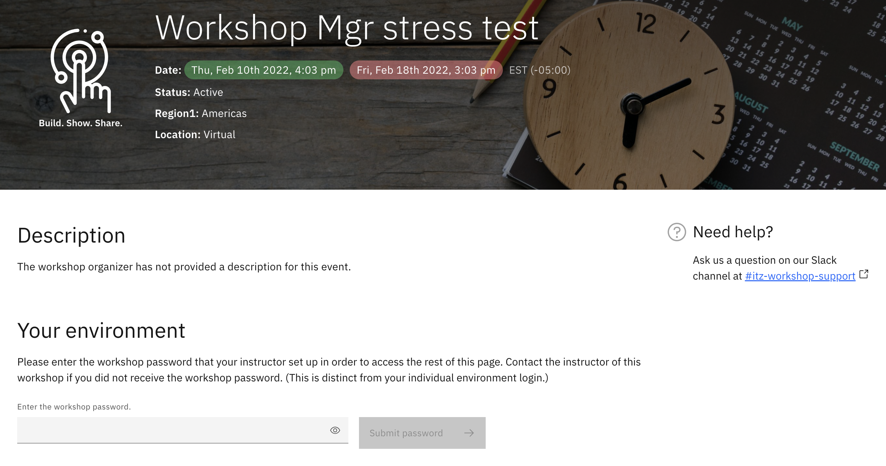
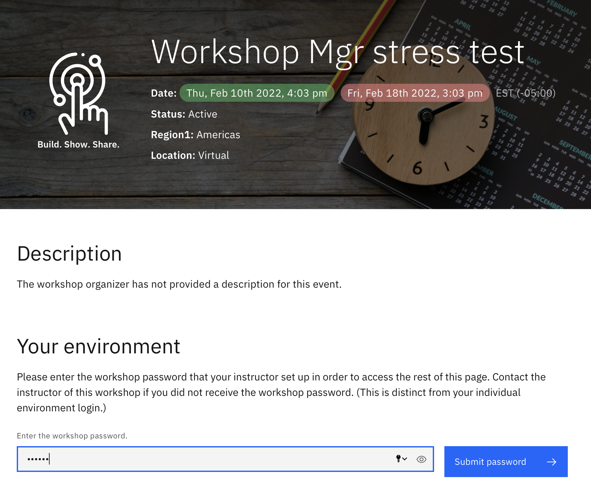
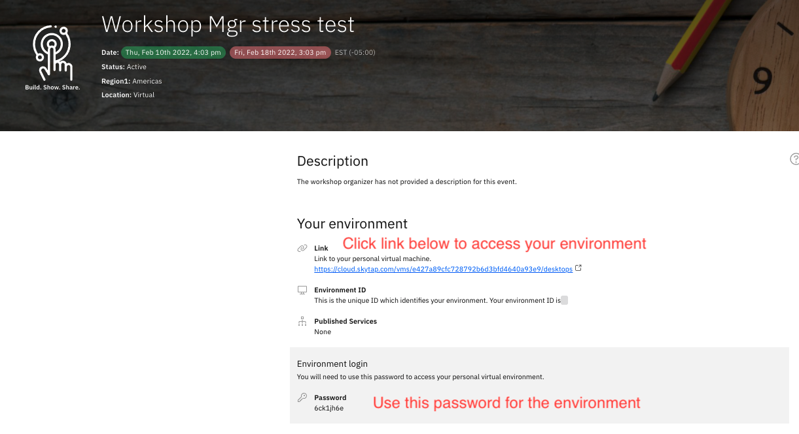

# How to for Attendee

Steps to claim a Workshop environment (Skytap)

1. Click on the Attendee url provided by your Workshop Instructor  
2. You will be required to log in using your IBM id. 
3. Once log in is completed, enter the Workshop Password provided by your instructor and click Submit Password  

Before Password is entered "Submit Password" is greyed out  
  

After Password is entered   
  

4. Your environment details will be provided, click on "Link" to access your environment use the Environment login Password to log into the environment  
  

Contact your Workshop Instructor if you have any questions.  
