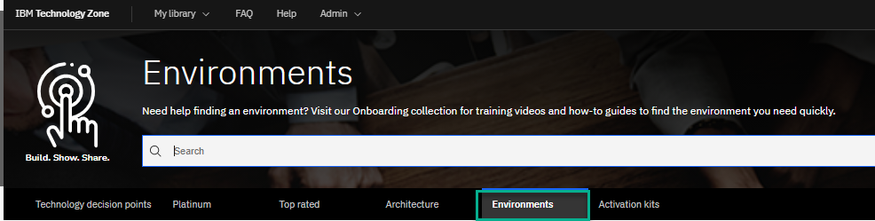
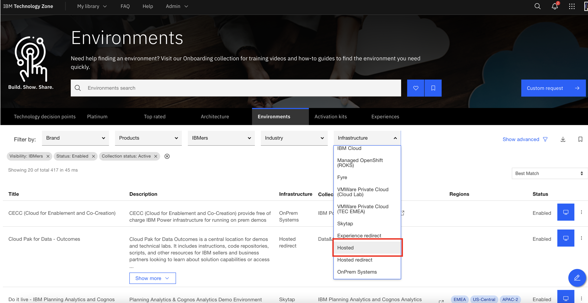
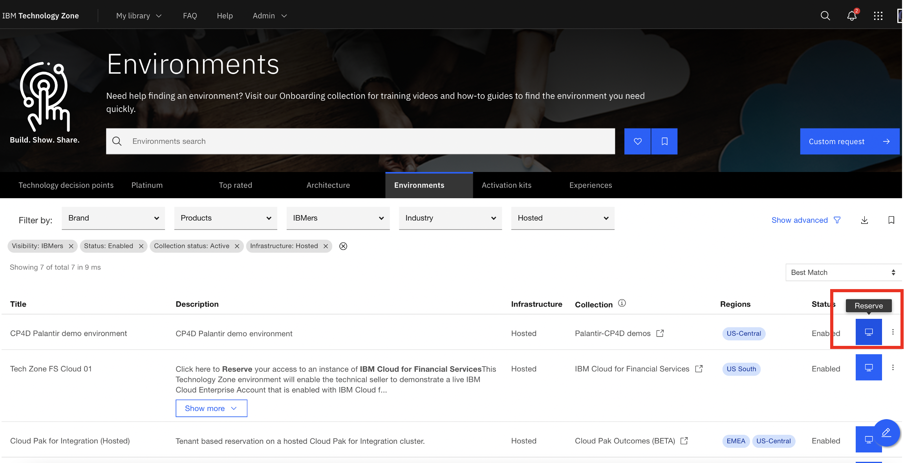
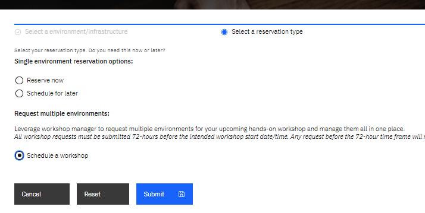
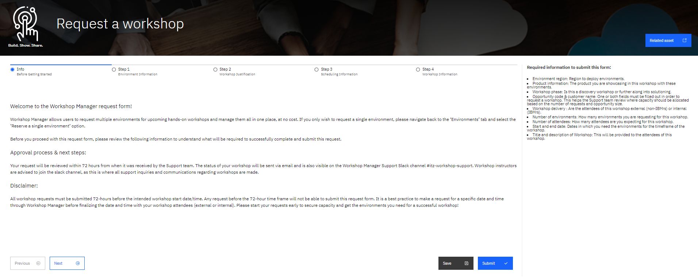
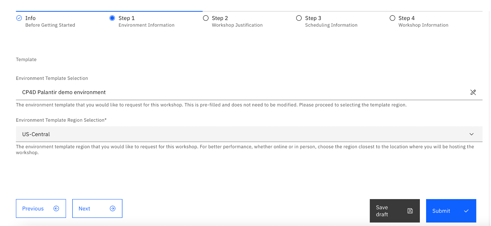
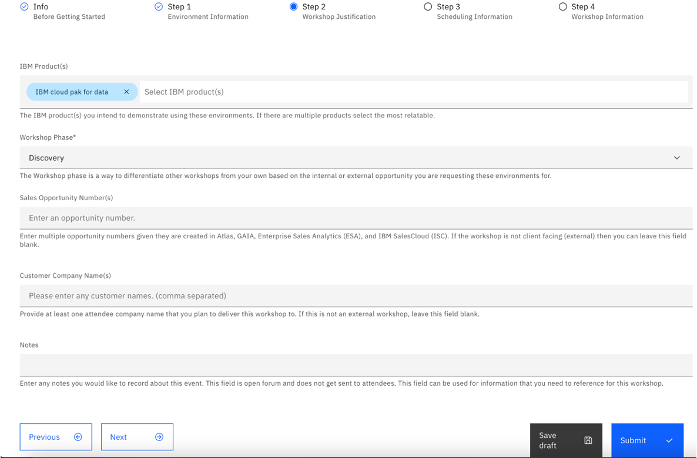
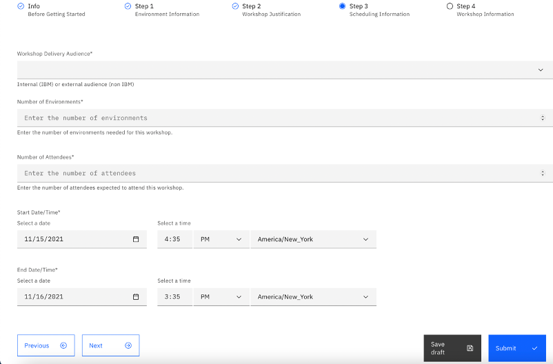
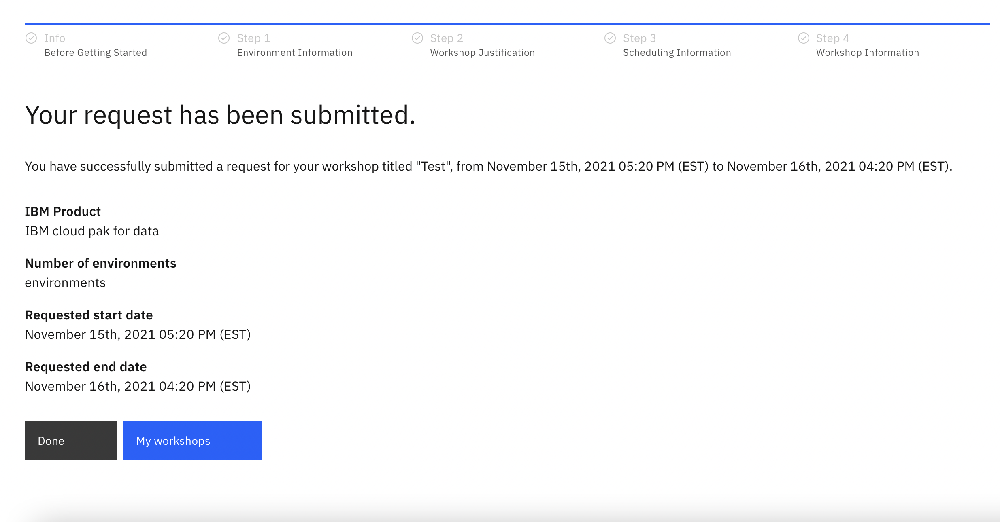

## How to Schedule a Hosted Workshop

Group reservations can be scheduled on IBM Technology Zone using the "schedule a workshop" feature which takes you to the Workshop Manager. 

1. From the [IBM Technology Zone](https://techzone.ibm.com/decisionpoints) page 

2. Click **Environments**

3. Filter for the desired infrastructure **Hosted**

4. Find the environment you would like to use for your workshop and click on the "reserve" icon

5. Select **Schedule a Workshop**

You will be taken to the "Request a workshop" page. 

**IMPORTANT: Be sure to read the Info page it provides important notes on filling the form correctly, approval process, next steps and disclaimer.**

6.  Click on **Next** as you go through the form the "right hand" of each page contains context for the form 

7. Step 1: Environment Information
  
* Environment Template selection is pre-filled from the parent environment
 
* Select the Region you want the environments provionined from. Choose the region closest to the students physical location. Afterwards, click **Next**
   

  
  
8. Step 2: Workshop Justification
  
* (Prefilled) IBM Products
 
* Select the Workshop Phase
  
* Enter 'Sales Opportunity Number' of Customer Company name is **required** for all workshop. This is a detemining factor for if you workshops get Approved or rejected
 
* Enter any notes you want to include with your workshop. Afterwards, click **Next**
  
  
 
    
 9. Step 3: Scheduling Information
  
* Select the "workshop delivery audience"
  
* Enter number of environments
 
* Enter number of attendees
  
* Select start date/time and end date/time. Note: your start date has to be greater than or equal to 72 hours of your current time. Afterwards, click **Next**
  

  
  
10. Step 4: Fill out the workshop details and click the "Submit" button once finished. If you would like to finish this workshop request at a later time, select "Save draft" and find both the saved and submitted workshop requests in "My workshops" tab.
 
  
   
11. After submitting your workshop request, navigate to your My workshops page by selecting the "My workshops" button. 
   
Only submitted worksops are reviewed "saved" Workshops are not reviewed.
   

   
12. Find your workshop that is in a "pending approval" status. 
   
   
  
Your request will be treated within 72 hours of when it was submitted. 

**NOTE** Only request in status "pending approval" are reviewed. Status "saved" will not be reviewed.
  
For all inquiries, questions or support, reach out to us on our slack channel [#itz-workshop-support]( https://ibm-dte.slack.com/app_redirect?channel=itz-techzone-support).
