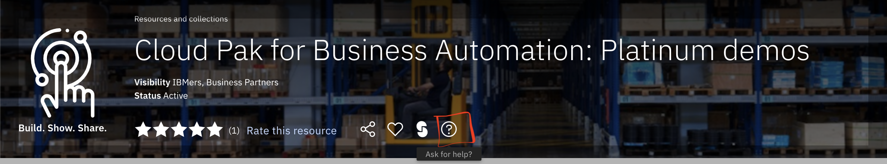
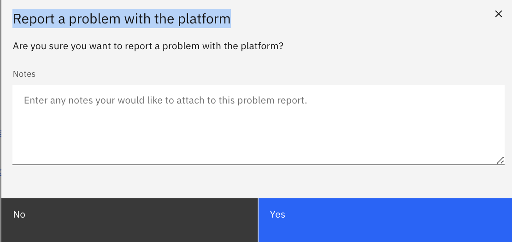
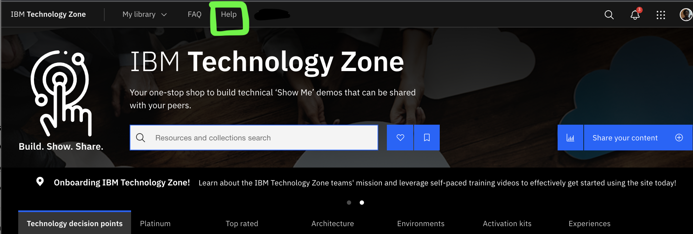
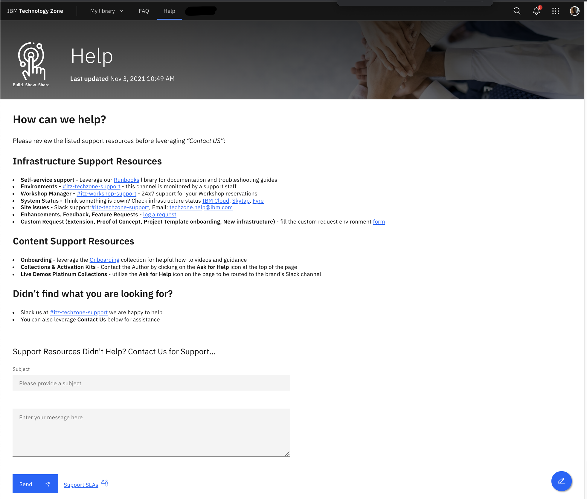

## Infrastructure Support

You can get help for infrastructure by using the "Ask for Help" or filling out form on the ["help"](https://techzone.ibm.com/help) page. 

Follow steps listed below for Infrastructure support

## From a collection/resource

1. Go to the Collection/resource
2. Click on the Question Mark "Ask for help" 
3. Select the "Ask for help or report a problem with the content on this page" 
4. Fill out the form with details and click send 
5. This will open a ticket with the support team and you will receive a Ticket number for your inquiry and a reply within 24 hours

## From the ["Help"](https://techzone.ibm.com/help) page. 

1. Click on ["Help"](https://techzone.ibm.com/help) page on the top on IBM Technology Page. 
2. Fill out the form with helpful details (Environment id/url, collection url etc) for your inquiry, click send 
3. This will open a ticket with the support team and you will receive a Ticket number for your inquiry and a reply within 24 hours
