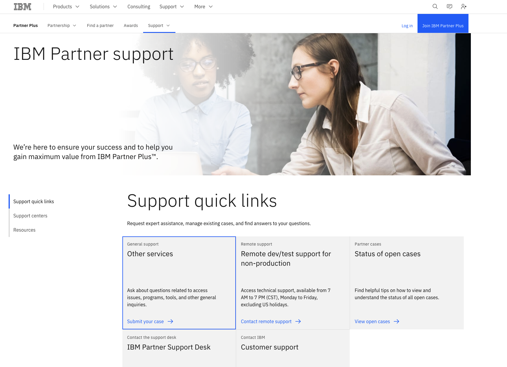

# How to Open a Support Web Case for Business Partners

## Summary

To get further assistance from IBM Technology Zone Support, these steps can be followed to open a web case.

## Instructions

1) Navigate to the IBM Partner Plus [Support Page](https://www.ibm.com/partnerplus/support)

2) Log in using the email associated with your Partner Plus account

3) Click on [Other Services](https://www.ibm.com/mysupport/s/createrecord?NewCasenp)

4) Complete and submit form to open a support case

### Info to provide:

**Case Title:** Quick title of issue you are having
   
**Support Type:** Keep as the default "Partner Ecosystem Support"
   
**Country:** Select the country you are in
   
**URL:** Enter in the associated reservation link, collection link, or any other link that you are having troubles with
   
**Description:** Provide the information we would need in order to troubleshoot the issue you are running into. This can include your reservation ID, exact recreation steps to recreate any errors you come across, collection URL's, etc.
   
**Upload Files:** Upload any screenshots or documents that may be able to help us troubleshoot the case
   
**Account:** Select the account that is most associated with what you are working on. If you are not assigned to an account, then you can skip this step
   
**Team Members:** Include team members that would like to have access to this case as well. NOTE: This can NOT be updated later
   
5) Click **Submit Case**, case is automatically created

>Note: You will be taken to your Case detail page that includes your Case number and description.

## How to view your cases

From the same support link above, click on [Status of Open Cases](https://www.ibm.com/mysupport/s/my-cases-np) to view your case list 

A list of all your case will be visible, example below

### Select a case to view available details:

- Case number
- Case history
- Add comment
- Response and comment from a support agent
- Case status
- Close case
- Escalate case
- Case information
- Upload files

## How to manage your case

Your case can be managed from the details view. Select the case you intend to manage from [Open Cases](https://www.ibm.com/mysupport/s/my-cases-np)

 
### Available functions:

- You can **add a comment** to provide additional details on your case to the support team 
- Close case
- Escalate case
- View responses to your case. 

## Notification E-Mails 

A notification E-Mail is sent when a case is submitted and when subsequent action is taken on the case.

### Case Created:

### Awaiting Feedback:

### Case Closed

## Further Support

*For any further help needed to create a case, please reach out to Cameron Bhatnagar (cjbhatnagar@ibm.com)*
