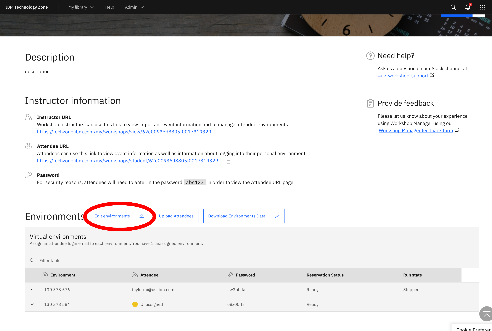
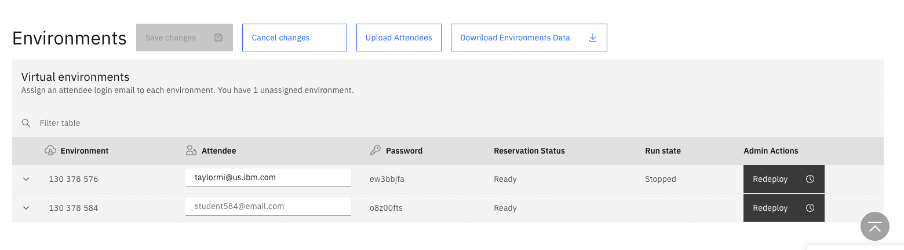
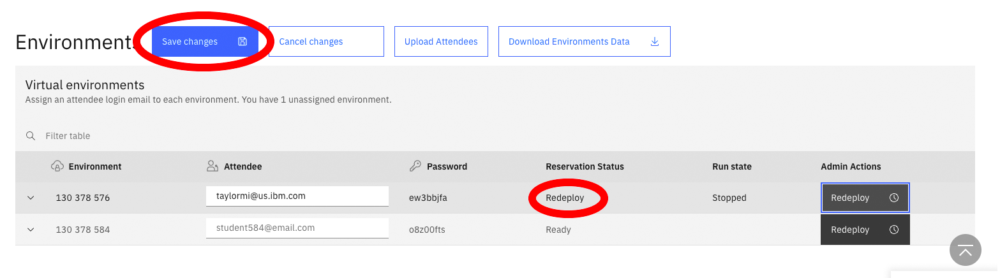

# How to Redeploy a Workshop Environment (Admin Only) feature
Sometimes an environment in a workshop will need to be redeployed.  This can be caused ny a failed deployment or a clean environment is required. 

To redeploy an environment:
1. Select your workshop from the "My Workshops" page. 
2. On the instructor page scroll to the Environments section.
3. Click the "Edit environments" Button.

4. The environments section enters edit mode.

5. Click the "Redeploy" button for the environment to be redeployed.

6. The environment's status changes to "Redeploy".
   
7. Click "Save Changes".
8. The workshop manger saves the workshop.  After a few minutes the workshop agent will start the redeploy process.

### Support

IBMers - Click [here](https://ibmsf.force.com/ibminternalproducts/s/createrecord/NewCase?language=en_US) to log a Support case 
For any questions, contact ITZ support - techzone.help@ibm.com
