# Replicating Functionality in TechZone

TechZone is a powerful resource if you would like to replicate your Proof-of-Technology, Test, Self-Education or Customer Demo environments. This runbook will cover four strategies for replicating functionality in IBM Technology Zone.

**Start with ITZ Base Images Template**
> For users who want to build their environments from a stable and tested starting point

**Utilize Existing Patterns**
> For users who want faster time-to-market with a customized pre-built environment

**Classic Infrastructure Account Migration to ITZ account**
> For users who previously leveraged Classic Infrastructure

**Custom Complex Environment Hosted on ITZ**
> For users with high-impact opportunties that require custom and complex TechZone environments

## TechZone Certified Base Images Collection

The ITZ Certified Base Images Collection is purpose-built to help bootstrap and develop new environments and demo assets. The Certified Base Images Collection assets include:

- Pre-installed software
- VMWare-based images or Multi-VM complex environments
- IBM Cloud, AWS, Azure, and On-premises resources

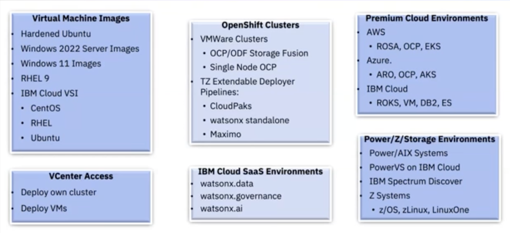

**NOTE: Premium offerings may be subject to approval by the TechZone team when attempting to reserve the environment on the reservation page.**

## How to Reserve a Certified Base Image

On the IBM Technology Zone homepage, navigate to the featured 'TechZone Certified Base Images' Collection, however you can also search for it using the search bar on the top right, or [use this link](https://techzone.ibm.com/collection/5fb3200cec8dd00017c57f20)

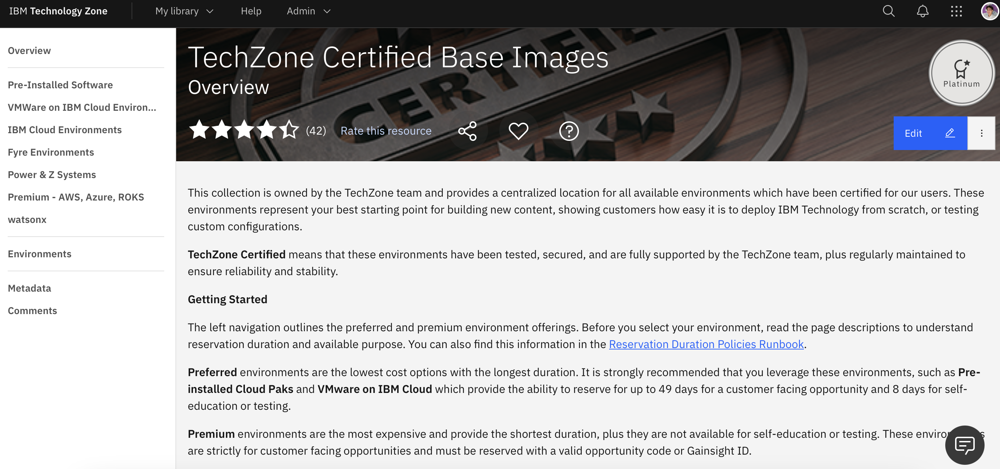

On the left navigation bar, you will see *Journeys*, which are a sequenced navigation implemented via tabs to better guide you through the collection.

In the TechZone Certified Base Images Collection images are stable, secure and ready-to-go. Select a *Journey* and you can easily reserve an environment using the blue 'reserve' button and filling the form

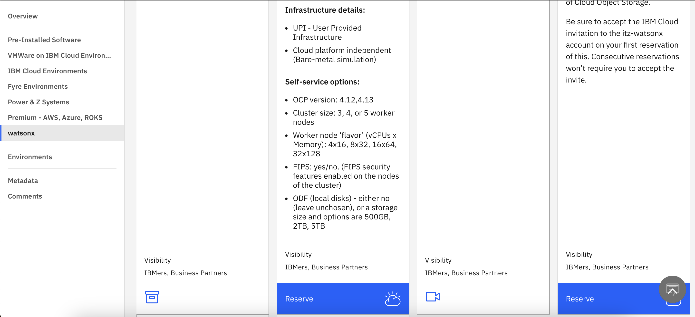

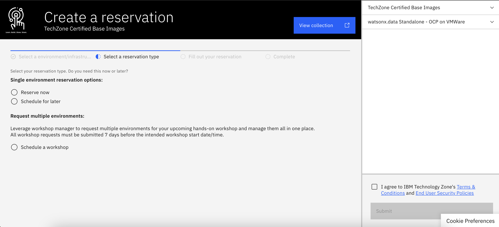

### How to Create your Own Collection

A collection is like a repository of environments and resources. To create your own, on the TechZone homepage navigate to the 'contribute content' button

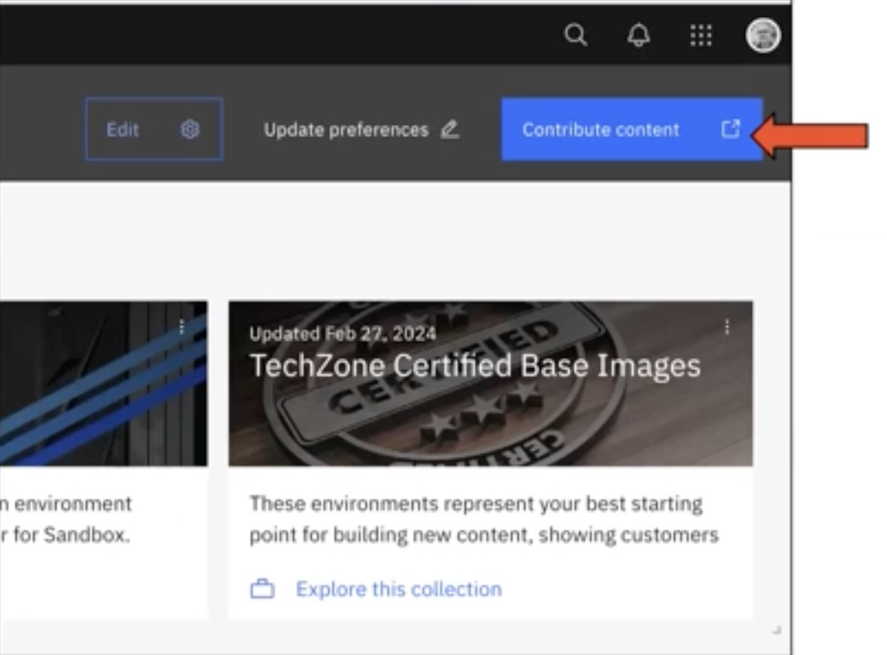

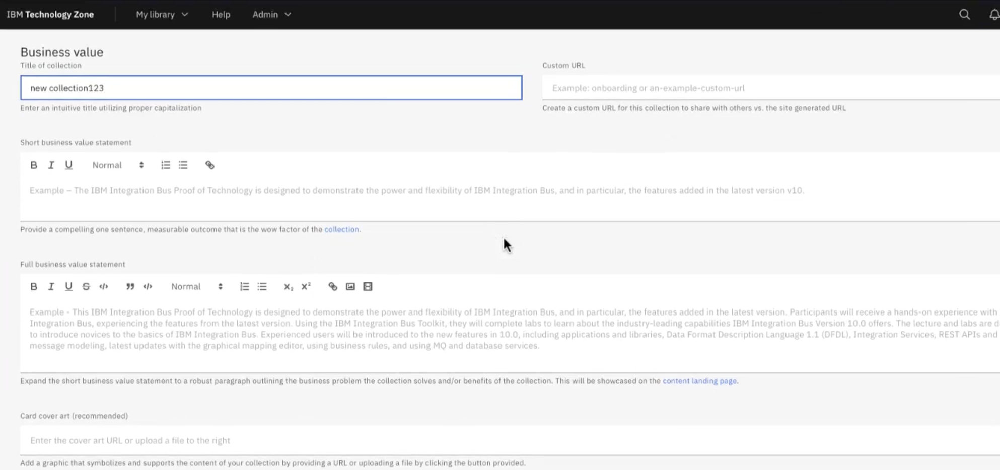

You will need to fill out the 'Operating Portfolios' and 'Brand' formfills, then add a 'collaborator' which are the authors and contributors of the content.

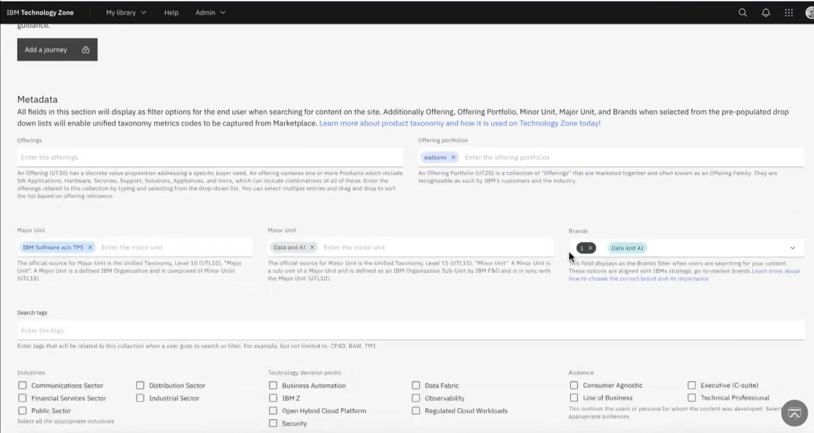

NOTE: To add multiple collaborators, after adding a new collaborator, press the 'tab' key to add more

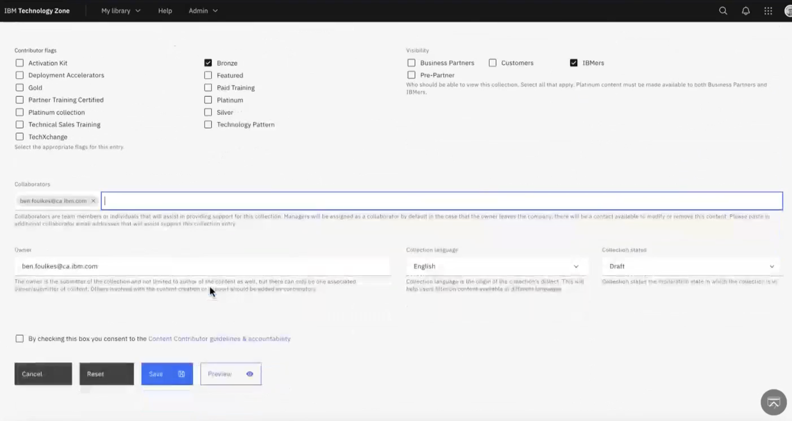

## Template a Base VM
> For users who want to build their environments from a stable and tested starting point

Once you have a collection, you will need to populate with content. You can customize a Base VM and template it for future reservations.

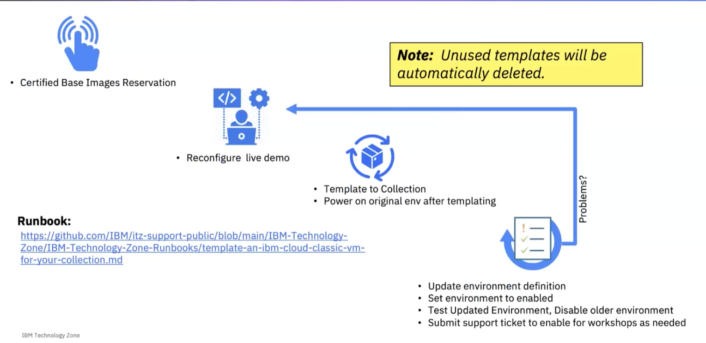

On the 'My Reservations' page, select an environment you would like to template, then click on the elipsis of the menu and select 'Template to Collection'

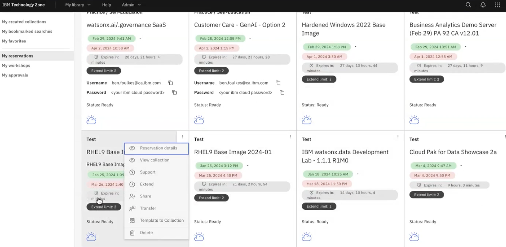

Select the collection it will belong to and click on 'Template'

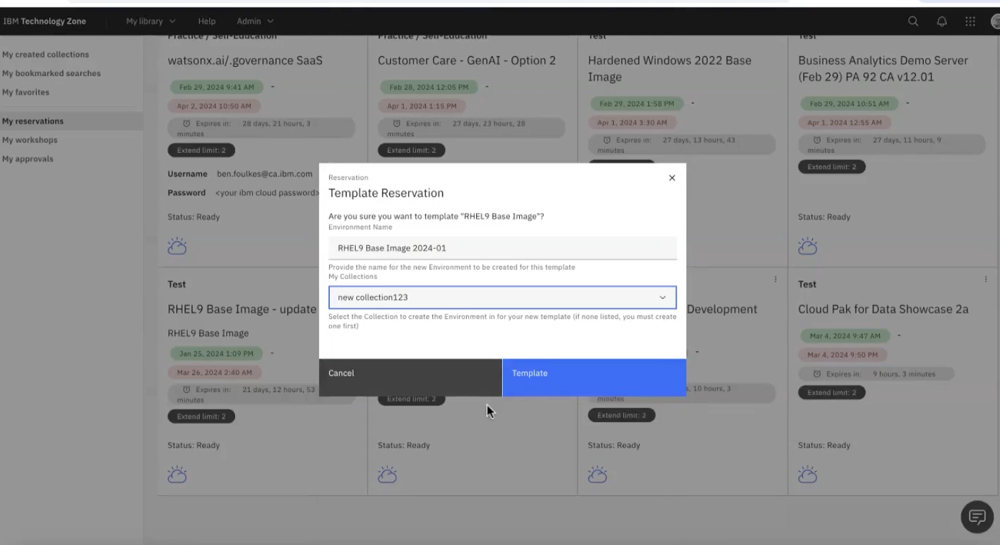

## Utilize Existing Patterns
> For users who want faster time-to-market with a customized pre-built environment

Once you have a collection, you will need to populate with content. You can customize an existing SaaS offering mix to suit your needs

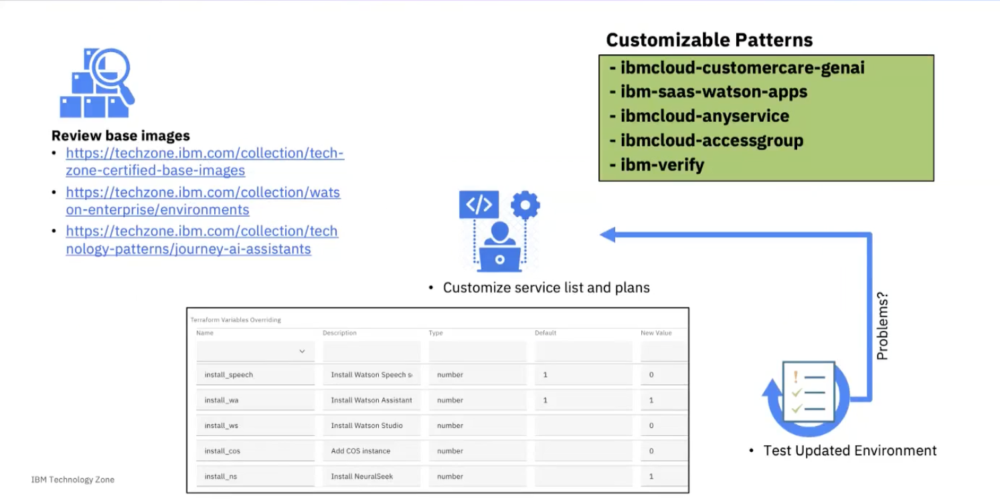

Select 'Update Collection' on the collection you would like to add a customized pattern to

Navigate to the 'Add Environment' button and click it. Then select an infrastructure

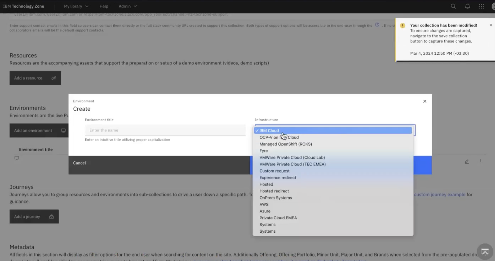

Next under the 'GitOps Pattern' dropdown menu, you can select the GitOps pattern to customize

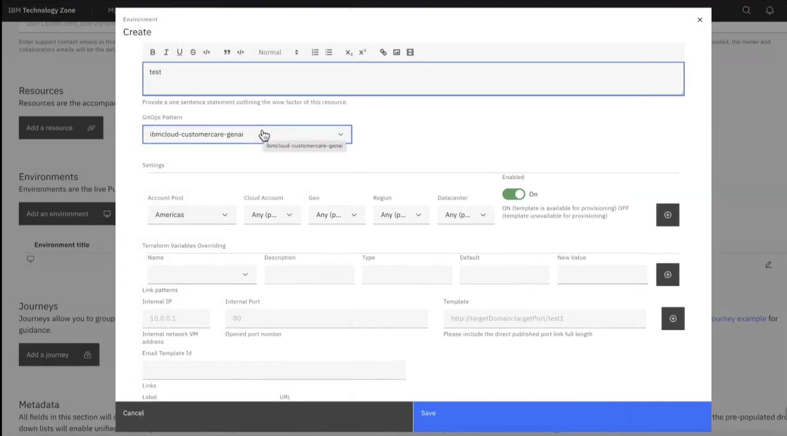

And now under the 'Terraform Variable Overriding' dropdown menu you can customize this environment with different software. 

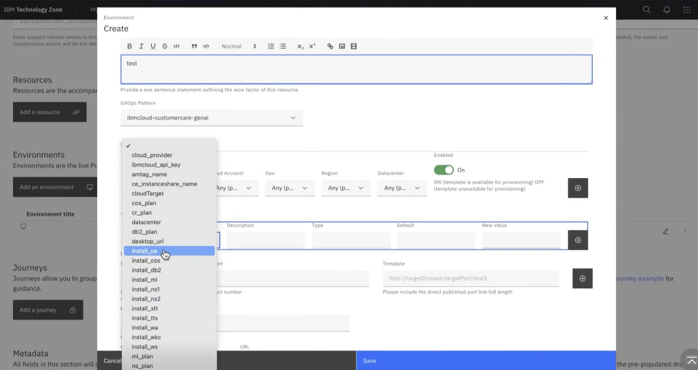

Press the '+' icon and change the 'new value' field to 1 to add your selected software or change the 'new value' field to 0 if you would to remove that selected software.

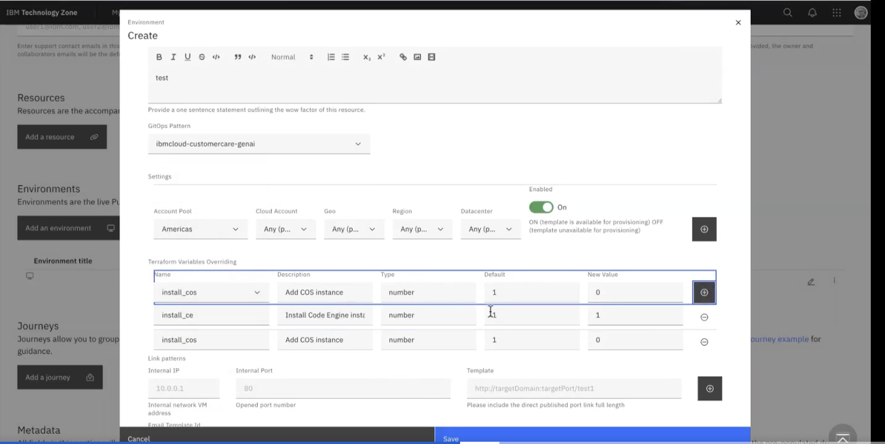

Press 'Save'
