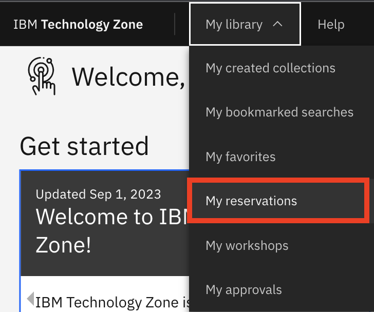
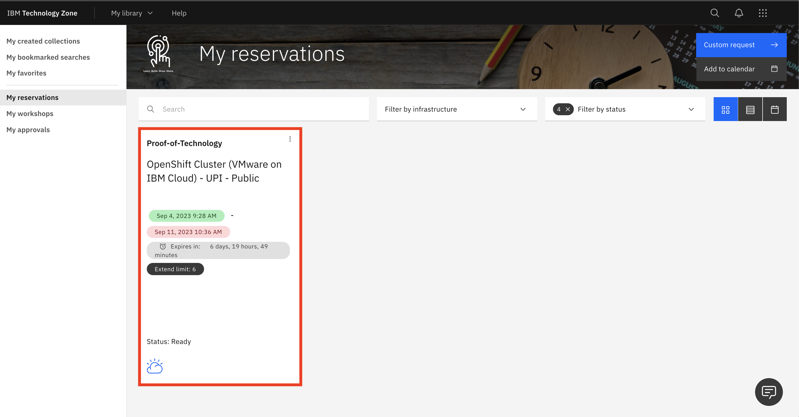
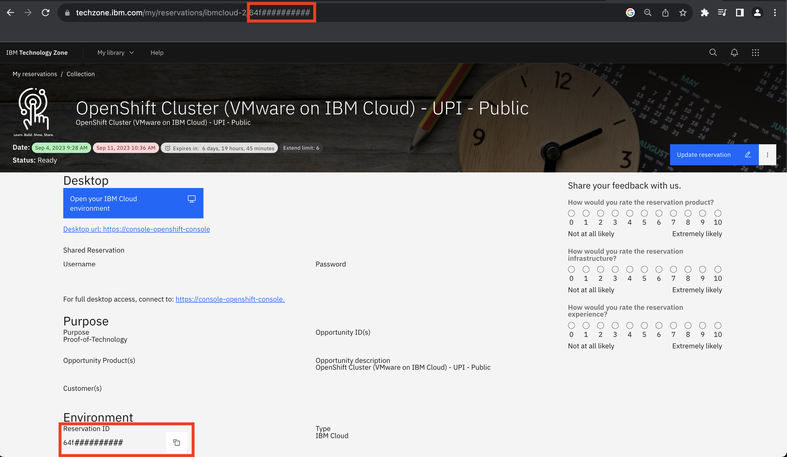
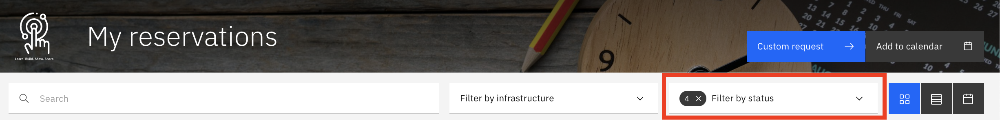

# How to find your reservation ID

To start, visit your reservation dashboard. You can do this by clicking on "My library" and then "my reservations." You can also find this page at https://techzone.ibm.com/my/reservations. 

From there, click on your reservation. 

As can be seen from the screenshot below, the ID can be found under the "Environment" heading or at the end of the url. 

# To find missing reservations

If you're having trouble finding your reservation, try altering the filters

You can scroll through the dropdown to see different options to select. By default, only 4 are selected when you open your reservation dashboard

