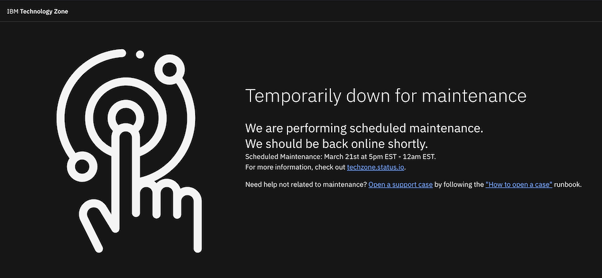
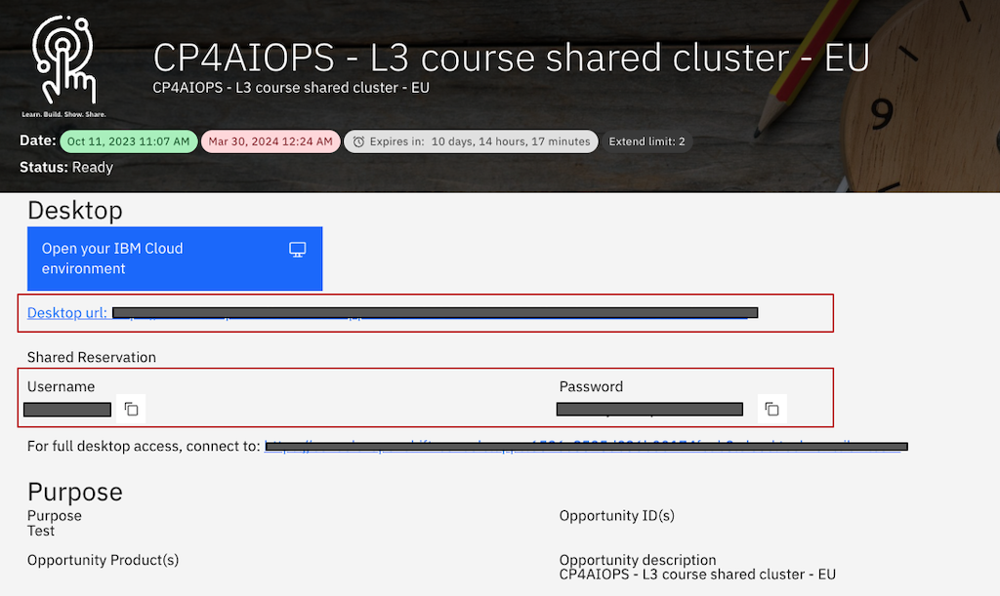
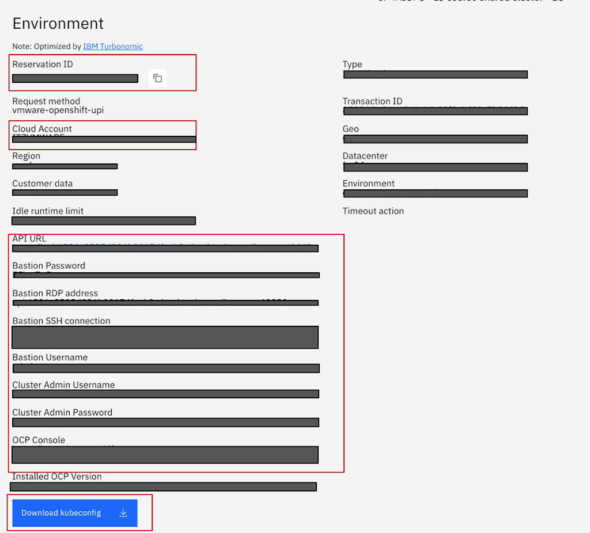
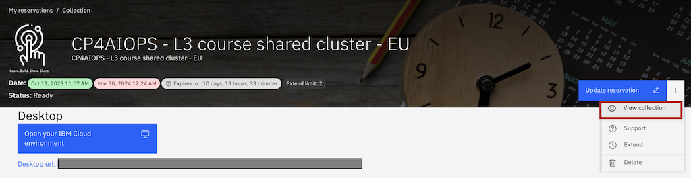

# IBM Technology Zone Maintenance Runbook

This runbook details how to locate environment credentials for single environment reservations and for workshops that have multiple environments in preperation for an upcoming maintenace window. This runbook will enable you to ensure a smooth and hassle-free process in accessing your environments while the site in unaccessible during maintenance window. 

## Maintenance on IBM Technology Zone

> Regular maintenance is essential to keep our systems running smoothly and to implement necessary updates, enhancements, and fixes. During these maintenance windows, there may be temporary disruptions to services, but these efforts are undertaken to improve overall system stability and security.

### ITZ Maintenance Page

When the entire IBM Technology Zone site is expected to be down during a maintenance window, users can expect to see the following maintenance page when trying to access the site. On the maintenance page, you'll find the scheduled maintenance date and time that the site will be unaccessible, along with convenient links to our TechZone status page and a support case submission form should you require assistance during the maintenance period.

### Scheduled Maintenance Dates

**MongoDB Migration from 4.4 to 5.0**

- Maintenance Window: March 21st, 2024, from 5:00 PM to 12:00 AM (EST)

- Description: This maintenance window will primarily focused on migrating databases. This migration will impact users being able to access the entire IBM Technology Zone site and the maintenance page (as shown above) will be turned on during the scheduled maintenance window. 

Please mark your calendars accordingly and plan any critical activities around these scheduled maintenance windows. We appreciate your cooperation and understanding as we work to enhance the performance and security of our systems.

## How to Prepare for Maintenance

Ensuring users can access their environments during maintenance periods for workshops and reservations is crucial to minimize disruptions to your activities. This section will guide users through the process of locating their credentials and saving important links necessary for accessing their reserved environments during maintenance periods. Whether you've reserved a single environment or multiple environments for a workshop, this guide will provide step-by-step instructions tailored to your specific infrastructure setup.

**IMPORTANT**: Please ensure to perform these steps prior to the maintenance period to ensure that you can access your environment before maintenance starts. Once maintenance window starts, the IBM Technology Zone site will be unaccessible to grab this information. 

### Locating Your Credentials for Single Environment Reservations

1. Log in to IBM Technology Zone
2. From the top navigation bar, select My Library. Then from the drop down list, select [My reservations](https://techzone.ibm.com/my/reservations).
3. Select the reservation tile that is in a Ready status to open the reservation details page.
4. From the reservation details page, copy and save the following information to local source:

    - `Desktop URL`
    - `Username and Password`
    - `Reservation ID`
    - `Cloud Account`
    - `API URL`
    - `Bastion Username, Password, RDP, and SSH connection`
    - `Cluster Admin Username, Password, and OCP Console`
    - `Download kubeconfig`

**NOTE:** Not all environment reservations will have the above information but if your reservation details page does include this information, please ensure to save this information so that you can reference it during the maintenace period. For example, some IBM Cloud reservations will use your IBM Cloud credentials to access the environment, but having the Account name copied will be helpful in navigating to the intended environment. 

5. Check the collection for additional information on the reservation: 

    a. From the reservation details page, select the three dot menu in the top right hand corner of the reservation banner. Then select "View collection".

    

    b. On the collection, search for lab guides and troubleshooting documentation to save URLs to these resources, as needed. 

**IMPORTANT**: Some content owners have important information, like additional access credentials in lab guides or within another resource. Ensure to save links to resources as needed so that you have what you need to get access to the environment during the maintenance period. 
