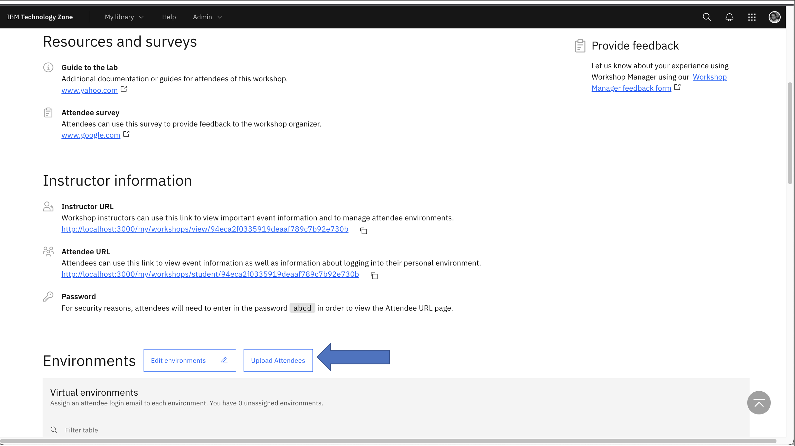
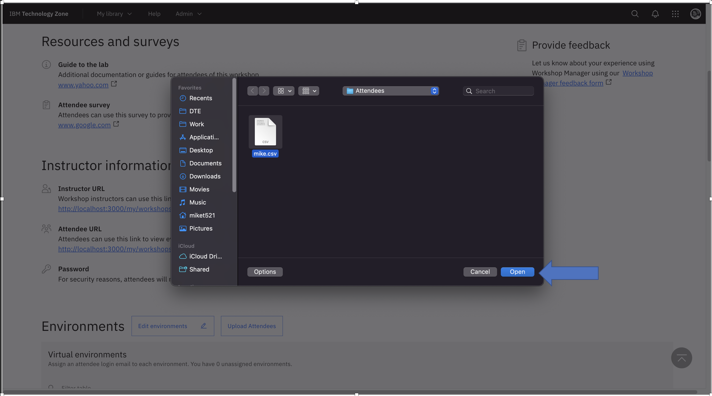
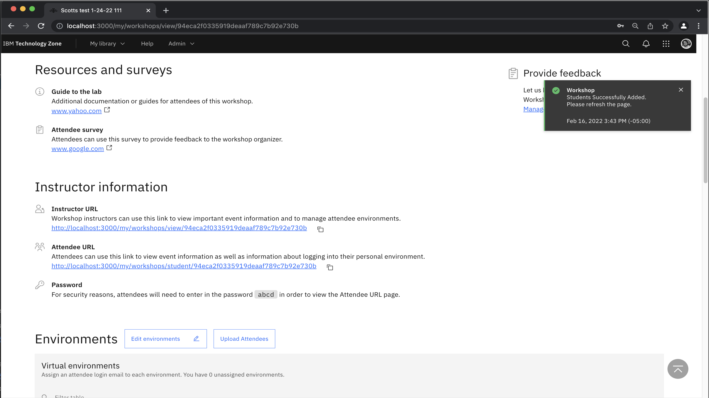

# How do I upload a list of students to a workshop?
Workshops will automatically assign environments to users as they login to the student page.  However, you may want to manually assign environments to the students.  This can be done using the "Edit Environments" button on the instructor page.  But , this can be inconvenient in the case of a workshop with a large number of students.

Workshop Manager allows you to upload a ".csv" file with a list of students and will assign the environments based on that list.

* The file must consist of a list of students with one IBM ID (email) on each line. For example:
```
user1@ibm.com
user2@partner.com
user3@gmail.com
```
To upload the students:
1. Select your workshop from the "My Workshops" page. 
2. On the instructor page scroll down until you see the "Environments" section.
3. Click the "Upload Attendees" Button.

4. Select your file from the dialog.
5. Click the "Open" button


After a few seconds you should get a success message.  After this you will have to refresh the page to see the assigned environments.



If there were more students the environments available, you will get an error message.  Please shorten the list and try again.

### Support

IBMers - use the [#itz-workshop-support](https://ibm-techzone.slack.com/archives/CTA2MV9AM) slack channel

For any questions, contact ITZ support - techzone.help@ibm.com
