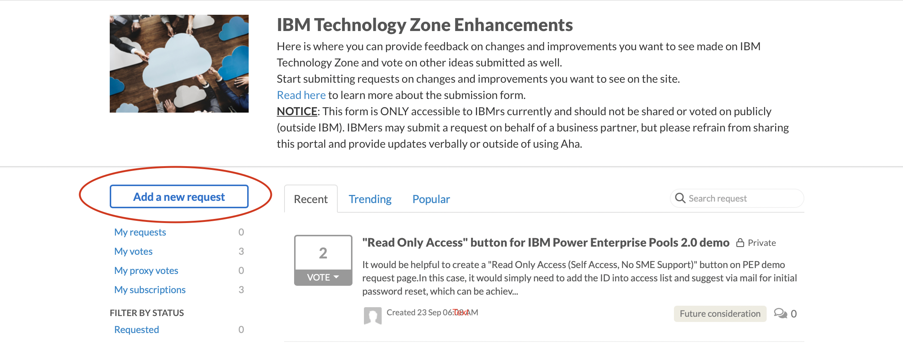
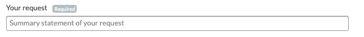
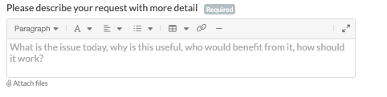
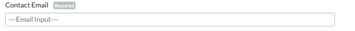
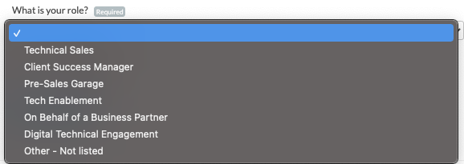
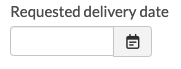
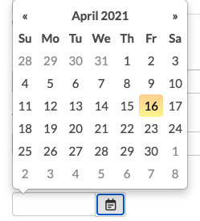

# IBM Technology Zone Enhacement Request

How to request a change to an existing feature or a new feature idea for IBM Technology Zone.

Please note: This page is not accessible to Business Partners at this time. Please contact brooke.jones@ibm.com if the partner you are working with would like to communicate directly with our team on requested changes, or submit the idea on their behalf. 

## DTE Welcomes your feedback

1.  Start by going to the 

2.  Click the 'Add a new request' button 

3. Provide a Summary statement of your request so that we can identify your request quickly when reviewing. 

4. Please describe your request with more detail:

* Outline clearly the issue today
* Why is this enhancement or new idea useful
* Who would benefit from this request
* Explain how this should work
* Attach screenshots of where this idea or enhancement could be implemented or additional documentation

5. Provide a contact email so that DTE can contact you after submitting your request for further follow up, information, or plans. 

9. Let us know what organization that you are associated with by selecting your role. If your role is NOT listed then please select Other - Not Listed

10.  Choose a timeline in which you would like your request to be completed by. 
* Please note - Requesting a specific delivery date will not garantee completion by this date.

11. Select Submit request when form is completly filled out. 

### Support

For any questions, contact ITZ support - techzone.help@ibm.com

