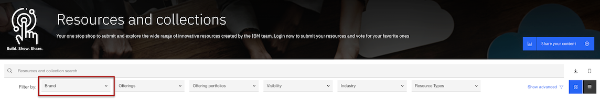
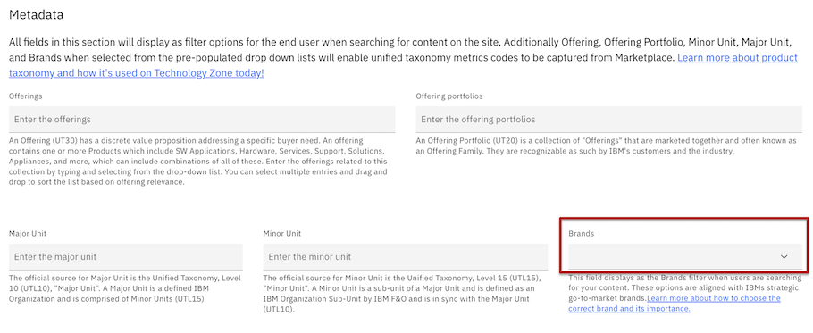
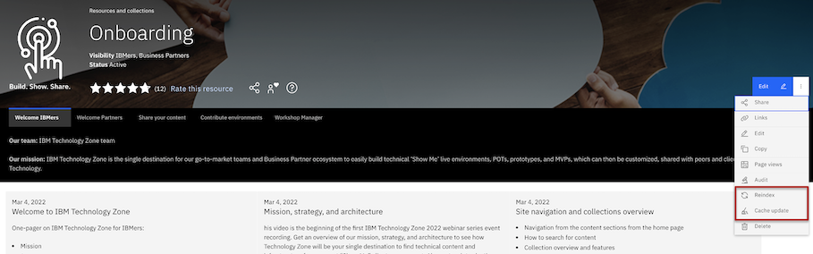

# Collection Brand Filter

Learn how this filter gets populated and how to navigate to the Brand filter while on IBM Technology Zone

## How to filter content and environments by **Brand**

There are multiple search pages on IBM Technology Zone to first be made aware of, that all have the same Brand filter available for use. 

- Platinum search page with filter options: https://techzone.ibm.com/platinum

- Environments search page with filter options: https://techzone.ibm.com/environments

- Activation Kits search page with filter options: https://techzone.ibm.com/activationkits

- Experiences search page with filter options: https://techzone.ibm.com/experiences

- General ALL collections and resources search page with filter options: https://techzone.ibm.com/search

Picking the General All collections and resources search page as an example, find the Brand filter displaying first in the filter option list. 

The Technology Zone team has provided an enhancement for Content Contributors while creating and modifying content to be able to select Brand from a normalized Brand list. The following Brand options will display if there are collections using this brand field.

- AI Applications

- Automation

- Data and AI

- IBM Z and LinuxONE

- Power

- Public Cloud

- Security

- Storage Systems

## How to add a Brand to a collection - content contributor specific

You noticed that your collection does not display as a Branded filtered results based on the Brand you intended it to be under. How do I go about updating my collection to be filterable from the Brand field.

Step 1. Navigate to your collection and select edit in the top right banner. 

Step 2. Scroll down to the Metadat section. Find the Brands field. 

Step 3. Select the Brand option that relates to the offering in which this collection was build to help demo. (above are the listed Brand options that you will see display)

Step 4. Save your collection and then allow time for your results to display. 

NOTE: To speed up the process, select the reindex option and then following the cache update option from your collection view page. The Reindex will force any data points that you updated on your collection to be updated within elastic search, meaning that the brand filter should be updated with the forced update. The cache update will speed up the refresh process for your collection to show the most recent version based on your changes while editing your collection.

  

### Support

For any questions, contact ITZ support - techzone.help@ibm.com
