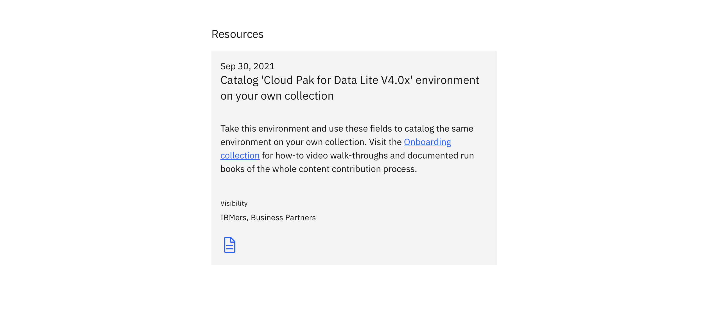
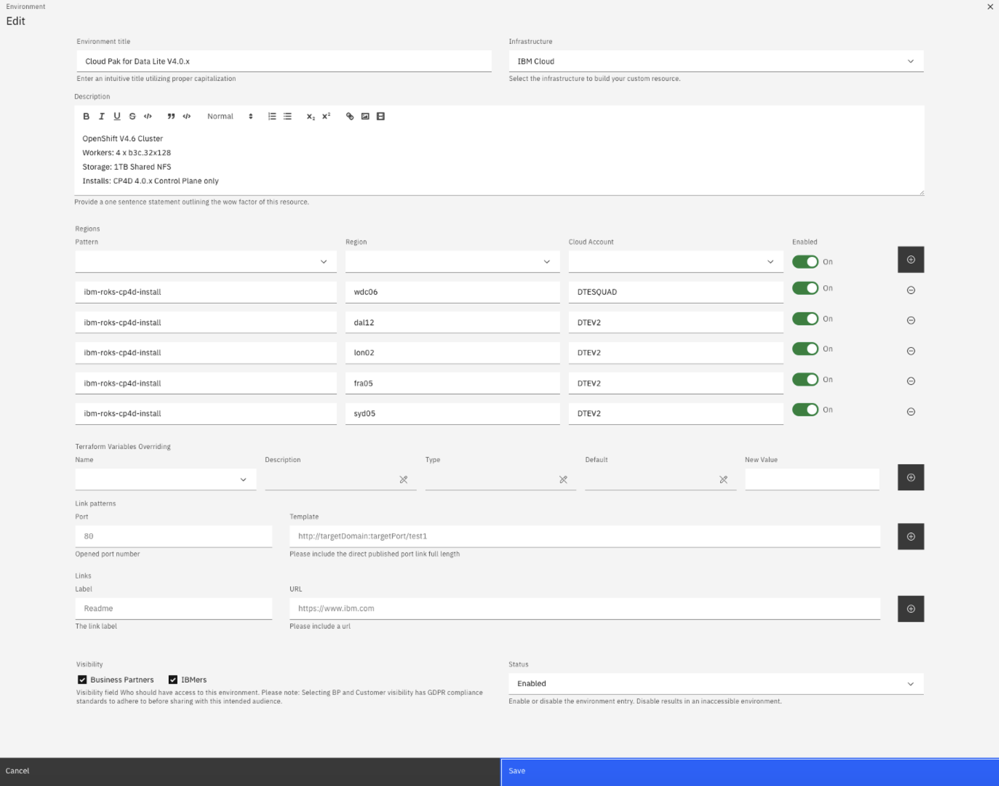

## How to Catalog Your Own Environment 

### Step 1: Navigate to the resource cataloging the environment you would like to reproduce.

### Step 2: Click the resource to go the Box Folder. You should be able to see a screenshot of the environment settings.  

### Step 3: Copy the environment settings using the screenshot of the environment to achieve your desired environment. 

### Step 4: To additionally customize your environment, view this [runbook](https://github.com/IBM/itz-support-public/blob/main/IBM-Technology-Zone/IBM-Technology-Zone-Runbooks/gitops-tf-override.md) on how to override environment setting.

**For support or additional questions,** contact techzone.help@ibm.com

**SME** for all additonal help and inquiries is brooke.jones@ibm.com 

