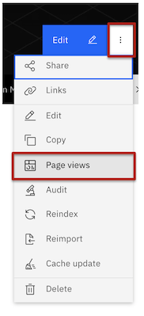
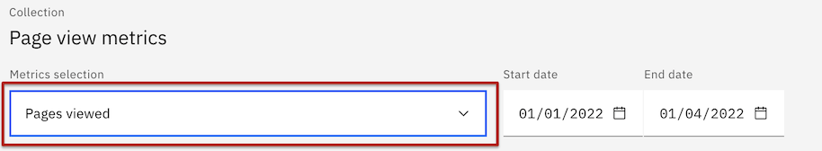
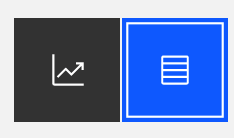
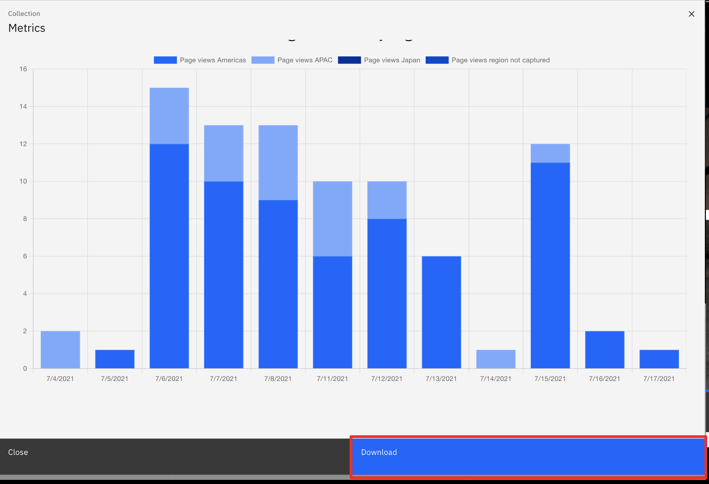
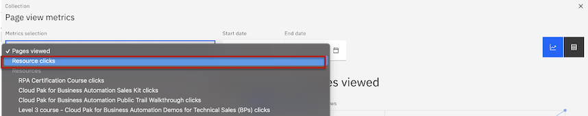
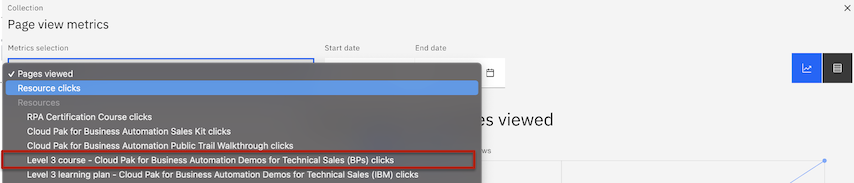

# Collection Metrics

How to view pageview metrics for your collections and click events for your resources on a collection, all within IBM Technology Zone.  

## Navigate to Your Collection Pageview Metrics

1. Visit your collection. 
An example of collection URL: https://techzone.ibm.com/collection/onboarding
2. Select the elipsis option to the right of the blue edit button. The drop down list will display the 'Page views' option.

  

3. In the top left of the collection metrics modal, see a dropdown menu option and ensure Pages viewed is select to see your collections overall pageview metrics. Then select the start date and end date that you would like to pull metrics from that timeframe. 

  

4. After completing the start date and end date fields, the data will populate the charts. 
NOTE: Please be patient as we pull metrics live for this specific collection from the data set. 

5. Select how you want to view the metrics with the table or chart option.

6. View the following  metrics and learn the terminology: 
    * Unique users - Unique visitors refers to the number of distinct individuals visting your collection during the selected time frame selected. 
    * Pageview - is an instance of a page being loaded (or reloaded) in a browser.
    * Persona - type of user visiting your collection. 
          - User IBMr
          - User Business Partner
          - User persona not captured could be IBMrs that have left the company that are no longer available in Blue pages.
    * Region - location of the user visiting your collection. 

7. Take the data with you and make your own charts with the download option in the bottom right of the collection metrics modal. 

  

## Navigate to your resource click event metrics

Question: What is a resource click event? 

Answer: A resource click event is a user viewing your collection and clicking on a resource tile. This action is captured to give you additional metrics as a contributor to see what resources are getting high volumes of traffic at a given time and what resources are not being used as much. This could help you decide revamping the order of your resources, removing the resource entirely and going with a new appraoch, and in general provides overall metrics on how your collection is being used additionally beyond the page view capture. 

1. Follow the sames steps listed above in step 1 and 2.

2. Select Resource Clicks towards the top from the Metrics section drop down menu to see all resource click events tied to this collection. 

  

3. Additionally, dive into an individual resources click events by selecting from the Resources section from the Metrics section drop-down menu. 

  

4. Ensure to select the start and end date and the same metrics download and views is available for resource clicks as there was above for pages viewed. 

### SME

Bugs identified can be captured in git issue board: https://github.ibm.com/dte2-0/cap-common-access-portal
Questions can be directed to brooke.jones@ibm.com
