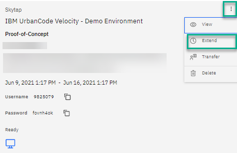

## How to delete a reservation

1. Log in to the portal using your IBM id
2. Go to "My Library" and click on "My reservations"

3. From the list of your reservation - find the reservation that requires an extension
4. Click on the 3 vertical dots. 

5. Select new date and time and click **delete**

Your reservation will be automatically deleted.

### Support

For any questions, contact ITZ support - techzone.help@ibm.com
