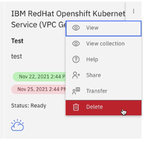
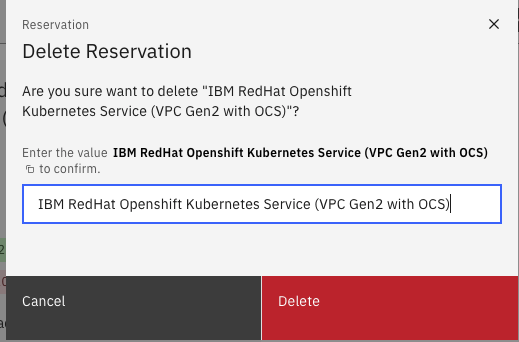

## How to Delete a Reservation

1. Log in to the portal using your IBM id  

2. Go to "My Library" and click on "My reservations"  

3. From the list of your reservation - find the reservation that you wish to delete  

4. Click on the 3 vertical dots, then select delete  

5. Confirm your action by Entering the value shown in bold (you can select the copy icon to copy and paste) and selecting delete

Your reservation will be automatically deleted.

### Support

For any questions, contact ITZ support - techzone.help@ibm.com
