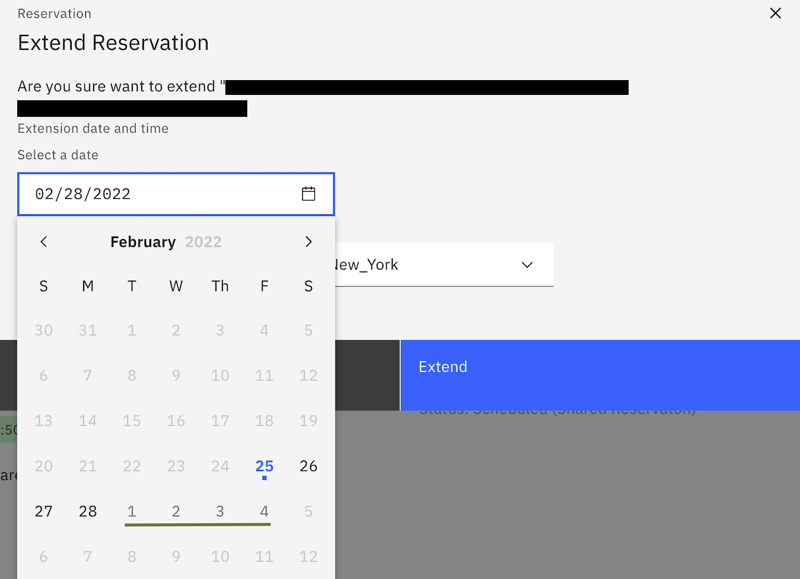

# How Do I Extend My Reservation?

1. Log in to the portal using your IBM id
2. Go to "My Library" and click on "My reservations"

3. From the list of your reservation - find the reservation that requires an extension
4. Click on the 3 vertical dots, "Extend" NOTE: if "extend" is greyed out, see note below

5. Select new date and time, selectable dates are in a light gray  

  

6. Select Extend 

  

Your reservation will automatically be extended until the new date and time selected. Please reference the following [reservation duration policies](https://github.com/IBM/itz-support-public/blob/main/IBM-Technology-Zone/IBM-Technology-Zone-Runbooks/reservation-duration-policy.md) for maximum extension days. 

NOTE: No additional extensions will be granted beyond the maximum given extension days

NOTE: if "extend" is greyed out, you do not have an opportunity number attached to your reservation. [Edit your reservation to include a valid opportunity number.](https://github.com/IBM/itz-support-public/blob/main/IBM-Technology-Zone/IBM-Technology-Zone-Runbooks/extend-self-education-into-sales-demo.md) If you get any errors contact support, Include the Opportunity number and reservation information (Environment id, dekstop url, cluster id,  cluster name etc )

Are you going on vacation and worried about losing your reservation? You can transfer it to a colleague to manage while away, see details [here](https://github.com/IBM/itz-support-public/blob/main/IBM-Technology-Zone/IBM-Technology-Zone-Runbooks/transfer_environment.md)

Attention: It is a user's responsibility to ensure they extend reservations before the listed end date and time. 
Environments are auto removed once reservations are expired and are currently not recoverable. All exception request should come in at least 72 hours before the scheduled end date and time. 

### Support

For any questions, contact ITZ support - techzone.help@ibm.com
IBMers Slack Channel #itz-techzone-support(https://ibm-techzone.slack.com/archives/C0124J683GW)
