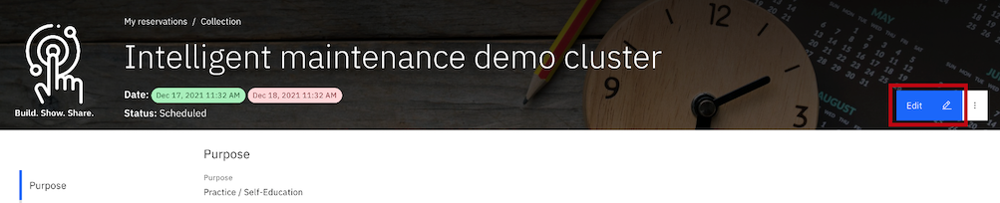
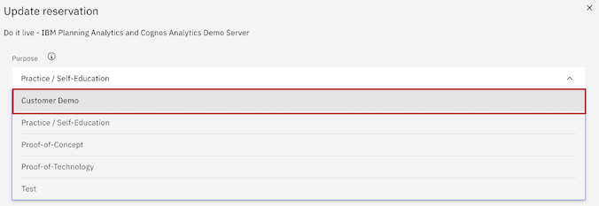
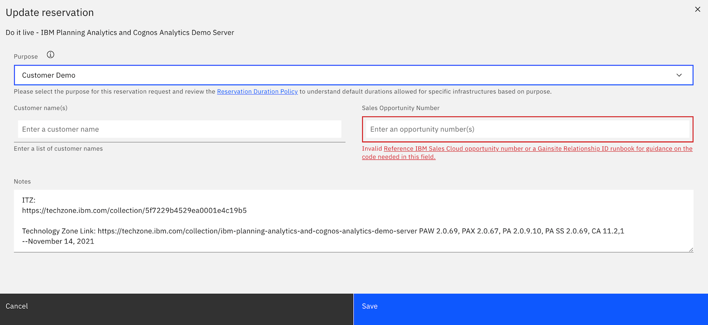
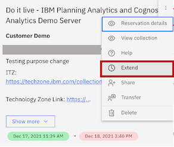
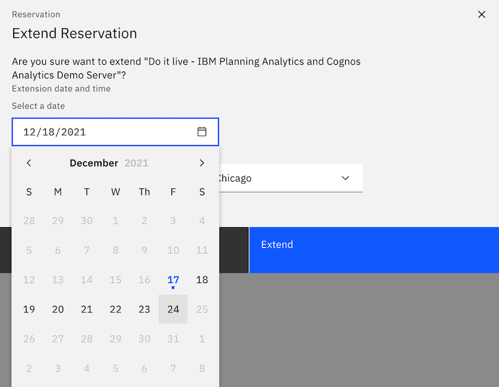

# Change reservation purpose to enable self-service extension option

For example, change reservation purpose from Self-Education to Customer Demo to enable the self-service reservation option. 

Steps:
-----
1. Click My Library

2. Click [My Reservations](https://techzone.ibm.com/my/reservations)

3. Click the elipsis menu option (3 dots on top corner of tile) and select **Reservation details**.

4. Click Edit

5. Change Practice/Self-Education to Customer Demo

**Important:** Customer Demo, Proof-of-Concept, and Proof-of-Technology are the three customer facing purposes that will require you to enter a valid opportunity code. Providing the valid opportunity code is what enables the self-service extension option on your reservation. 

6. Add the Sales Opportunity ID in the "Sales Opportunity Number" field.

Valid sales opportunity IDs can be from IBM Sales Cloud for Technical Sales or Gainsite relationship IDs for Customer Success Managers. Select the "Reference IBM Sales Cloud opportunity number or a Gainsite Relationship ID runbook for guidance on the code needed for this field" hyperlinked under the Sales Opportunity Number field to see step by step where and how to find a valid code for this field.  

7. Click Save to capture the reservation purpose updates.

8. Return to [My Reservations](https://techzone.ibm.com/my/reservations) page

9. Click the elipsis menu option (3 dots on top corner of tile) and see now that the Extend option now displays. Click **Extend**.

10. Select new end date and click Extend.  Allow for Save to complete and changes to display on reservation tile.

**Important:** Users can extend their reservations in one week increments. 

For example from screenshot below the user is selecting to extend this reservation for a week to have a new end date of December 24th. If you would like to extend this reservation to December 31st, come back December 24th and extend an additional week.

