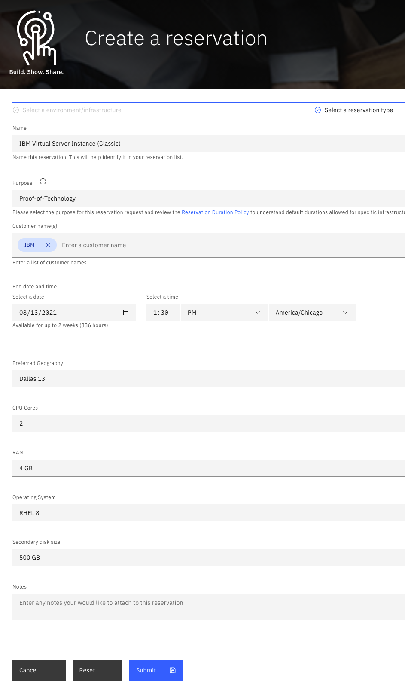
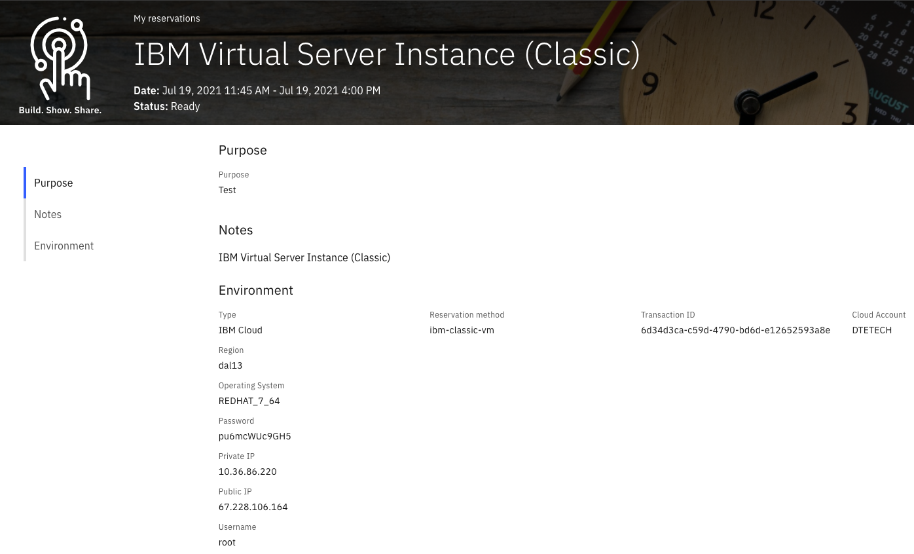
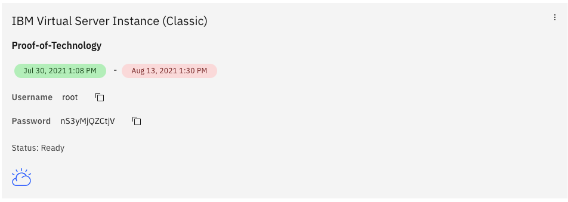

# GitOps Template Developer Guide

## Details 

The GitOps Agent utilizes Terraform as the main provisoning engine. All infrustructure code can be defined in TF config files by HCL (Hashicorp Configuration Language).

### Terraform patterns

Let's define a new pattern for IBM Cloud Virtual Server Instance. The pattern will allow users to provision an environment with customizable options (e.g. OS type, CPU, RAM, and local storage size).

The Terraform pattern should contain at least 3 config files: `variables.tf`,  `main.tf`, `output.tf`, and 2 optional: `input.tf` and `options.tf`.

Let's create a new Terraform module with the following config files:
1) `variables.tf`
Variables serve as parameters for a Terraform module, allowing aspects of the module to be customized without altering the module's own source code, and allowing modules to be shared between different configurations.
The variable declaration can also include a `default` argument. If present, the variable is considered to be optional and the default value will be used if no value is set when calling the module or running Terraform. These variables are not available to users directly via UI, and can be changed only by `reservation-ms` miscroservice. Each template should contain `cloud_provider` variable with Cloud Provider ID for proper loading. 
At this moment, the GitOps pipeline supports: `ibmcloud`, `aws`, and `azure`.

```
### Cloud Provider Credentials ####

variable "ibmcloud_api_key" {
  type = string
}

variable "iaas_classic_api_key" {
  type = string
}

variable "iaas_classic_username" {
  type = string
}

####################################


# Cloud Provider ID
variable "cloud_provider" {
  type    = string
  default = "ibmcloud"
}

variable "resource_group_name" {
  type    = string
  default = "DTE"
}

variable "access_group_name" {
  type    = string
  default = "dteroks-users"
}

variable "datacenter" {
  type    = string
  default = "dal13"
}

variable "user_email" {
  type = string
}

variable "user_id" {
  type = string
}

variable "requestId" {
  type    = string
  default = "NoID"
}

variable "primary_disk_size" {
  description = "Primary disk size"
  type        = number
  default     = 100
}
```
Here is the set of variables which will be sent to the GitOps Agent from the Reservation microservice:
| Cloud Provider | ID          | Variable | Description
|----------------|-------------|----------|-------------
| IBM Cloud      | ibmcloud    |ibmcloud_api_key | API key
|                |             |iaas_classic_username | Classic Infrastructure (SoftLayer) Username
|                |             |iaas_classic_api_key | Classic Infrastructure API key
| AWS            | aws         |aws_access_key | API Access Key
|                |             |aws_secret_key | API Secret Key
| Azure          | azure       |subscription_id | Subscription ID
|                |             |client_id       | Client ID
|                |             |client_secret   | Client Secret
|                |             |tenant_id       | Tenant ID
| Any            |             |user_email      | User Email
|                |             |user_id         | IBM Cloud User ID
|                |             |requestId       | Request ID associated with reservation

 

2) `input.tf`
The input TF contains variables which are available to users for changing in the reservation forms.

```
variable "os_reference_code" {
  description = "Operating System"
  type        = string
  default     = "REDHAT_8_64"
}

variable "cpu_cores" {
  description = "CPU Cores"
  type        = number
  default     = 2
}

variable "memory" {
  description = "RAM"
  type        = number
  default     = 2
}

variable "secondary_disk_size" {
  description = "Secondary disk size"
  type        = number
  default     = 0
}
```
Its variable descriptions will be rendered as labels for UI components (text box and drop-down list).


3) `options.tf`
This file contains options for corresponding input variables. Please append input variable with `_options` part.
They will be rendered as drop-down lists.
```
variable "os_reference_code_options" {
  type = list(object({
    value      = string
    prettyName = string
  }))
  default = [
    {
      value      = "REDHAT_7_64"
      prettyName = "RHEL 7"
    },
    {
      value      = "REDHAT_8_64"
      prettyName = "RHEL 8"
    },
    {
      value      = "UBUNTU_20_64"
      prettyName = "Ubuntu 20.04 LTS"
    }
  ]
}

variable "cpu_cores_options" {
  type = list(object({
    value      = number
    prettyName = string
  }))
  default = [
    {
      value      = 2
      prettyName = "2"
    },
    {
      value      = 4
      prettyName = "4"
    },
    {
      value      = 8
      prettyName = "8"
    }
  ]
}

variable "memory_options" {
  type = list(object({
    value      = number
    prettyName = string
  }))
  default = [
    {
      value      = 2
      prettyName = "2 GB"
    },
    {
      value      = 4
      prettyName = "4 GB"
    },
    {
      value      = 8
      prettyName = "8 GB"
    },
    {
      value      = 16
      prettyName = "16 GB"
    },
    {
      value      = 32
      prettyName = "32 GB"
    }
  ]
}

variable "secondary_disk_size_options" {
  type = list(object({
    value      = number
    prettyName = string
  }))
  default = [
    {
      value      = 0
      prettyName = "None"
    },
    {
      value      = 500
      prettyName = "500 GB"
    },
    {
      value      = 1000
      prettyName = "1 TB"
    },
    {
      value      = 2000
      prettyName = "2 TB"
    },
    {
      value      = 5000
      prettyName = "5 TB"
    }
  ]
}
```
Results:  
  


4) `main.tf`  
The main config file consists the resources to be provisioned.
```
data "ibm_resource_group" "resource_group" {
  name = var.resource_group_name
}

resource "random_string" "suffix" {
  length  = 5
  special = false
  upper   = false
}

locals {
  vm_name = "ibm-classic-${random_string.suffix.result}"
}

resource "random_string" "password" {
  length  = 8
  special = false
  upper   = false
}

data "ibm_compute_ssh_key" "public_key" {
  label = "gen1rsa"
}

data "ibm_security_group" "allow_ssh" {
  name = "allow_ssh"
}

data "ibm_security_group" "allow_all" {
  name = "allow_all"
}

data "ibm_security_group" "allow_outbound" {
  name = "allow_outbound"
}

resource "ibm_compute_vm_instance" "vm" {
  hostname             = local.vm_name
  domain               = "dte.demo.ibmcloud.com"
  os_reference_code    = var.os_reference_code
  datacenter           = var.datacenter
  network_speed        = 100
  hourly_billing       = true
  private_network_only = false
  cores                = var.cpu_cores
  memory               = var.memory * 1024
  disks                = var.secondary_disk_size > 0 ? [var.primary_disk_size, var.secondary_disk_size] : [var.primary_disk_size]
  local_disk           = false
  public_vlan_id       = 3103032
  private_vlan_id      = 3103034
  ssh_key_ids          = [data.ibm_compute_ssh_key.public_key.id]
  tags                 = [var.user_id, var.requestId]
  user_metadata = jsonencode({
    type = {
      keyname = "USER_DATA"
      name    = "User Data"
    }
    value = {
      vncPassword = random_string.password.result
      vncUser     = "dteuser"
    }
  })
}

resource "ibm_network_interface_sg_attachment" "sg_private1" {
  security_group_id    = data.ibm_security_group.allow_all.id
  network_interface_id = ibm_compute_vm_instance.vm.private_interface_id
  soft_reboot          = false
}

resource "ibm_network_interface_sg_attachment" "sg_private2" {
  security_group_id    = data.ibm_security_group.allow_outbound.id
  network_interface_id = ibm_compute_vm_instance.vm.private_interface_id
  soft_reboot          = false
}

resource "ibm_network_interface_sg_attachment" "sg_public1" {
  security_group_id    = data.ibm_security_group.allow_ssh.id
  network_interface_id = ibm_compute_vm_instance.vm.public_interface_id
  soft_reboot          = false
}

resource "ibm_network_interface_sg_attachment" "sg_public2" {
  security_group_id    = data.ibm_security_group.allow_outbound.id
  network_interface_id = ibm_compute_vm_instance.vm.public_interface_id
  soft_reboot          = false
}

data "external" "vsi_credentials" {
  program = ["bash", "${path.module}/scripts/get-vsi-creds.sh"]
  query = {
    ibmcloud_api_key = var.ibmcloud_api_key
    vm_id            = ibm_compute_vm_instance.vm.id
  }
  depends_on = [ibm_compute_vm_instance.vm]
}
```

5) `output.tf`
Output values are a way to expose some of that information to the user of your pattern.

```
output "username" {
  description = "Username"
  value       = data.external.vsi_credentials.result.username
}

output "password" {
  description = "Password"
  value       = data.external.vsi_credentials.result.password
}

output "public_ip" {
  description = "Public IP"
  value       = ibm_compute_vm_instance.vm.ipv4_address
}

output "private_ip" {
  description = "Private IP"
  value       = ibm_compute_vm_instance.vm.ipv4_address_private
}

output "os" {
  description = "Operating System"
  value       = var.os_reference_code
}

output "sharingportalid" {
  description = "Username"
  value       = data.external.vsi_credentials.result.username
}

output "sharingPortalPwd" {
  description = "Password"
  value       = data.external.vsi_credentials.result.password
}
```
These output values will be rendered and presented to the user in its reservation card view.

`sharingportalid` and `sharingPortalPwd` will be shown as username and password.


Example: https://github.ibm.com/dte2-0/ccp-gitops-patterns/tree/main/ibm-classic-vm
### Contribution
Save your TF files in a new folder. The folder name (e.g. `ibm-classic-vm`) will be used as your pattern name. Commit changes to 
https://github.ibm.com/dte2-0/ccp-gitops-patterns
The GitOps agent will upload your pattern to Techzone automatically.
