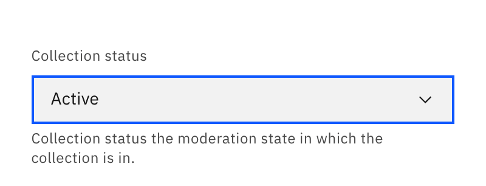
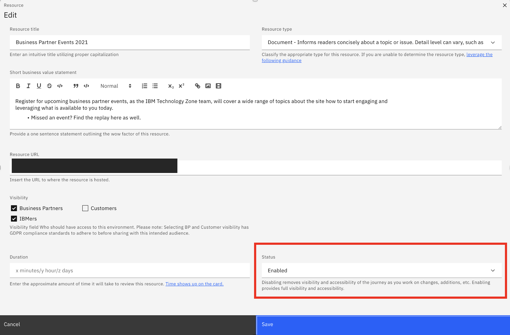

## How to Publish your Collection or Resource on TechZone

**Collection status change**

* Click to edit collection button.
* Navigate to the bottom right of the collection to the 'Collection status' field. 
* Change the status from draft to active. 

**NOTE:** Required fields to save a collection entry need to be filled in prior to saving or changing status of a collection. Required fields are: title, short business value statement, IBM products, and brands. 

**Resource status change** 

* Click on the resource edit button.
* Navigate to the bottom right of the resource to the 'Status' field.
* Change the status from disabled to enabled. 

**NOTE:** Required fields to save a resource entry need to be filled in prior to saving or changing status of a resource. Required fields are: resource title, resource type, short business value statement, resource url, and at least one visibility persona selected.

Journeys and environments will be similar to resources.
