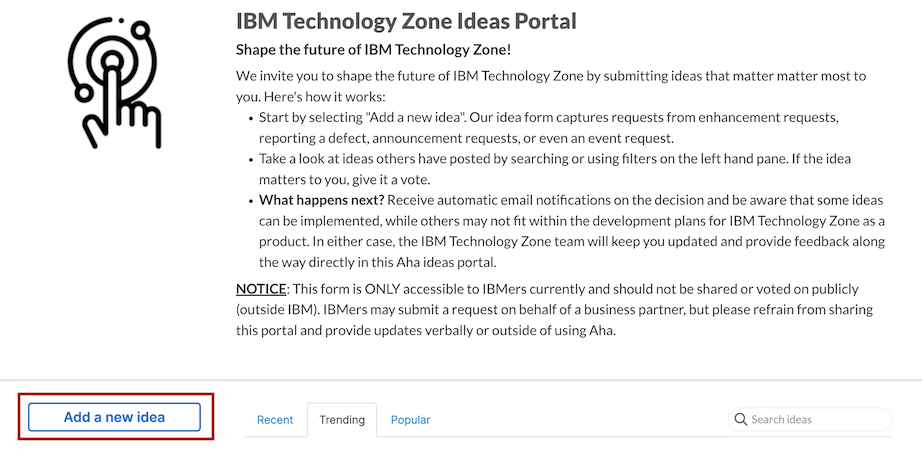
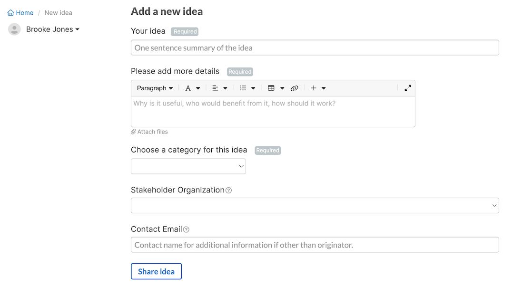

# How to Submit an Idea to the IBM Technology Zone Team

The IBM Technology Zone team uses Aha for the single place to capture feedback and ideas regarding IBM Technology Zone. 

1.  Get started submitting your first idea by going to the [IBM Technology Zone Enhancements](https://itz-enhancements.ideas.aha.io/portal_session/new) Page

2.  Click the 'Add a new idea' button 

3. Fill out the idea form to provide us more information on your idea. 

- Provide a Summary statement of your idea so that we can identify your request quickly when reviewing. 

- Please provide additional detail:

  * Describe your idea you have in mind
  * Outline clearly what you are looking for
  * Explain why you would like to see this
  * Highlight who else would benefit from this idea

- Choose an idea category. Below are the types of ideas that you can request today:

  * Enhancement request: 	An enhancement makes doing something on the site that was already possible before simpler. Add onto the capability of a feature to improve the existing functionality. 

  * Report a defect: While the definition of 'bug' is commonly understood, here are some examples: 

    - Incorrect or misleading user interface text. 

    - Usability issues that prevent people from using functionality (as if it didn't work at all)

  * Announcement request: Feedback regarding news, announcements, contests, user surveys, polls, and more that you would like to see regarding IBM Technology Zone in the [#itz-techzone-announcements](https://ibm-dte.slack.com/app_redirect?channel=itz-techzone-announcements) Slack channel. 

  * Event request: Request an event topic of interest for the [Webinar Series: IBM Technology Zone](https://ec.yourlearning.ibm.com/w3/series/10180821?other=Upcoming%20Events). 

- Select your stakeholder organization. (optional field)

- Provide an additional contact email if another party is interested in further discussing this idea. This field is for email information that is not the submitter of this idea form. (optional field)

4. Select "Share idea" when form is completely filled out. 

### Support

For any questions, contact ITZ support - techzone.help@ibm.com
