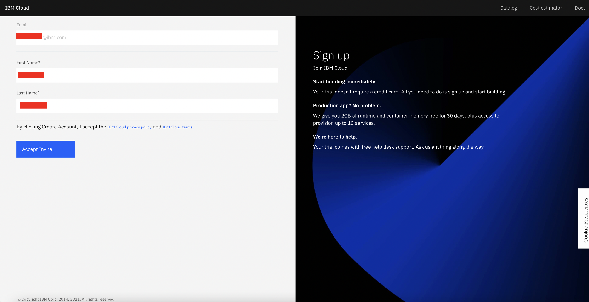
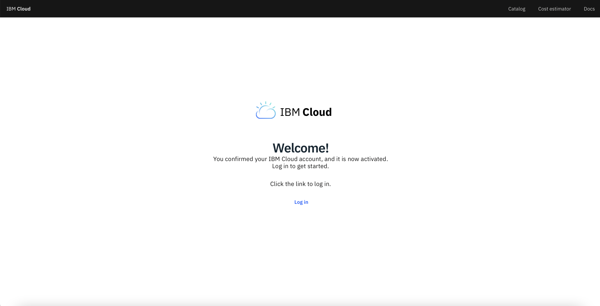
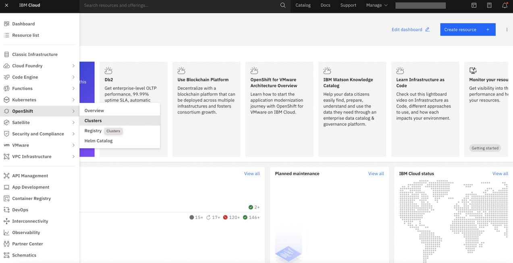
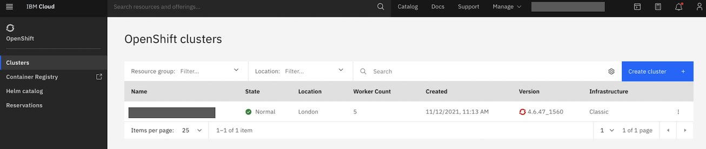
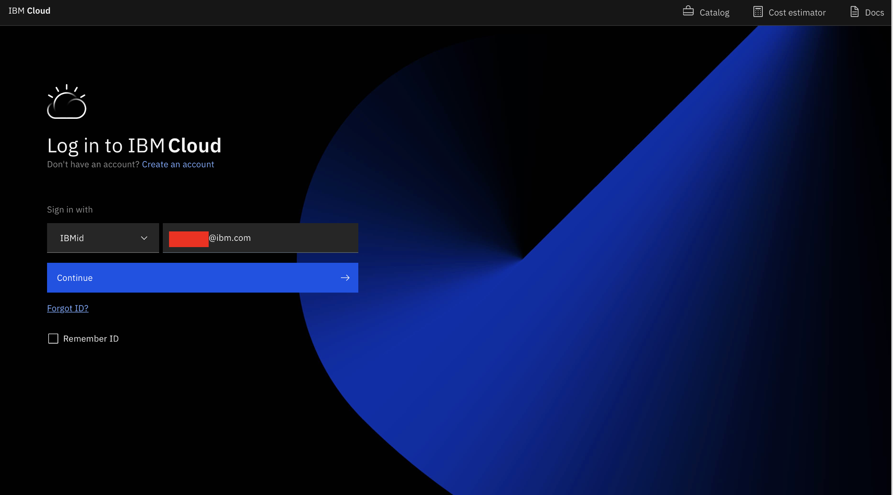

# How to Accept an IBM Cloud Invite 

When your environment is being provisioned, you will be able to see it in "My reservations", however that does not mean you will be able to access it. When your environment is ready you will get an invitation in **IBM Cloud to accept the invite to the Technology Zone teams shared IBM Cloud account**. If you do not accept the invitiation you will not be able to access the environment. 

To learn how to reserve an environment, view this document. 

## How to Accept an IBM Cloud Invite through your email
**Step 1** Navigate to your email where you should have received IBM Cloud environment updates ("Your environment has been scheduled", "Your environment is provisioning", "You are invited to join an account in IBM Cloud" and finally "Your environment is ready")

 

**Step 2** Inside the email titled "You are invited to join an account in IBM Cloud", click "Join now". 

**Step 3** You will be taken to a page where you are required to fill in your IBMid credentials. Click 'Accept Invite'.

**Step 4** You will see a Welcome page where you will be able to click "Login".

**Step 5** Ensure you are on the right account for this reservation. 

**Step 6** Click the three stacked line icon on the left of the top header > Click "OpenShift" > Click "Clusters".

**Step 7** You now have access to your reserved cluster.

## How to Accept an IBM Cloud Invite through your IBM Cloud account

**Step 1** Navigate to [IBM Cloud](https://cloud.ibm.com) and login with your IBMid.

**Step 2** Click on the bell notifications icon.

**Step 3** You will see a notification that says "You are invited to join an account in IBM Cloud", click the blue link on the right of your screen that says "Join now"

**Step 4** You will be taken to a page where you are required to fill in information to Join IBM Cloud.

**Step 5** You will see a Welcome page where you will be able to login.

**Step 6** Ensure you are on the right account for this reservation.

**Step 7** Click the three stacked line icon on the left of the top header > Click "OpenShift" > Click "Clusters".

**Step 8** You now have access to your reserved cluster.

### What Happens If I Do Not Accept the IBM Cloud Invitation?

Why can't I access IBM Cloud? If you do not accept the IBM Cloud invitation, as specifically directed in the reservation details you will encounter an error.

