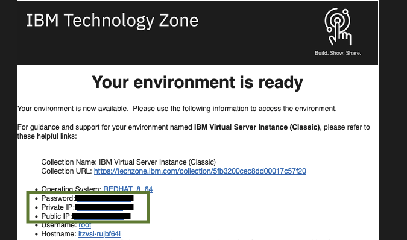

#  IBM Virtual Server Instance (Classic) Reservations

1. When reserving an IBM Virtual Server Instance (Classic) Environment, you will receive the following details  
  

Access the VM using the Public IP, Username and Password  

For Linux, use ssh  
For Windows, use RDP  

Note: Private IP is not accessible externally. This can only be used between IBM Virtual Server Instance (Classic) VMs.  

### Support  

For any questions, contact ITZ support - techzone.help@ibm.com  
