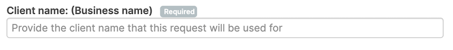
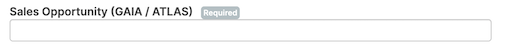
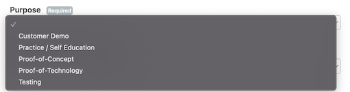
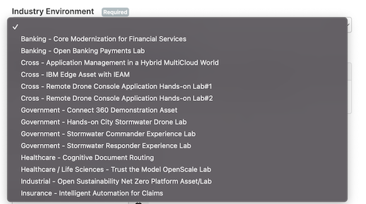
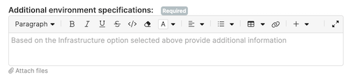
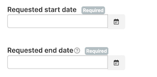
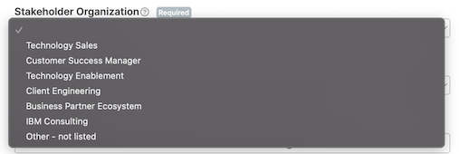
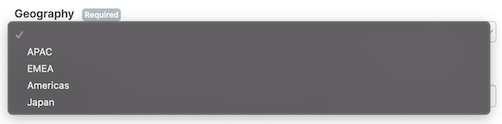
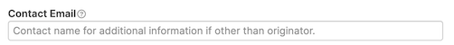
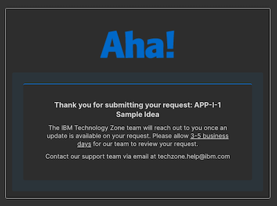

# Industry Environment Request Process and Expectations

The following document is a step-by-step of how to submit an Industry Environment Request and the manual processing performed in order to fulfill the request.

**Note on this Aha form:** This request form is only temporary.  Eventually the goal is to automate the on- and off-boarding of users.  As that happens, industry environments will be removed from the form.

1. Navigate to the **Industry Environment Requests form**: https://sbaas.ideas.aha.io/ideas/new

2. Login with your IBMid credentials

NOTE: Business Partners and IBMrs with a IBMid can sign into this form

3. Ensure you read the following important message at the top of the form. As this will give you time frame to expect a response after submitting this form.

**IMPORTANT**: Please allow 3-5 business days for our team (IBM Technology Zone team) to evaluate your request and connect you with the owning content team. We highly encourage you to submit your request 1 week prior to the planned client engagement to ensure content can be prepared in support of your client meeting. Content owners are available to assist in content customization in support of large client opportunities.

4. Fill out the Industry Environment Request form: 

* **Client name** - Enter name of client.  If this is for educational purposes, include a short description

* **Sales Opportunity** - Enter sales opporunity number, or `Education` or `Testing`

* **Purpose** - Choose one of the values depending on how you are planning to use this Industry Environment.  If this related to a customer opportunity (PoC, demo preparation, etc), please be sure to include a valid oppty above.

* **Industry Environment** - Choose the Industry Environment that you would like to request access to

* **Additional environment specifications** - Depending on what is needed, this may or may not be accommodated. Use this field to provide mandatory requirements that you need within this environment that the content team needs to be aware of when working with you on this request. 

* **Requested start/end date** - Enter dates in which you need access to the environment for. 

Note: For dates longer than 2 weeks, or if extensions are required, a valid opportunity number may be necessary. 

* **Stakeholder Organization** - Choose the organization that you are in. You can use bluepages to further identify this field.

* **Geography** - Choose your Geography location. 

* **Contact email** - If there is another individual that will be needing access or that is tied to this request in some way, please add their email in this field. (different email than the requester)

5. Once the form is submitted, you will receive a confirmation email with the request ID for reference. 

6. While waiting, here is what is taking place behind the scenes:

- The IBM Technology Zone team receives the request and routes it to the owning IBM team. This routing piece could take 1-2 business days. The owning team will depend based upon the Industry Environment you selected in the Aha form that you are requesting access to. 
- Once the IBM team is aware of your request, there is an additional time frame needed to setup the environment and to provide you access. This piece could take 2-3 business days. You will be emailed by the owning team once your environment has been properly setup. This email will include credentials and other information to help with onboarding. 

7. Access your Industry Environment! 

8. Requested end date coming due process: Once the Industry Environment requested end date is coming due to expire, the IBM Technology Zone team will contact the owning Industry environment IBM team about the expired request. The Industry environment owning team will then off-board the user, if necessary. 

NOTE: If you need more time, please be sure to contact the owning IBM team about how long you would like to extend the requested end date to so that you do not lose your environment. IBM owning team would have to approve the extension, as this is not a garantee. Providing a valid oppotunity code will help justify the need of the extension. 

## How to identify the owning Industry Environment team

Navigate to the following specific Industry Environment collection and find the author and collaborator information on the collection page. These individuals are the owning Environment team that you can contact if you have additional questions after your request has been routed to them from the IBM Technology Zone team. 

| Sandbox Name | 
|--------------|
| [Banking - Core Modernization for Financial Services](https://techzone.ibm.com/collection/core-modernization-fs#tab-2)  |        
| [Banking – Open Banking Payments Lab](https://techzone.ibm.com/collection/open-banking-hands-on-lab)                      | 
| [Cross – Remote Drone Console Application Hands-on Lab#1](https://techzone.ibm.com/collection/dronelab1)    |  
| [Cross – Remote Drone Console Application Hands-on Lab#2](https://techzone.ibm.com/collection/dronelab2)   | 
| [Cross - Application Management in a Hybrid MultiCloud World](https://techzone.ibm.com/collection/sandbox-as-a-service-sbaas-activation-kit) |
| [Cross -IBM Edge Asset with IEAM](https://techzone.ibm.com/collection/sandbox-as-a-service-sbaas-activation-kit)                            | 
| [Government – Connect 360 Demonstration Asset](https://techzone.ibm.com/collection/c360-demo-asset)           |  
| [Government – Hands-on City Stormwater Drone Lab](https://techzone.ibm.com/collection/government-hands-on-city-stormwater-drone-lab)           | 
| [Government – Stormwater Commander Experience Lab](https://techzone.ibm.com/collection/government-industry-stormwater-commander-experience-lab)            |  
| [Government – Stormwater Responder Experience Lab](https://techzone.ibm.com/collection/government-industry-stormwater-responder-experience-lab)            |   
| [Healthcare – Cognitive Document Routing](https://techzone.ibm.com/collection/EIL-HCLS-Cognitive-Routing-Lab)                      | 
| [Healthcare / Life Sciences – Trust the Model OpenScaleLab](https://techzone.ibm.com/collection/IEL-HCLS-Building-Trusted-OpenScale-Lab)   | 
| [Industrial - Open Sustainability Net Zero Platform Asset/Lab](https://techzone.ibm.com/collection/ibm-open-sustainability-net-zero-osnz-platform) | 
| [Insurance – Intelligent Automation for Claims](https://techzone.ibm.com/collection/intelligent-automation-claims)             |  
