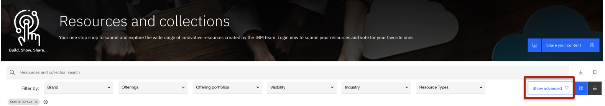

# Search Page Filter Logic

When searching on IBM Technology Zone this filter logic can help users identify how best to narrow their search.

Users will find search filter options from the search page: https://techzone.ibm.com/search

Additinally selecting the "Advanced search" button will provide more filter options. 

Filters that are AND logic:
- searchbox
- AudienceFilter
- BusinessUnitsFilter
- BrandsFilter 
- CategoriesFilter 
- IndustriesFilter 
- TechnicalDecisionPointsFilter
- ProductsFilter
- PortfoliosFilter
- StatusFilter
- TagsFilter
- TypeFilter
- FlagsFilter
- SimpleFilter
- HasResourcesFilter
- HasPlatformsFilter
- HasJourneysFilter
- VisibilityFilter
- UpdatedAtFilter
- CreatedAtFilter
- ExpireAtFilter
- VerifiedAtFilter
- LanguageFilter
- FlagsSensor

Filters that are OR logic: everything else not mentioned in AND logic list above.

