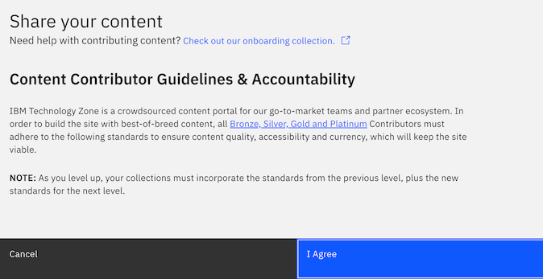
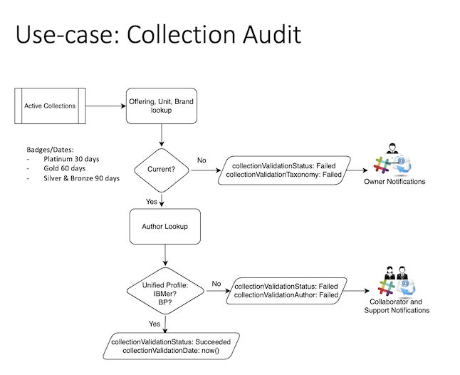

# Automated Collection Lifecycle Management on Technology Zone *RETIRED*

*RETIRED*

As of today, content contributors must adhere and agree to guidelines and standards before creating and publishing any collection on IBM Technology Zone. Refer to screenshot below on terms you agreed to as a contributor to maintain consistent, accessible, and quality content is published on the site. 

(screenshot below - this pop up modal displays after select "Share your content" button)

  

Due to the maintanence of content authors collections being a manual process today, the IBM Technology Zone team is working on a solution to automate notifications to content authors when their collections have an identified issues to resolve regarding quality standards. Below are a list of issues that our team will be automating checks for regarding content issues:

1) Collection ownership: When and if a collection owner is not longer within IBM or their is no longer active, a new author/owner should be assigned. 
2) Collection last updated date: Depending on your collections badge, different standards apply today:
   - Bronze & Silver adheres to a 90 day refresh cycle.
   - Gold adheres to a 60 day refresh cycle. 
   - Platinum adheres to a 30 day refresh cycle. 
3) Collection has proper taxonomy applied: Collections have to have valid IBM Federated catalog offerings applied for a consistent user experience searching for your content and for proper reporting offering usage metricss. 
6) Collection has an associated brand: Collection have to have a brand applied for a consistent user experience searching for your content and to ensure proper reporting offering usage metrics are captured appropiately which is reliant on this field as well.
7) Collection has been badged appropriately: Collections must have a badge associated with their collection and should be reviewed when refresh cycle approaches to ensure that your collection still meets the minimal criteria for each badge at that time. 

Why is this process being automated? As content contributors accumulate and contribute more collections the ability to manage timeframes of when updates should be made and the meta data underlying is tagged appropriately can be hard to maintain manually. We appreciate the contributions made to IBM Technology Zone, now let us help you manage it with friendly reminders and content checks. 

## What is changing: 

Emails sent to authors to remind them to update content based on content badge standards. Refer to the above list of issues that our new validation service will check regarding your content. 

## When to expect this automation: 

This automation is planned for Q3 2022. 

Please come back to this runbook for additional documentation as we have more details on this initiative. 

Two validation checks to expect with MVP rollout end of July. 

1. Based on badge of collection email authors if collections last updated date is more than the following per badge.
   - 30 days for Platinum
   - 60 days for Gold
   - 90 days for Silver & Bronze
2. Validate content owner is still valid. If not found in Blue Pages or within Authorization service, then email collaborators to reassign ownership.

Emails sent to authors with trigger based on once a week running validation checks on all collections on published on Technology Zone. If a collection is in a draft or retired status the validation will not occur on these collections.

## Support

Additional questions or support on this initiative can be direct to brooke.jones@ibm.com.
