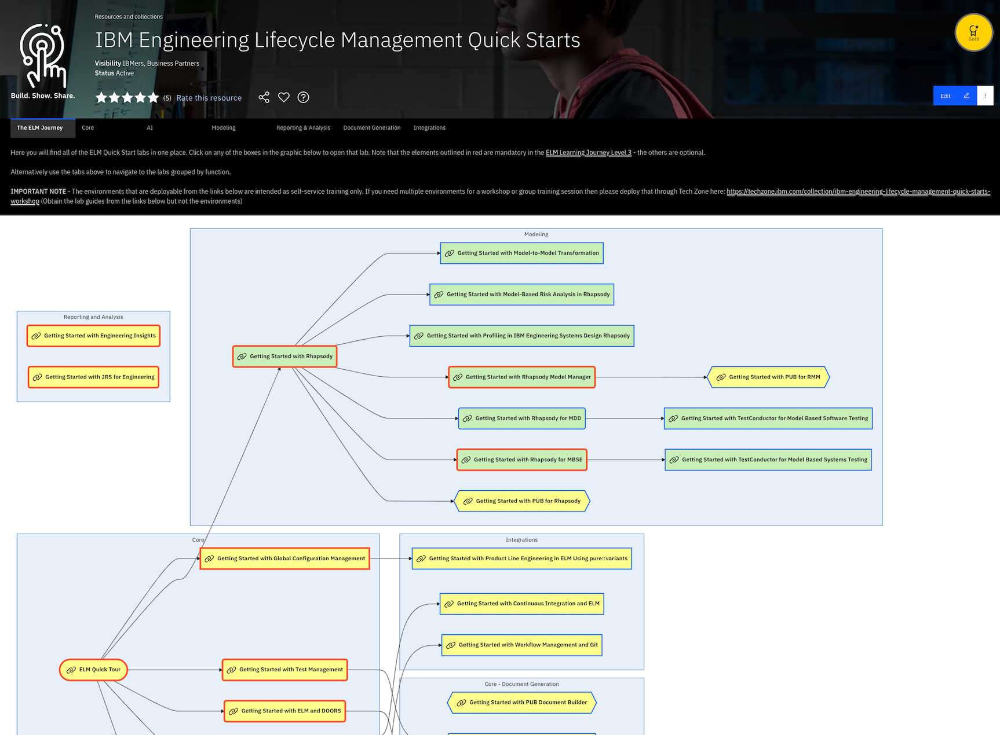
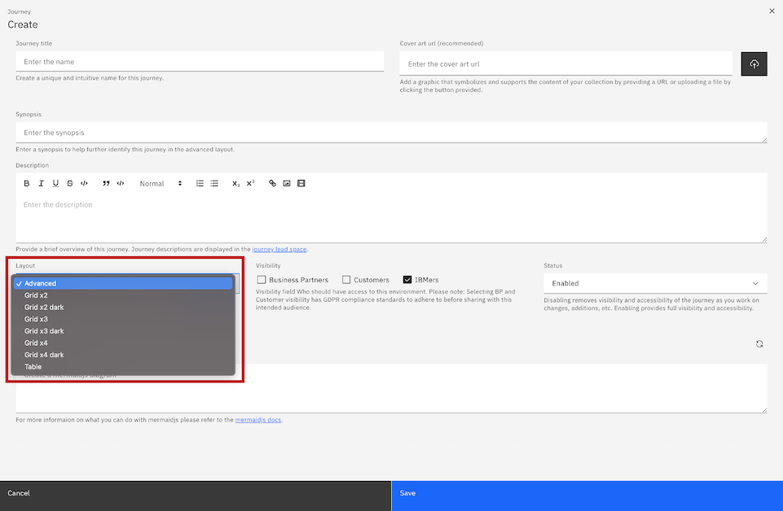
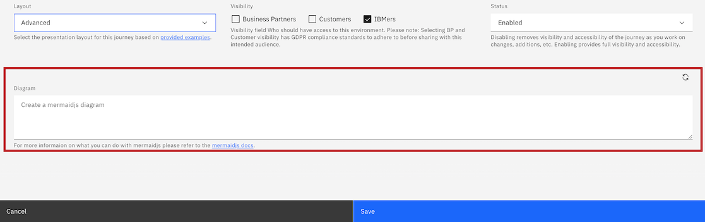

# Customized journeys with Mermaid

The main purpose of Mermaid is to help with Visualizing Documentation and resources using text and code. It is a Javascript based diagramming and charting tool that renders Markdown-inspired text definitions to create and modify diagrams dynamically. 

Get started learning about mermaid syntax here: https://mermaid-js.github.io/mermaid/#/./n00b-syntaxReference

See an example of a collections journey using advanced mermaid. 

https://techzone.ibm.com/collection/ibm-engineering-lifecycle-management-quick-starts

## How to create advanced Mermaid journeys on your collections

1. Navigate to your owned collection and select the edit button in the top right banner of the collection page.

2. From the edit collection form, navigate to the Journey section. Click the "Add a journey" button.

3. Fill in the title, synopsis, description, as these are required fields. 

4. To create an advanced mermaid journey which is a fully customizable workflow, select from the Layout field "Advanced".

5. This will display an additional field, called "Diagram". This field is where you will input your customized mermaidjs diagram markdown. 

## Supporting documentation

Leverage the Mermaidjs docs site: https://mermaid-js.github.io/mermaid/#/flowchart

### Support 

This is not fully supported by IBM Technology Zone team. 

For any questions, contact ITZ support - techzone.help@ibm.com
