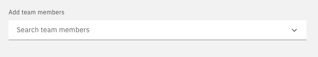
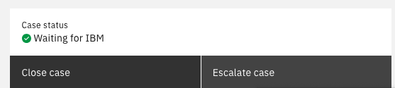
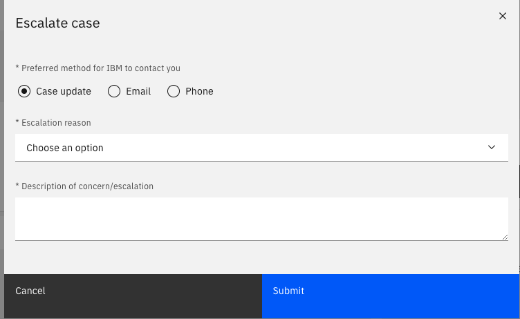

# How to open a Support web Case.
This runbook contain steps for opening a support case with the IBM TechZone Support Team

- [Getting started](https://github.com/IBM/itz-support-public/blob/main/IBM-Technology-Zone/IBM-Technology-Zone-Runbooks/open_case_web_internal.md#Getting-started)
- [Adding a Team member to your case](https://github.com/IBM/itz-support-public/blob/main/IBM-Technology-Zone/IBM-Technology-Zone-Runbooks/open_case_web_internal.md#adding-a-team-member-to-your-case)
- [How to view your case](https://github.com/IBM/itz-support-public/blob/main/IBM-Technology-Zone/IBM-Technology-Zone-Runbooks/open_case_web_internal.md#how-to-view-your-cases)
- [How to manage your case](https://github.com/IBM/itz-support-public/blob/main/IBM-Technology-Zone/IBM-Technology-Zone-Runbooks/open_case_web_internal.md#how-to-manager-case)
- [How to escalate your case](https://github.com/IBM/itz-support-public/blob/main/IBM-Technology-Zone/IBM-Technology-Zone-Runbooks/open_case_web_internal.md#how-to-escalate-your-case)
- [Notification emails](https://github.com/IBM/itz-support-public/blob/main/IBM-Technology-Zone/IBM-Technology-Zone-Runbooks/open_case_web_internal.md#notifcation-mails)

## Getting started
### 1. From the IBM Technology Zone [Help Page](https://techzone.ibm.com/help)

### Click [Open a case](https://ibmsf.force.com/ibminternalproducts/s/createrecord/NewCase?language=en_US) hyperlink to get redirect to the webform

   

### You can also open a case directly from the [IBM Internal Web case](https://ibmsf.force.com/ibminternalproducts/s/), select "Open a case" to get started

### 3. Complete and submit form to open a support case

 - **Type of Support:** select or Type **Product Support**if it is not default.
 - **Case Title:** Enter the case title that best describes your inquiry.
 - **Product manufacturer:** select or type **IBM** if it is not default.
 - **Product:** select or type **IBM Technology Zone** if it is not listed. Other Product Alias accepted "**TechZone**", "**ITZ**"
>_**IMPORTANT NOTE: Product is a required field to ensure case gets routed to proper support queue**_
 - **Reservation ID:** Enter your reservation id, if not applicable leave blank
 - **Severity and account information:** select the severity level that defines your case.
>**Note:** severity level is subject to change after your case is reviewed by a Support agent. 
 - **Case Description:** enter detailed description of your issue/inquiry
 - **Client reference:** include if available
 - **Case Contact number:** include if available
 - **Add team memebers:** You can add your team members to your case. **Note:** Team members can only be added before you submit a case and not after.
   
### 4. Click **Submit Case**, case is automatically created

>Note: You will be taken to your Case detail page that includes your Case number and description.

## Adding a Team member to your case

Adding a team member to your case has to be completed while creating your support case and not after. Team memebers cannot be added after you submit a case
- Enter the name of your team membeer in the "search box"

  
  
- Select the team member name from the drop down list
- The team member is automatically added to the "Selected member" list
- You can include mutiple team members on your case
  

## How to View your cases

Click on [My Cases](https://ibmsf.force.com/ibminternalproducts/s/my-cases) to view your case list 

You can also go to [IBM Internal Web case](https://ibmsf.force.com/ibminternalproducts/s/), select "View your cases" 

A list of all your case will be visible, example below 

Select a case to view available details, list below 
 - case number
 - case history
 - add comment
 - response and comment from a support agent
 - case status
 - close case
 - escalate case
 - case information
 - upload files
 - Team members

## How to Manager case
 Your case can be managed from the details view. Select the case you intend to manage from [My Cases](https://ibmsf.force.com/ibminternalproducts/s/my-cases)
 
 
- you can **add a comment** to provide additional details on your case to the support team 
- close case
- escalate case
- View responses to your case.

  ## How to escalate your case

  - Click on Escalate case
    
    
  - Select "preferred method of contact". 
> Phone not currently supported
  - Select "escalation reason" from drop down list
  - Type your "Description of concern/escalation"
    
    
    
  - click submit
   

## Notifcation Mails 

A notifcation mail is sent when a cases is submitted and for subsequent actions taken on the case.

Example, **Case Created**, **Awaiting Feedback** and **Case Closed**

