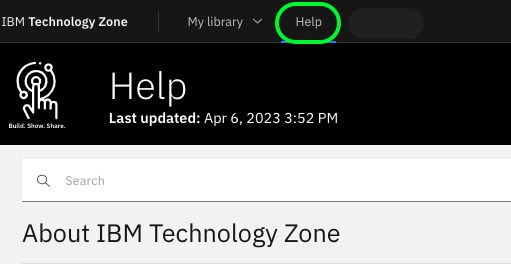
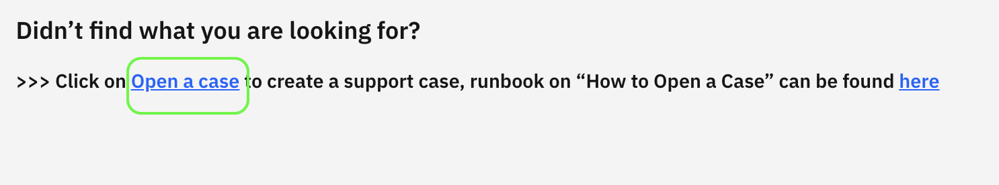
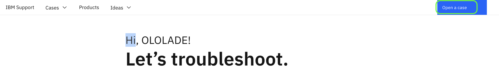
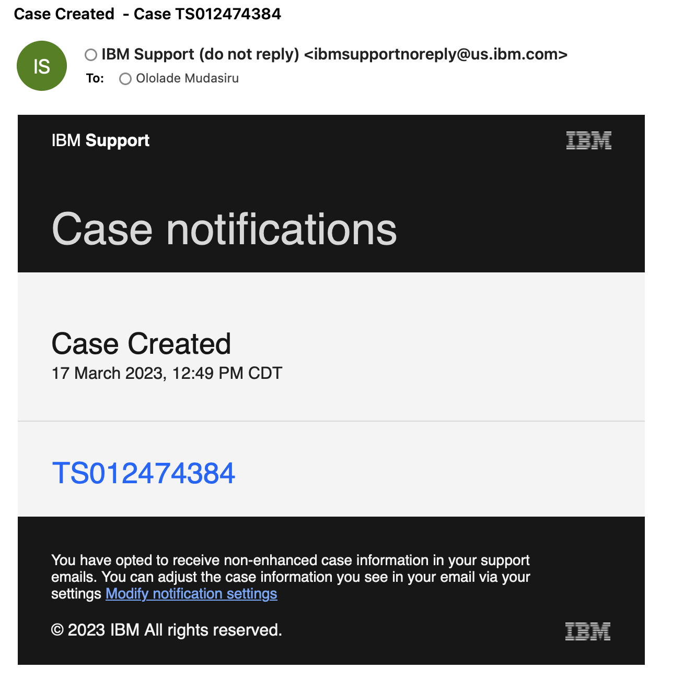
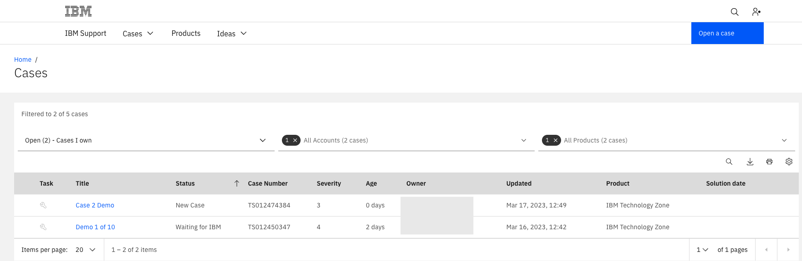
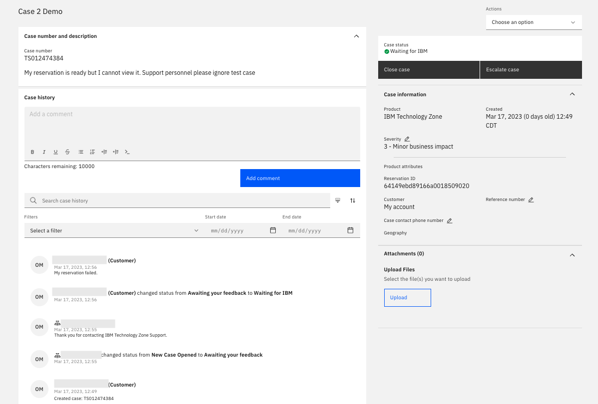
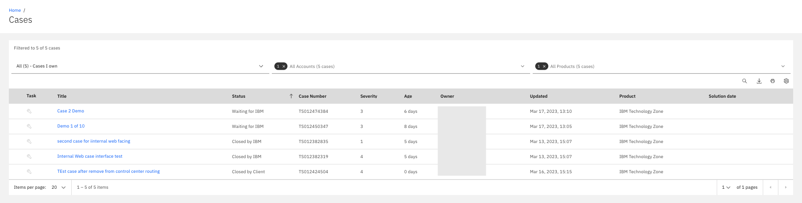
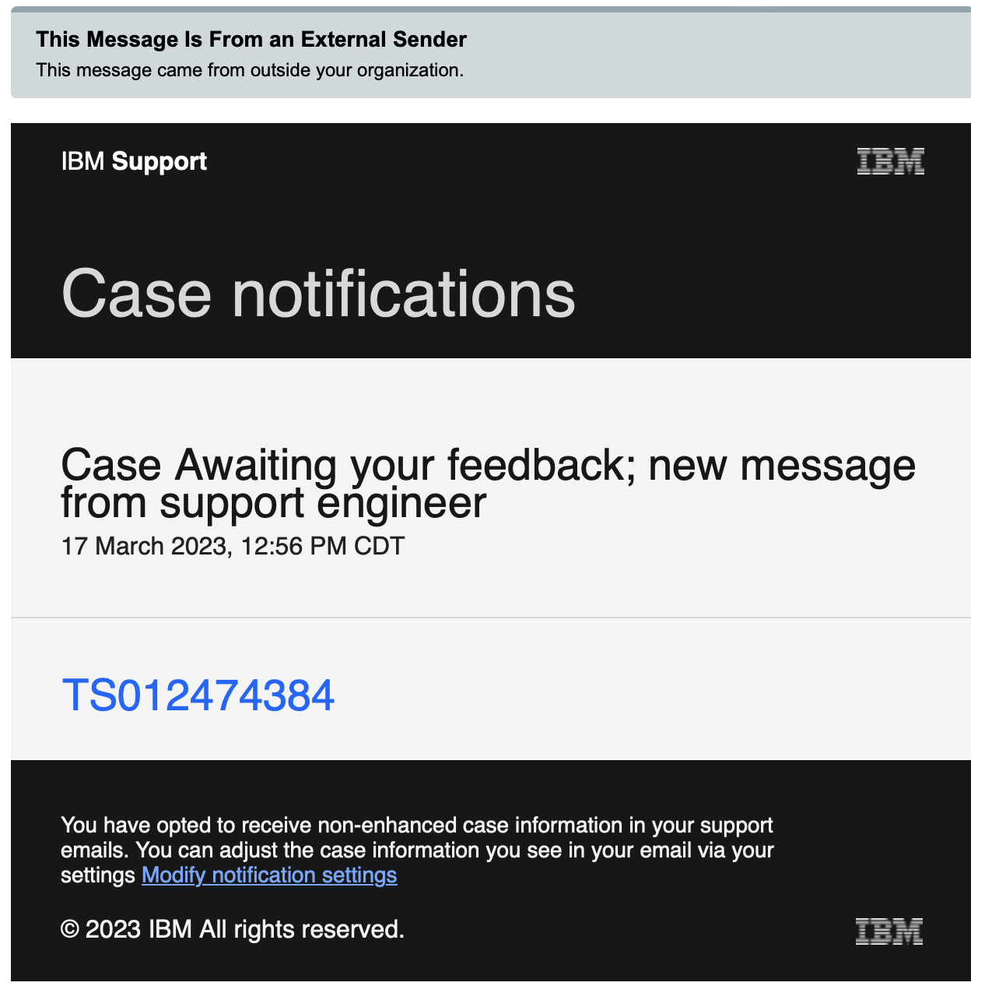
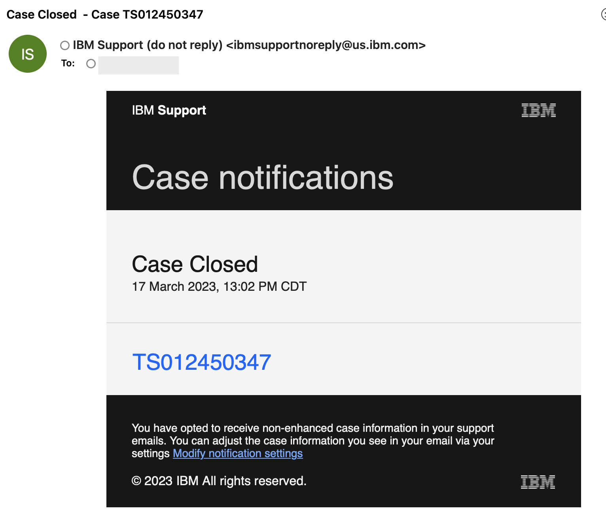

## How to open a Support web Case.

1. Go to IBM Technology Zone [Help Page](https://techzone.ibm.com/help)

2. Click on [Open a case](https://ibmsf.force.com/ibminternalproducts/s/createrecord/NewCase?language=en_US) hyplerlink or log in to [IBM Internal Web case](https://ibmsf.force.com/ibminternalproducts/s/), select "Open a case"  
3. Begin to fill the form to open case your support case
4. **Type of Support:** select Product Support
5. **Case Title:** Enter the case title that best describes your inquiry
6. **Product manufacturer:** IBM
7. **Product:** Select **IBM Technology Zone** Note: This is a required field to ensure you case gets routed to proper queue
8. **Reservation ID:** Enter the reservation id, if not applicable leave blank
9. **Severity and account information:** select the severity level that defines your case
10. **Case Description:** enter detailed description of your issue/inquiry
11. **Client reference:** include if available 
12. **Case Contact number:** include if available
13. Click **Submit Case**
14. Your case is automatically created

>Note: - You will be taken to your Case detail page that includes your Case number and description
- You will immediately receive a case created mail 

## How to View your cases

Click on [My Cases](https://ibmsf.force.com/ibminternalproducts/s/my-cases) to view your case list

You can also go to [IBM Internal Web case](https://ibmsf.force.com/ibminternalproducts/s/), select "View your cases" 

A list of all your case will be visible 

Select a case to view details 

Details available
- case number
- case history
- add comment, 
- response and comment from a support agent
- case status
- close case
- escalate case
- case information
- upload files 

## How to Manager case
 Your case can be managed from the details view. 
 Select the case you intend to manage from [My Cases](https://ibmsf.force.com/ibminternalproducts/s/my-cases)
 
 
- you can **add a comment** to provide additional details on your case to the support team 
- close case
- escalate case
- View responses to your case. 

## Notifcation Mails sent

A number of mails are sent through the procees from when opend to closed

Example 

1. Case Created

2. Awaiting Feedback 

3. Case Closed 

