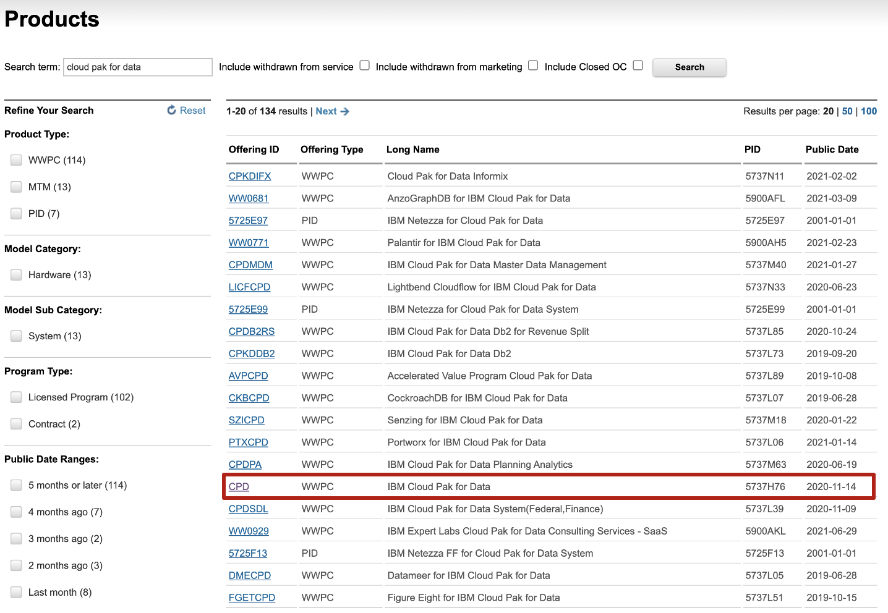
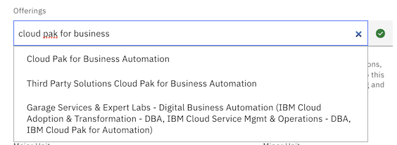
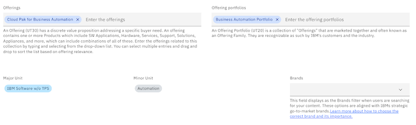
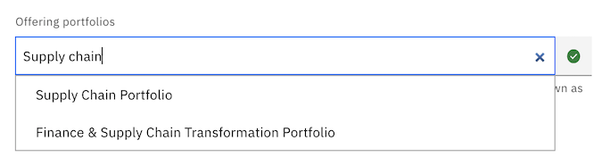
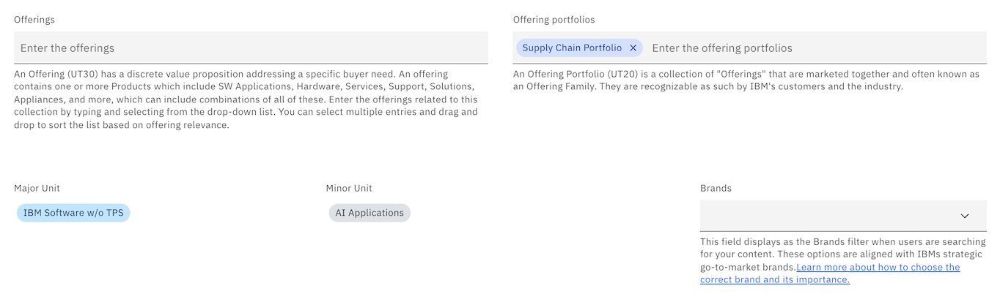
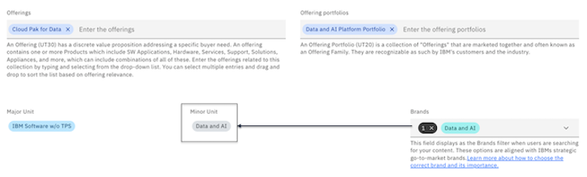
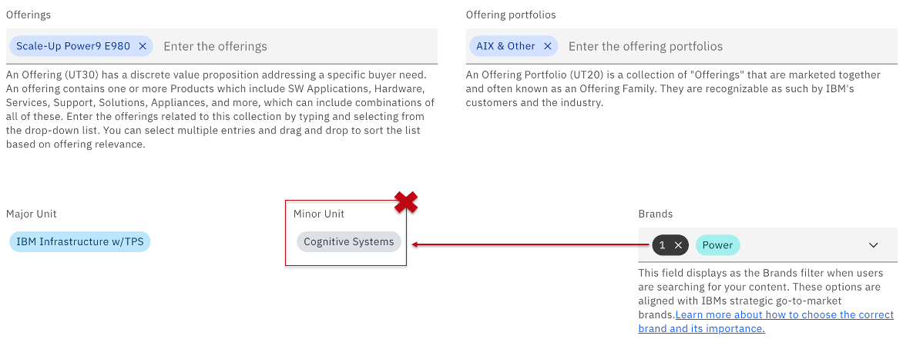

# Unified Taxonomy fields on your collections

How it works today and who to contact based on the issue you are facing with IBM Technology Zone's taxonomy. 

## Basics of IBM Unified Taxonomy (UT)

Learn more about [unitified taxonomy terminology](https://w3.ibm.com/w3publisher/unified-taxonomy/ut-terminology)

To find your official product, brand, and business unit, please visit the official [IBM Federated Catalog (FedCat)](https://uatfedcat001.w3-969.ibm.com:9201/).

Use the 'Search term:' field to search for your product. 

Lets look up Cloud Pak for Data as an example in the catalog to find the Brand and Business Unit for this product: 

Reference the following taxonomy breakout:

* Offerings: UT level 30 code

* Offering portfolio: UT level 20

* Minor unit: UT level 15 code

* Major unit: UT level 10 code

## Effective Unified Taxonomy (UT) overall mapping as of today

See all taxonomy levels available today from Federate Catalog [here](https://prodfedcat001.w3-969.ibm.com:9201/ut_hierarchy.html).

Ensure both 'Exclude' options are both selected, as these will remove finance records that are not relevent.

Additionally review the Level 10 and Level 15 options as needed to find the offering you are looking for and the true taxonomy behind the scenes. 

## How to catalog the correct taxonomy for your collection on IBM Technology Zone

First understand why cataloging collections by IBMs Federated Catalog is so important: When reviewing IBM Technology Zone's collection inventory, content is filtered into brand specific reports back up to executives. Reviewing how many collections of content there are on IBM Technology Zone under the brand "Data & AI" for example, or "Security". These reports help us understand the inventory of content on the site today. 

Cataloging taxonomy on your collections starts with either a specific **Offering** involved with your demo OR an **Offering Portfolio**. 

* If your collection is a demo about a specific **Offering** then start by searching and selecting from the correct offering in the drop down menu. This will pre-populate the rest of the taxonomy fields automatically (Offering portfolios, Minor unit, and Major unit). 

* If your demo is not specific to one offering then skip to the **Offering portfolios** field to search and select from the Offering portfolios drop-down menu. This will pre-populate the rest of the taxonomy fields automatically (Minor unit, Major unit). 

**IMPORTANT NOTE:** The **Offerings** and **Offering portfolios** fields are an **AND/OR** required feilds. Meaning both need to be populated or at minimum, Offering portfolios field. Also note that selecting from the drop down list will pre-populate the other taxonomy fields that are required as well. Ensure to select from the drop down menu options to populate the Minor and Major unit fields automatically. 

Example 1: Searching "Cloud Pak for Business Automation" and selecting from the Offerings drop down menu.

After selecting "Cloud Pak for Business Automation" in the drop-down list, the rest of the taxonomy fields will populate automatically (Offering portfolios, Minor unit, Major unit). Displaying the end result as shown below. 

Example 2: Searching "Supply Chain Portfolio" and selecting from the Offerings drop down menu.

Searching "Supply Chain Portfolio" in the drop-down list, the rest of the taxonomy fields will populate automatically (Minor unit, Major unit). Displaying the end result as shown below. 

## Selecting the correct Brand

This field will be the new way for content contributors to associate their collections to a specific go-to-market brand. Additionally, this will result in a Brand filter for users to search for content by each of these go-to-market brands. This brand field was created due to the internal Unified Taxonomy nomenclature not being known outside of IBM. These brands align with how we promote offerings outside of the company. For example, with Power and IBM Z, nomenclature in the IBM's Federated Catalog (home of the unified taxonomy) would display as Cognitive Systems or in some cases Mainframe Hardware or Mainframe Software. This terminology is old and or no longer promoted as such outside of IBM. This brand field will provide an alias for content creators tagging a brand to their collections and an easy approach for our users searching for content by these specific go-to-market brands.

When to choose which brand for your collection:

* In most cases, reference the Minor unit taxonomy level when deciding which Brand option to select. If there is not a Brand option that directly matches the Minor unit field based on what you cataloged for the Offerings or Offering Portfolios taxonomy fields (these cases will most likely be Power or IBM Z brands), then select the best Brand option based on the options available today from the Brand drop-down list.

Below is an example of Data & AI Minor unit that matches with a Brand field option:

Below is an example of a Cognitive Systems Minor unit not matching with a Brand field option:

* Please use the Offerings or Offerings portfolios field to best determine the go-to-market brand needed to be selected for this collection.

## Report an IBM Federated Catalog taxonomy issue

Not finding a product? 
Identied a wrong UT values associated with a product? 

Please contact: 

* Dee Ann Benning - benning@us.ibm.com
* Rupal Mehta - mehtar@us.ibm.com

Dee Ann and Rupal will be able to point you to the contact to work with depending on the Unified Taxonomy update request or questions you have. Keep in mind branding changes or taxonomy changes could take time to go through approval process. 

### Support

For any questions, contact ITZ support - techzone.help@ibm.com
