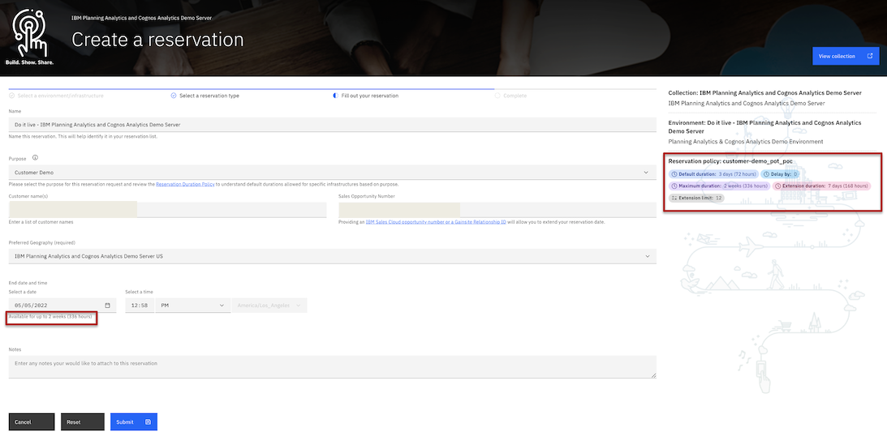

# How Long Can I Reserve an Environment For? 

Please review the following enhnacement added to IBM Technology Zone's reservation forms to improve the visibility for our users to see exactly how long they can reserve an environment for. 

Now find two places on the reservation form that display the amount of time in which a user can reserve an environment for (see screenshot below). 

Watch how the reservation durations will change as you fill out the form. Providing more information, for example, selecting a "Customer Demo", "Proof of Concept", or "Proof of Technology" purpose and provding a valid IBM Sales Cloud or Gainsite relationship ID will provide you more time on the intial reservation form. 

### Definitions

Default duration: Without selecting a purpose or geo on the initial reservation form, this will be the default time frames that you can reserve this environment for to start. 

Maximum duration: As you fill out the form the maximum duration will be how long you can choose to reserve this environment till. The max time allowed on this initial reservation form. (Note: users can leverage the extend option if they provide a valid opportunity code after making the inital reservation)

Delay by: There are some environments that you can reserve on Technology Zone that need to be scheduled a specific amount of time before the environment will start provisioning. For example: A delay by date of 3 days, means that you will not be able to select a start date until three days from today's date. 

Extension duration: This environment will allow you to extend for this duration after reserving the environment. For example: An extension duration of 7 days means that you will be able to extend this reservation every week for another 7 days.

Extension limit: This environment has a limited number of extensions. For example: Having an extension limit of 12 means that you can extend your reservation every week for another 7 days but there is a limite to doing an extension to 12 times only. 

### Support

For any questions, contact ITZ support - techzone.help@ibm.com

