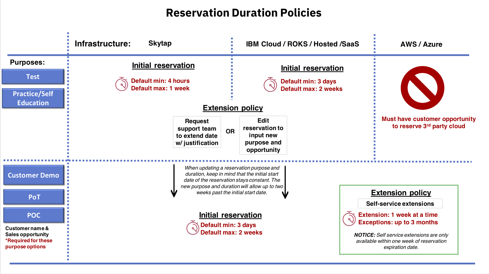

# How Long Can I Reserve an Environment? 

Please review the following infographic and keep reading for additional context.

> **NOTICE:** All infrastructure options durations are dependent on the pupose selected.

## Skytap infrastructure duration policies:
* Purpose type: Test or Self-education
    * Minimum duration to have this environment is 4 hours. (this value is by default)
    * Default maximum duration means that you can select to have this environment for up to 1 week based on this purpose.
    * To extend this reservation you must edit the reservation and input a new purpose along with a valid opportunity code.
  
    
* Purpose type: Customer Demo, POT, & POC
    * Minimum duration to have this environment is 3 days. (this value is by default)
    * Maximum duration that you can reserve on the initial reservation request form is up to 2 weeks. 
    * Extend your reservation 1 week at a time for up 3 months by providing a valid opportunity code in the reservation form. 

## IBM Cloud, ROKS duration policies:
* Purpose type: Test or Self-education
    * Minimum duration to have this environment is 3 days. (this value is by default)
    * Maximum duration that you can reserve on the initial reservation request form is up to 2 weeks. 
    * To extend this reservation you must edit the reservation and input a new purpose along with a valid opportunity code.
    
* Purpose type: Customer Demo, POT, & POC
    * Minimum duration to have this environment is 3 days. (this value is by default)
    * Maximum duration that you can reserve on the initial reservation request form is up to 2 weeks. 
    * Extend your reservation 1 week at a time for up 3 months by providing a valid opportunity code in the reservation form.

## AWS & Azure infrastructure duration policies:
* Purpose type: Test or Self-education
    * We are not currently allowing reservations for 3rd Party Cloud unless there is a Sales opportunity associated with the reservation. Please proceed to customer related purpose if you have a valid opportunity code. 
    
* Purpose type: Customer Demo, POT, & POC
    * Minimum duration to have this environment is 3 days. (this value is by default)
    * Maximum duration that you can reserve on the initial reservation request form is up to 2 weeks. 
    * Extend your reservation 1 week at a time for up 3 months by providing a valid opportunity code in the reservation form.

### Definitions

Default minimum: Without changing any dates on the initial reservation form will default to this time frame specified above. 

Default maximum: If you would like to modify past the default minimum, you can select up to the default maximum based on time frame specified above. 

Initial reservation: Starting by filling out the reservation form on IBM Technology Zone.

Extensions: 
* For purpose Test or Self-education, you must edit the reservation to input a new purpose and opportunity code to then be able to extend the reservation. (follow next extension rule once you have updated your reservation with the new purpose) 
* For purpose Customer Demo, POC, & POT the customer name and opportunity code field capture will display. Filling in a valid opportunity code will alloow you to exgtend up to 1 week at a time for up to 3 months.

> **NOTICE** For the self service extension, you must extend within one week of the reservation expiration date. 
    
Exceptions:
* If you do not have an opportunity code or customer name associated with your reservation that you reserved as purpose Test, then follow the custom request runbook to request an extension based on your unique business justification. 

### Support

For any questions, contact ITZ support - techzone.help@ibm.com

