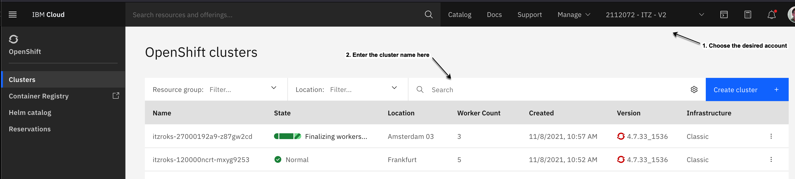
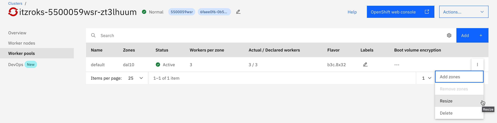

# Resizing a ROKS Cluster Worker Pool

## Pre-requisites

- Cluster name

- IBM Cloud account

**NOTE:** The worker node "flavor" cannot be changed for a given existing worker pool.  A new worker pool needs to be created using a new node flavor for requests that involve increasing the size of the worker nodes.

# Step-by-step guide

- Select the proper account

- Search for the cluster with the given name.

- Once you have the target cluster selected:
  - Select worker pools
  - Under the 3-dot menu on the far right of the worker pool, select resize. (See figure below.)

- In the worker pool resize dialog that pops up, modify the number of workers/zone. (See figure below.)
  - Usually the Tech Zone clusters are deployed to only 1 zone (to help reduce costs).
  - Note the total number workers.

- Once you have the number of workers set to the desired value, click on the resize button  to kick off the provisioning.

- The new worker nodes should be provisioned in about 15 minutes.
