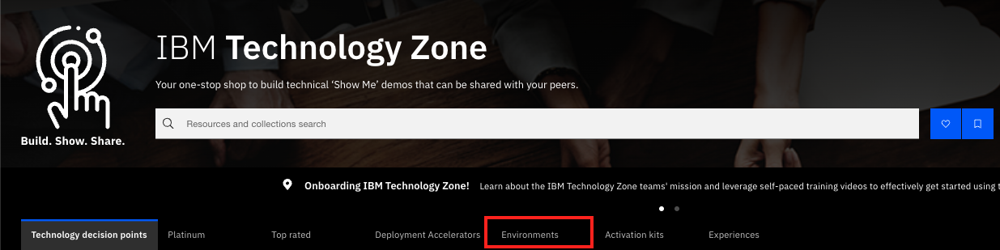
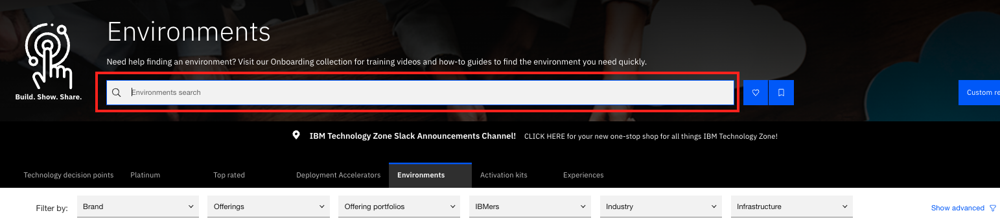
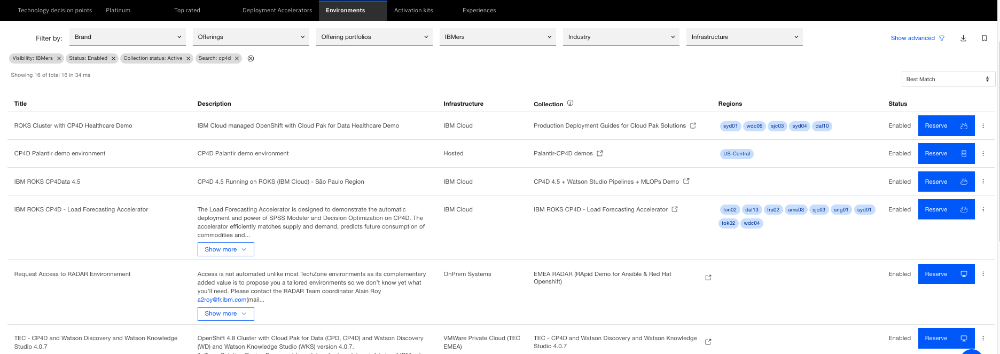
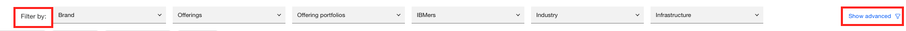
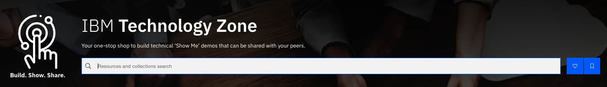
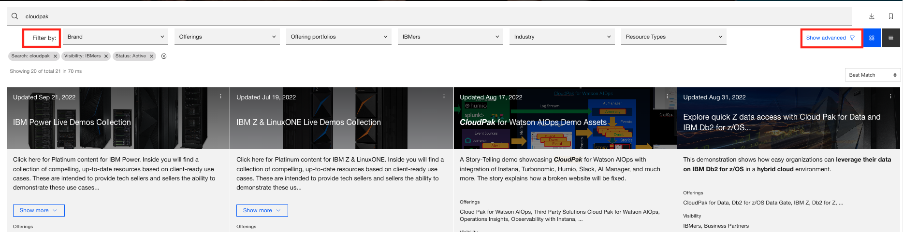

# How do I search for an environments/collection?

# 1. Search for environments

- Click on the Environments tab

- Enter desired environment name and click enter, a list of environments will be available to choose from

Example we enter cp4d, available "cp4d" environments is listed

We have **Filter by** and **Show advanced filter** which narrows down your search list, displaying only the data that interest you. 
Options available : Brand, Resource Type, Language, Audience, etc.

# 2. Search for Collections/resources

Enter the desired collection/resource name in the [search box](https://techzone.ibm.com/) 

click enter, a list of collections/resources will be available to choose from. Select your desired collection from the list to explore.

We have **Filter by** and **Show advanced filter** which narrows down your search list, displaying only the data that interest you.

Filter by: refine your list by "Brand", "Offerings", "Industry", "Resource Type" etc.

Show advanced: refine your list by "Owner", "collaborators", "Languages", "Audience" etc.
