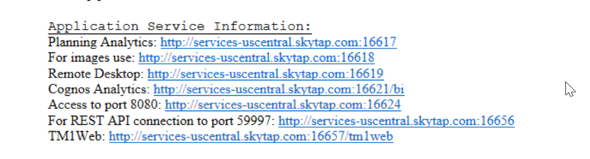

# Share an Environment with a Client

You will need to provision the environment yourself, but it be shared to clients

## Please note: The use of Customer Data is not allowed on IBM Technology Zone.

## Skytap
For Skytap environments you can share the access information for the client to use(Desktop URL and password or application links).
In this method, there is no limit to invited users.

Example of Desktop URL for VM access

Example of Published Services for access just to a web hosted service

## ROKS
ROKS environments can be shared with any users with an IBM ID, https://github.com/IBM/itz-support-public/blob/main/IBM-Technology-Zone/IBM-Technology-Zone-Runbooks/share_environment.md.

### Support

For any questions, contact ITZ support - techzone.help@ibm.com
