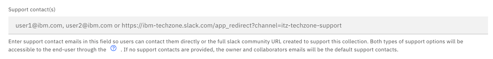
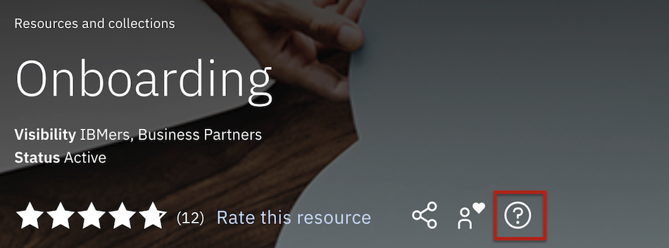
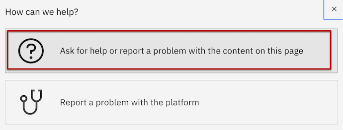
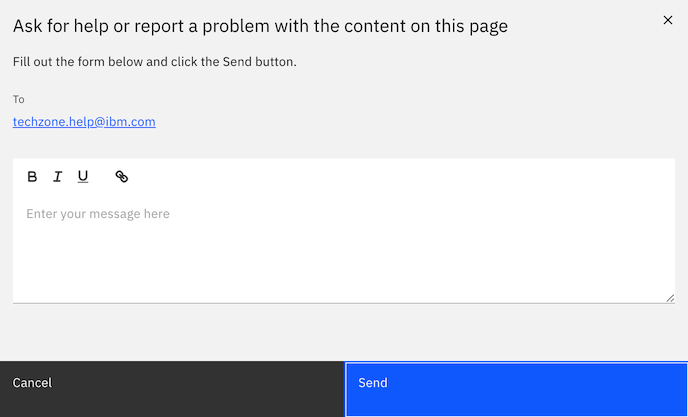
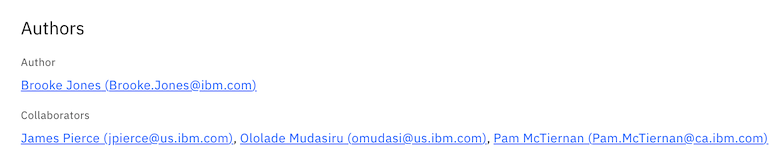

# Support Contacts on a Collection

On a collection today, there is an author that owns the whole collection and collaborators that can support with content creation or are subject matter experts that can support any quesitons a user has on the content.

To specifiy specific users within the author or collaborator list that will support this content specifically, navigate to the edit collection form and find the Support contacts field. 

A full slack channel URL can be provided as your collections support model or email addresses (comma delimited list if multiple emails provided) of the people that should be contacted when the end users selects the help icon from your collection view page. 

Selecting the content support option.

Notice that the emails you input into Support contacts field will display. I used the Technology Zone support email in this example. 

See Onboarding collection has a different author and collaborators associated to this collection but filling in the Support contacts field allows you as the collection owners to justfiy who should be contacted when users need support. 

Technology Zone onboarding collection: https://ibm.biz/techzone-onboarding

Leaving the Support contacts field blank will default support to the author and collaborators of a collection so only use the Contact support field if you have a Slack channel that you would like to direct users to or if there are a unique set of individual emails that need to be the support contacts for this collection.

Example of a full slack support channel URL would be the following: https://ibm-dte.slack.com/app_redirect?channel=itz-techzone-support

Users that select content support option for collections that have a Slack support model will be automatically redirected to the slack channel in a web browser or Slack app. 

### Support

For any questions, contact ITZ support - techzone.help@ibm.com
