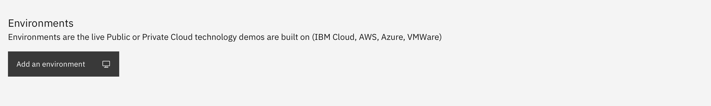
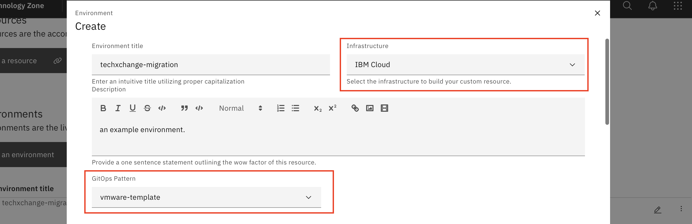
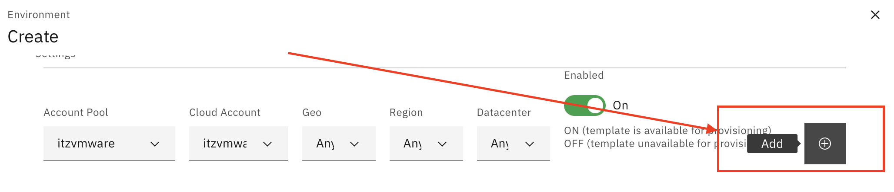
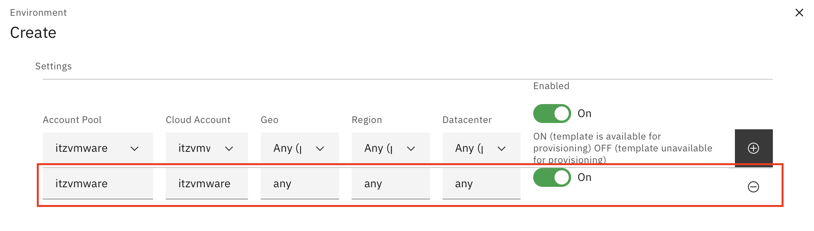
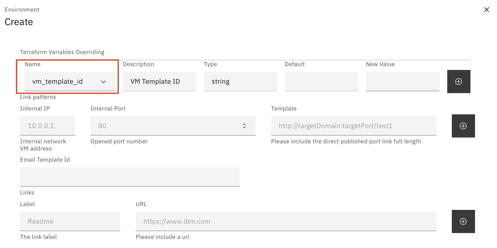

<h1 align="center">Requesting TechXchange Lab Migrations to TechZone</h1>

You own an environment that was used at a TechXchange event and you would like to have migrated so others can make a reservation directly on TechZone. 

## Before you start

Before you migrate your labs from TechXchange to TechZone, you should be aware of both the initial
and the ongoing expectations for TechZone content. To continue to have up-to-date and relevant 
content in TechZone, you should be aware of TechZone's content lifecycle.

To learn more about the content lifecycle for TechZone, see the questions below in the FAQ:

1. [Is there a lifecycle for content in TechZone?](/IBM-Technology-Zone/IBM-Technology-Zone-FAQs/content-faqs.md#is-there-a-lifecycle-for-content-in-techzone)
1. [What are the expectations for author support in TechZone?](/IBM-Technology-Zone/IBM-Technology-Zone-FAQs/content-faqs.md#what-are-the-expectations-for-author-support-in-techzone)

It is important to understand--before migrating your content to TechZone--that publishing your
content in TechZone comes with an obligation to support the content and keep it updated as long
as it's published in TechZone.


## Getting Started

### 1. Before migrating an Environment you must first have a TechZone Collection.

_**Note:** If you don't have a Collection on TechZone, please view the instructions below:_

1. To create your own collection, first review TechZone [Guidance and Standards](https://github.ibm.com/dte-support/private/blob/master/itz/itz-runbooks/techzone-content.md)

2. Visit the [How to Create a Collection Runbook](https://github.com/IBM/itz-support-public/blob/main/IBM-Technology-Zone/IBM-Technology-Zone-Runbooks/techzone-content.md#how-to-create-a-collection) for more information on how to create a collection.

3.  Add **Resources**, view the [How to Create a Resource](https://github.ibm.com/dte-support/private/blob/master/itz/itz-runbooks/techzone-content.md#:~:text=Back%20to%20Top-,What%20is%20a%20Resource,-%3F) for more information on house to create the resource. Create a resource explaining the lab guide and implement it as a Resource Document type.

4.  Have the new **Collection** reviewed by mbawa@us.ibm.com before proceeding to step 2.

    > **TechXchange Instructor Collection Creation Guidance**
    >
    > New collections to be created only for the recent TechXchange assets, are encouraged to title the collection the same name used for the session so that those that attended can easily find the assets on TechZone. 
    >
    > Collections should include the environment used for the TechXchange lab session and the Lab Guide as a supporting resource to accompany the environment.
    > 
    > Contact mbawa@us.ibm.com to review new collection before proceeding to step 2.

     
### 2. Reach out to TechZone support team to request your Lab be Migrated to TechZone

1. Reach out to TechZone support team by [opening a case](https://ibmsf.force.com/ibminternalproducts/s/createrecord/NewCase?language=en_US) or by emailing [techzone.help@ibm.com](techzone.help@ibm.com) to request your lab to be migrated to TechZone. 

2. Provide the following details in your request:

    -  The Collection name and direct URL link to the collection.
 
    -  The Session ID.


>  _**DISCLAIMER:** Please be aware of the following steps that are taken before the template transfer can proceed:_
> 
>  _- ISOs associated with the source template will be unmounted._
> 
> _-  Snapshots associated with the source template will be deleted._
> 
> _The Aspera automation that performs the template transfer tends to fail unless the above steps are taken._
> _If this process is disruptive to your template, please communicate with Support so we can determine other available options._

### 3. Onboarding the Environment to a Collection

The TechZone support team will respond back with a text file and a link to the **Onboarding Environment to a Collection** section for you to take next steps for onboarding your environment onto TechZone.

**The TechZone support team will provide you with a text file that includes Terraform Variables Overriding as follows:**

```
Terraform Variables Overriding
------------------------------
vm_template_id

vm_template_folder

vm_map_string // CONTENT AUTHOR TO UPDATE THE JSON STUB FILE PROVIDED BY TECHZONE SUPPORT

vm_subnet

vm_router_ip

vm_domain
```

Follow guidance below to ensure that you copy and paste this information correctly into the environment entry. 

1. Navigate to [your collection](https://techzone.ibm.com/my/collections?StatusFilter=%5B%22Active%22%2C%22Draft%22%2C%22Pending+Approval%22%5D) and select edit:

    - Scroll down the collection edit form and locate the environment section

    - Select **'Add an environment'** button



2. Provide a title for the environment and select IBM Cloud from the Infrastructure drop down list

    - Provide a description for the environment for users to identify what they are reserving 

    - Select `vmware-template` from the GitOps Pattern drop down list

_**NOTE:** `vmware-template` is for VMware only_



3. Under the Settings section, follow the below steps to setup this section:

    - Select `itzvmware` from the dropdown menu under the Account Pool field 

    - Select `itzvmware` from the dropdown menu under the the Cloud Account field

    - Select the relevant GEO, either `Americas`, `Europe` or `AP` from the dropdown menu under the Geo field

    - Select `Any(preferred)` from the dropdown menu the Region field

    - Select `Any(preferred)` from the dropdown menu the Data Center field

_**NOTE:** Ensure that you press the "`add`" button, otherwise your inputted values will not be saved!_





4. Under the **Terraform Variables Overriding section**, follow the below steps to ensure each variable provided in the text file is setup correctly

- Adding the `VMWare template ID` variable

     - `Name` field, select from the drop-down menu list '`vmware_template_id`'



- Adding the `VMWare Template Folder` variable:

   - Select `vm_template_folder` add the New value and Click on the + icon

   - Select `vm_map_string` from pulldown and add the New value and Click on the + icon

-  Follow guidance on how to build out map string for an image by referencing the [How to Build your vm-map-string Runbook](https://github.com/IBM/itz-support-public/blob/main/IBM-Technology-Zone/IBM-Technology-Zone-Runbooks/vm-map-string-setup.md). 

   - Select `vm_subnet` from pulldown and add the New value and Click on the + icon

   - Select `vm_router_ip` from pulldown and add the New value and Click on the + icon

    - Select `vm_domain`  from pulldown and add the New value and Click on the + icon
    
- Click the bottom blue Save button" to save the "Terraform Variables Overriding" for the Collection


## Variable Dictionary:

**Default Variables required**

   - Infrastructure - where to deployed. For example "IBM Cloud"
   - GitOps Patterns - Provisioning instructions - Select "vmware-template"
   - Account pool - Location - Select the different locations (`itzvmware`), Cloud Account (`itzvmware`), Geo (`Americas`), Region (`us-east`), Datacenter (`wdc04`)
   - `vm_template_folder` - parent folder name. For example "templates-shared"
   - `vm_template_id`- the template folder name for the VMs
   - `vm_map_string` - values for the VMs - make sure your VM Map string is correct, you can use any JSON validators like https://jsonlint.com/) 
   - `vm_domain` - Network domain for the VM
   - `vm_router_ip` - Router for the VM
   - `vm_subnet` - Subnet for the VM

_**Note:** If you do not have custom Network requirements, use the defaults values below for the Network details:_

- Default `vm_domain value` is `ibmdte.net`
- Default `vm_router_ip` value is `10.0.0.254`
- Default `vm_subnet value` is `10.0.0.0/24`

**Example of a `vm_map_string`**
```
{ 	"GKLM41-20230105": { 		"ip": "10.0.0.1", 		"hostname": "host-1", 		"stage": 1 	} }

"GKLM41-20230105" // Template file name
"ip": "10.0.0.1" // IP address for the VM<br>
"hostname": "host-1" // Hostname for the VM<br>
"stage": 1 // create and launch first (order to create a VM which has no dependency)
"stage": 2 // Optional if have more than 1 VM and there are dependencies: create and launch second (create after stage 1 has been created - dependent on stage 1 creation)
"stage": 3 // Optional if have more than 1 VM and there are dependencies: create and launch third (create after stage 2 has been created - dependent on stage 2 creation)
```
**Published Services Variables**

- If adding ports to be exposed as publish services, add port variable to the vm_map_string which can be found in the [VMwarePublishedServices Runbook.]( https://github.com/IBM/itz-support-public/blob/main/IBM-Technology-Zone/IBM-Technology-Zone-Runbooks/VMwarePublishedServices.md)
